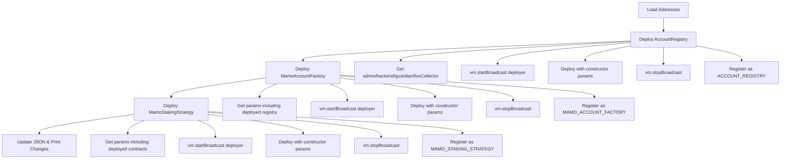

# DeployMamoStaking.s.sol Implementation Plan

## Overview
This document outlines the comprehensive deployment script for three smart contracts following the exact patterns established in `script/DeployMulticall.s.sol`.

## Contracts to Deploy

### 1. AccountRegistry
- **File**: `src/AccountRegistry.sol`
- **Constructor**: `(address admin, address backend, address guardian, address _feeCollector)`
- **Purpose**: Manages caller whitelist and fee collection for the staking system
- **Address Key**: `ACCOUNT_REGISTRY`

### 2. MamoAccountFactory
- **File**: `src/MamoAccountFactory.sol`
- **Constructor**: `(address admin, address backend, address guardian, AccountRegistry _registry, IMamoStrategyRegistry _mamoStrategyRegistry, address _accountImplementation)`
- **Purpose**: Factory contract for deploying user accounts with standardized configuration
- **Address Key**: `MAMO_ACCOUNT_FACTORY`

### 3. MamoStakingStrategy
- **File**: `src/MamoStakingStrategy.sol`
- **Constructor**: `(address admin, address backend, address guardian, AccountRegistry _registry, IMultiRewards _multiRewards, IERC20 _mamoToken, IDEXRouter _dexRouter, ERC20MoonwellMorphoStrategy _morphoStrategy, uint256 _compoundFee)`
- **Purpose**: Executes automated reward claiming and processing logic
- **Address Key**: `MAMO_STAKING_STRATEGY`
- **Compound Fee**: 100 basis points (1%)

## Required Address Keys

The following addresses must be available in the addresses.json file:

- `DEPLOYER_EOA` - The deployer address
- `MAMO_COMPOUNDER` - Admin role address
- `BACKEND_ADDRESS` - Backend role address  
- `GUARDIAN_ADDRESS` - Guardian role address
- `FEE_COLLECTOR` - Fee collector address
- `MAMO_STRATEGY_REGISTRY` - Strategy registry contract
- `MAMO_ACCOUNT_IMPLEMENTATION` - Account implementation contract
- `MULTI_REWARDS` - MultiRewards contract
- `MAMO_TOKEN` - MAMO token contract
- `DEX_ROUTER` - DEX router contract
- `MORPHO_STRATEGY` - ERC20MoonwellMorphoStrategy contract

## Script Structure

### Import Statements
```solidity
import {AccountRegistry} from "@contracts/AccountRegistry.sol";
import {MamoAccountFactory} from "@contracts/MamoAccountFactory.sol";
import {MamoStakingStrategy} from "@contracts/MamoStakingStrategy.sol";
import {ERC20MoonwellMorphoStrategy} from "@contracts/ERC20MoonwellMorphoStrategy.sol";
import {IMamoStrategyRegistry} from "@interfaces/IMamoStrategyRegistry.sol";
import {IMultiRewards} from "@interfaces/IMultiRewards.sol";
import {IDEXRouter} from "@interfaces/IDEXRouter.sol";
import {IERC20} from "@openzeppelin/contracts/token/ERC20/IERC20.sol";
import {Script} from "@forge-std/Script.sol";
import {console} from "@forge-std/console.sol";
import {Addresses} from "@fps/addresses/Addresses.sol";
```

### Main Functions

#### 1. run() Function
- Load addresses from JSON file
- Call deploy function with addresses and deployer
- Update JSON and print changes

#### 2. deploy() Function
- Orchestrates all three deployments
- Returns array of deployed contract addresses
- Calls individual deployment functions in sequence

#### 3. deployAccountRegistry() Function
- Gets admin, backend, guardian, feeCollector from addresses
- Uses vm.startBroadcast(deployer) for access control
- Deploys AccountRegistry with constructor parameters
- Uses vm.stopBroadcast() after deployment
- Registers address using addresses.addAddress("ACCOUNT_REGISTRY", address, true)
- Returns deployed contract address

#### 4. deployMamoAccountFactory() Function
- Gets required parameters including deployed AccountRegistry
- Uses vm.startBroadcast(deployer) for access control
- Deploys MamoAccountFactory with constructor parameters
- Uses vm.stopBroadcast() after deployment
- Registers address using addresses.addAddress("MAMO_ACCOUNT_FACTORY", address, true)
- Returns deployed contract address

#### 5. deployMamoStakingStrategy() Function
- Gets required parameters including deployed AccountRegistry
- Uses vm.startBroadcast(deployer) for access control
- Deploys MamoStakingStrategy with constructor parameters (compoundFee = 100)
- Uses vm.stopBroadcast() after deployment
- Registers address using addresses.addAddress("MAMO_STAKING_STRATEGY", address, true)
- Returns deployed contract address

## Deployment Flow



## Key Implementation Details

### Access Control Pattern
Each deployment function follows the exact pattern from DeployMulticall.s.sol:
```solidity
vm.startBroadcast(deployer);
// Deploy contract
vm.stopBroadcast();
// Register address
```

### Address Registration Pattern
Following the DeployMulticall.s.sol pattern for address registration:
```solidity
string memory contractName = "CONTRACT_NAME";
if (addresses.isAddressSet(contractName)) {
    addresses.changeAddress(contractName, address(contract), true);
} else {
    addresses.addAddress(contractName, address(contract), true);
}
```

### Logging Pattern
Consistent with DeployMulticall.s.sol logging approach using console.log for deployment confirmations.

### Error Handling
Include proper validation for all constructor parameters to ensure non-zero addresses and valid configurations.

## Dependencies and Interfaces

The script requires the following interfaces and contracts:
- `IMulticall.sol` for Call struct definition
- All contract imports for deployment
- Forge-std imports for scripting functionality
- FPS (Forge Proposal Simulator) for address management

## Testing Considerations

After deployment, the script should:
1. Verify all contracts are deployed successfully
2. Confirm all addresses are registered correctly
3. Validate constructor parameters are set properly
4. Ensure proper role assignments for admin, backend, and guardian roles

## File Location
The deployment script should be created at: `script/DeployMamoStaking.s.sol`

This plan ensures complete adherence to the established patterns while providing comprehensive deployment functionality for all three contracts.