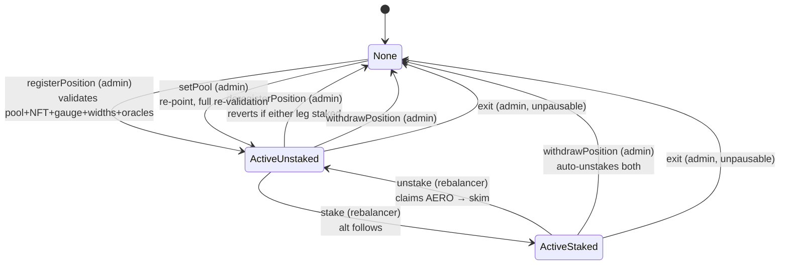
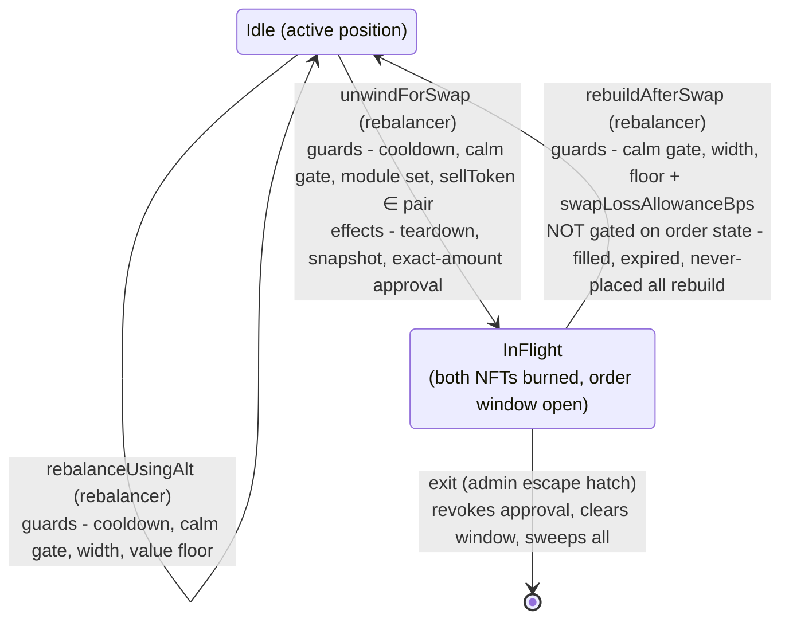
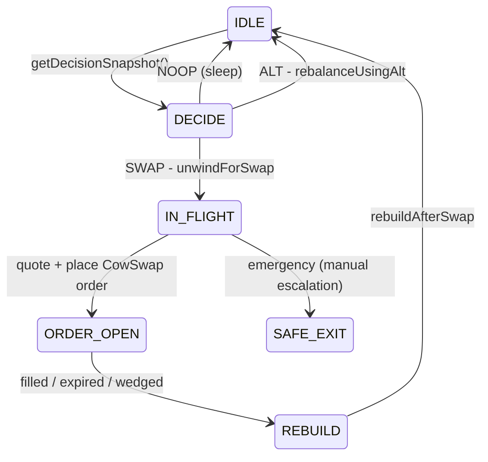

# LPAutoBalancerV2 — System Overview

Canonical entry point for the LP auto-balancer. Explains what the system is, its state machines, and how the offchain backend drives it. Deep detail lives in the linked documents (see [Document map](#document-map)); vocabulary is fixed in the repo-root [`CONTEXT.md`](../CONTEXT.md).

- Contract: `src/LPAutoBalancerV2.sol` (+ `src/LPCompoundModule.sol`, `src/libraries/LPGeometryLib.sol` / `LPValuationLib.sol` / `LPPositionLib.sol`)
- Phase-1 deployment: WETH/cbBTC on Aerodrome Slipstream (Base), gauged

## 1. What it is

A Safe-governed, **dual-position** Aerodrome concentrated-liquidity rebalancer with **two rebalance modes, chosen per-cycle by the backend**:

- **Rebalance (no-swap)** — the Beefy-CLM-style default: withdraw both positions and re-mint from the balances as they are, principal never sold, impermanent loss realized only on a true range exit;
- **Swap-rebalance** — an explicitly-armed two-phase path (CowSwap, oracle-bounded, floor-guarded end to end) for when the position is too lopsided for a no-swap rebuild to fix.

Principal is held as two NFTs:

- **main** — a balanced range straddling spot (the bulk of principal);
- **alt** — a transient single-sided range parking whatever surplus leg the main mint could not consume.

"Explicitly-armed" is operational reality, not just intent: until the checker owner configures the WETH↔cbBTC token pairs and the admin sets the slippage knobs, no rebalance order validates and every swap cycle degrades to a no-swap rebuild. The mode decision table lives in [§5](#5-backend-integration-summary--the-spec-is-the-contract).

Reward AERO (from gauge staking) is a third, non-principal asset: it is either dropped to the weekly distribution or partially sold back into the pair (the compound share) via CowSwap — reward-only orders validated by the `LPCompoundModule`.

## 2. Actors and trust model

| Role | Holder (phase 1) | Powers |
|---|---|---|
| `DEFAULT_ADMIN_ROLE` | F-MAMO Safe | register/deregister/withdraw/exit, `setPool`, `setGauge`, `setOracles`, `setFeeCollector`, `setCompoundModule`, `setSwapLossAllowanceBps`, `recoverERC20` |
| `GUARDIAN_ROLE` | F-MAMO Safe | `pause()` / `unpause()` |
| `MANAGER_ROLE` | Safe (op key optional) | `setPositionConfig` (widths, calm-gate params, loss cap, cooldown) |
| `REBALANCER_ROLE` | backend EOA (hot key) | `rebalanceUsingAlt`, `unwindForSwap`, `rebuildAfterSwap`, `stake`, `unstake`, `compound` |
| — (permissionless) | anyone | `collectFees`, `claimEmissions`, `getDecisionSnapshot` |

Trust envelope: the hot rebalancer key can shift value only within the haircut the Safe configured — `maxRebalanceLossBps` (≤ 500) per rebalance, plus `swapLossAllowanceBps` (≤ 500) on the swap path, with CowSwap orders additionally price-floored by the module's `rebalanceSlippageBps` against Chainlink. All unbounded value movement (exit destinations, fee collector, config) is Safe-only. `exit()` is the escape hatch: admin-gated, **not** pausable, callable mid-flight.

## 3. State machines

Three interlocking machines. A and B are contract state (canonical here); C is the backend's loop (canonical prose: [backend spec §3](superpowers/specs/2026-07-03-lp-auto-balancer-v2-backend-spec.md#3-cycle-state-machine-and-stateless-recovery)).

### 3.1 Machine A — position lifecycle (admin plane)

State = (`position.active`, `mainStaked`; the alt always follows the main's stake state).



Notes:
- `registerPosition`/`setPool` share one validation path (`_validateAndStore` → `LPPositionLib.validateGauge` + `validatePoolAndNft`): pool descriptor ↔ live pool, NFT ownership + NFT ↔ pool binding, gauge rewards AERO + gauge ↔ pool binding, width bounds (incl. the `int24.max` cap).
- `deregisterPosition` is pure bookkeeping transfer (reverts if staked); `withdrawPosition` rescues in one call (auto-unstakes); `exit` additionally liquidates to tokens and sweeps — see 3.2 for its mid-flight role.

### 3.2 Machine B — rebalance window (operational plane)

State = `rebalanceInFlight`.



While `InFlight`:
- The module's `validateRebalanceOrder` (EIP-1271) accepts CowSwap orders **only** in this window, pinned to `sellTokenInFlight`, receiver = balancer, price-checked at `rebalanceSlippageBps` against Chainlink.
- `collectFees` fails fast (`AlreadyInFlight`); `getDecisionSnapshot` stays callable but skips the burned-NFT geometry reads (fields zeroed).
- `position.mainTokenId`/`altTokenId` still hold the burned ids until rebuild — any path reading them against the real position manager reverts (see residuals, §6).
- A cycle consumes a full cooldown even if no order fills (`rebuildAfterSwap` stamps `lastRebalance`).

### 3.3 Machine C — backend sweep (mirror of backend spec §3)



**Stateless recovery is mandatory**: on every wake the backend derives its phase from chain truth (`rebalanceInFlight`, relayer allowance, balances, orderbook) — never from local memory. Full rules: backend spec §3.

## 4. Operational flows

**Rebalance (no-swap)** — `rebalanceUsingAlt(RebalanceParams)`, atomic:
1. calm gate (spot vs TWAP) + cooldown + width checks;
2. snapshot pre-value (positions and loose balance separately);
3. unstake if staked (AERO claim → skim), withdraw + burn both NFTs;
4. `_mainRange`: spot-centered straddle, or single-sided on the funded side when the minority leg is dust (< `MIN_MAIN_LEG_USD`);
5. mint main (unfunded-leg min zeroed on single-sided), mint alt from the surplus (skipped below `MIN_ALT_VALUE_USD`);
6. **value floor**: `after ≥ posBefore·(1 − maxRebalanceLossBps) + looseBefore` (loose un-haircut, H-1);
7. forward dust, restake if it was staked.

**Swap-rebalance** — two transactions bracketing an offchain CowSwap order:
1. `unwindForSwap`: same guards + teardown + split-value snapshot; approves the vault relayer for exactly `sellAmount` of `sellToken`; opens the window.
2. Offchain: backend quotes and places the order; the module validates it (window + direction pin + price check).
3. `rebuildAfterSwap`: rebuilds from whatever balances exist (fill or no fill), floor gets the extra `swapLossAllowanceBps`, revokes approval, closes the window.

**Compound** — `compound(compoundBps)`: harvests AERO, drops `1 − compoundBps` to the feeCollector, forwards the compound share to the module; the backend then posts reward-only AERO→WETH / AERO→cbBTC orders (module `isValidSignature`, `allowedSlippageInBps`). Proceeds land on the **balancer** as loose balance and fold at the next rebuild.

**Fees/emissions** — `collectFees` (unstaked; both legs) and `claimEmissions` (staked) are permissionless skims to the feeCollector.

## 5. Backend integration (summary — the spec is the contract)

Operational source of truth: [backend spec](superpowers/specs/2026-07-03-lp-auto-balancer-v2-backend-spec.md). This section is the orientation layer only.

**Who calls what.** The REBALANCER key drives everything operational (see role table); all reads come from the single atomic view `getDecisionSnapshot()`:

```
spotTick, twapTick, mainTickLower/Upper, mainInRange, altTickLower/Upper, hasAlt,
mainLiquidity, altLiquidity, mainStaked, hasGauge, earnedAero,
cooldownRemaining, deviationGateOpen, rebalanceInFlight, rebalanceStartedAt
```

**Mode decision** (full math: spec §4):

| Signal | NOOP | Rebalance (no-swap) | Swap-rebalance |
|---|---|---|---|
| `mainInRange` | true | false | false |
| imbalance (`altLiquidity` vs `mainLiquidity`) | — | moderate | severe (alt-dominant) |
| `deviationGateOpen` | — | must be true | must be true |
| `cooldownRemaining` | — | must be 0 | must be 0 |
| `rebalanceInFlight` | false | false | false (else resume machine C) |

**Happy paths** (parameters and payloads: spec §5–6):

1. *No-swap*: snapshot → `rebalanceUsingAlt(width, mins…, deadline)` → verify via fresh snapshot (`mainInRange == true`, new ids).
2. *Swap cycle*: snapshot → `unwindForSwap(sellToken, sellAmount, mins…, deadline)` → quote + place CowSwap order → poll → `rebuildAfterSwap(width, mins…, deadline)` → verify.
3. *Recovery*: order expired/unfilled → call `rebuildAfterSwap` anyway (no-swap outcome; deliberately not gated on order state). Wedged beyond repair → escalate to Safe `exit()`.

**Invariants the backend must respect** (false-revert or worse if ignored):
- Size `sellAmount` from the **position snapshot**, not from `balanceOf(balancer)` — pre-existing loose balance is commingled at unwind, and slippage on loose inflates loss against a floor sized to position value only (documented residual, `rebuildAfterSwap` NatSpec).
- Mins protect against sandwiches, but on a single-sided rebuild the unfunded leg's min is force-zeroed by the contract — don't rely on it.
- One sweep instance at a time; a swap cycle consumes a full cooldown even without a fill.
- Freeze config during a cycle (R6): admin setters callable mid-flight silently rebase the floor's basis.
- Assert the config invariants of spec §7 at startup (checker pair configs, `maxTimePriceValid(WETH/cbBTC) < minRebalanceInterval`, appData registered).

## 6. Protections and known residuals

**Protections**: calm gate (TWAP deviation) on every rebalance path; value floor with loose-balance separation (H-1); haircut caps hard-coded (`MAX_LOSS_CAP_BPS = 500`, `MAX_SWAP_LOSS_ALLOWANCE_BPS = 500`); CowSwap orders Chainlink-floored, direction-pinned, window-scoped, exact-amount-approved; gauge/pool/NFT bindings validated on every admin path; width capped at `int24.max`; pause blocks everything operational while `exit` stays available.

**Known residuals** (accepted, documented — details in [swap-rebalance design §8](superpowers/specs/2026-07-02-lp-auto-balancer-v2-swap-rebalance-design.md) R1–R6 and contract NatSpec):
- The swap-rebalance floor spans two transactions: donations between unwind and rebuild widen apparent headroom (not extractable); slippage on commingled loose can false-revert an honest rebuild (recoverable — `exit()` or smaller sell).
- No `AlreadyInFlight` guard on `rebalanceUsingAlt`/`stake`/`withdrawPosition`/`deregisterPosition` (role-gated; they revert deep but harmlessly; `collectFees` — the permissionless one — is guarded).
- Module keeps a standing max AERO relayer approval (reward-only exposure; `recoverERC20` escape hatch exists on both contracts).

## Document map

| Document | Role |
|---|---|
| this file | entry point: architecture, state machines, integration orientation |
| [`CONTEXT.md`](../CONTEXT.md) | canonical vocabulary |
| [backend spec](superpowers/specs/2026-07-03-lp-auto-balancer-v2-backend-spec.md) | operational contract for `lp_balancer_sweep`: reads/writes, decision math, CoW lifecycle, error table, monitoring, launch checklist |
| [setup runbook](LP_AUTO_BALANCER_V2_WETH_CBBTC_SETUP.md) | phase-1 WETH/cbBTC deployment: 011 proposal, deferred checker steps, handover |
| [backend handbook](LP_AUTO_BALANCER_V2_BACKEND_HANDBOOK.md) | operating the WETH/cbBTC position: venue facts, the 011 total-allocation parameter, venue mechanics, backend process shape, preflight + go-live |
| [dual-position design](superpowers/specs/2026-06-17-lp-auto-balancer-v2-dual-position-design.md) | why dual-position/no-swap; original design record |
| [swap-rebalance design](superpowers/specs/2026-07-02-lp-auto-balancer-v2-swap-rebalance-design.md) | two-phase swap path design + review residuals R1–R6 |
