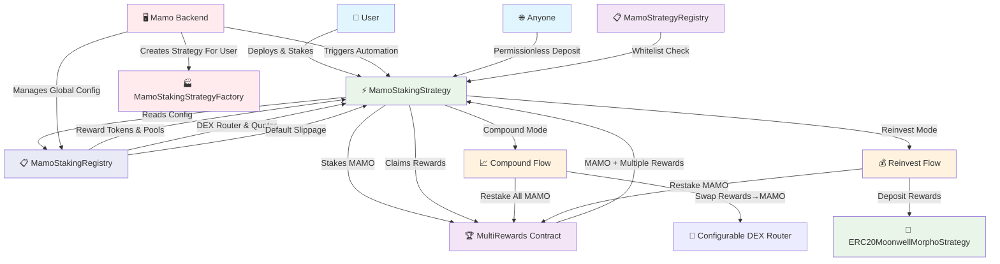
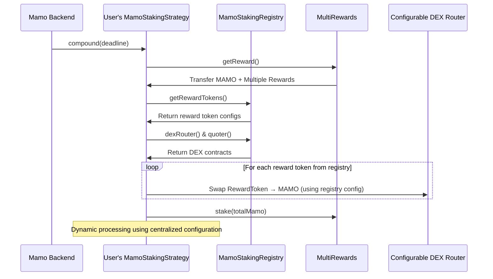
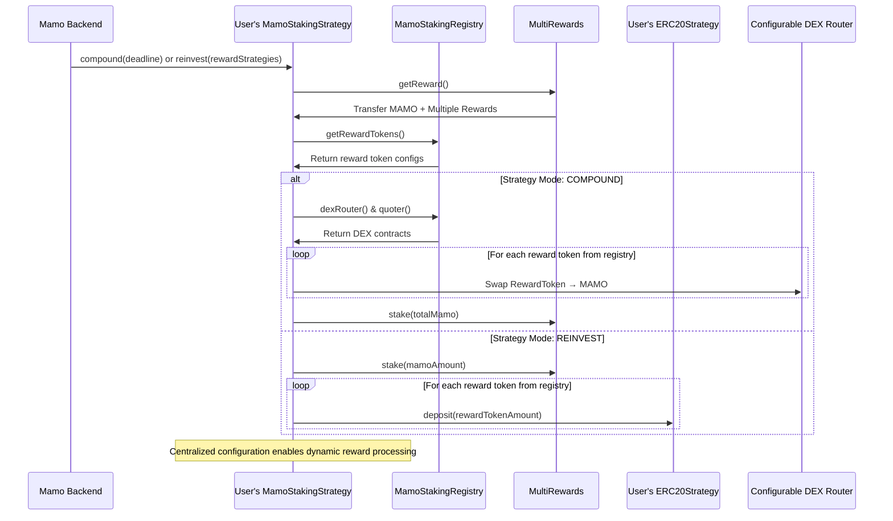
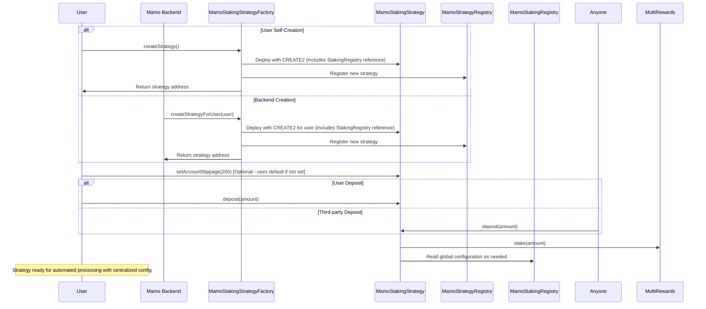
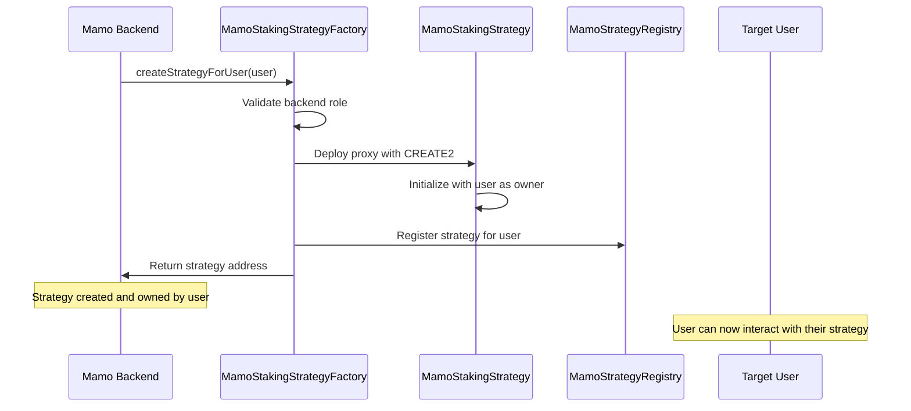

# Mamo Staking Architecture

## Overview

The Mamo Staking feature introduces an automated reward claiming and compounding system that allows users to optimize their staking rewards through two distinct strategies: **Compound** and **Reinvest**. This system builds upon the existing MultiRewards contract and follows the same per-user strategy pattern as the ERC20MoonwellMorphoStrategy, ensuring consistency across the Mamo ecosystem.

The architecture features a centralized configuration registry (**MamoStakingRegistry**) that manages global settings like reward tokens, DEX routing, and slippage parameters, eliminating the need for per-strategy configuration and enabling dynamic system-wide updates.

## System Architecture


```mermaid
graph TB
    User[👤 User] --> |Deploys & Stakes| Strategy[⚡ MamoStakingStrategy]
    Backend[🖥️ Mamo Backend] --> |Creates Strategy For User| Factory[🏭 MamoStakingStrategyFactory]
    Backend --> |Triggers Automation| Strategy
    Anyone[🌐 Anyone] --> |Permissionless Deposit| Strategy
    
    Strategy --> |Stakes MAMO| MultiRewards[🏆 MultiRewards Contract]
    Strategy --> |Claims Rewards| MultiRewards
    MultiRewards --> |MAMO + Multiple Rewards| Strategy
    
    Strategy --> |Reads Config| StakingRegistry[📋 MamoStakingRegistry]
    Strategy --> |Compound Mode| CompoundFlow[📈 Compound Flow]
    Strategy --> |Reinvest Mode| ReinvestFlow[💰 Reinvest Flow]
    
    CompoundFlow --> |Swap Rewards→MAMO| DEXRouter[🔄 Configurable DEX Router]
    CompoundFlow --> |Restake All MAMO| MultiRewards
    
    ReinvestFlow --> |Restake MAMO| MultiRewards
    ReinvestFlow --> |Deposit Rewards| ERC20Strategy[🏦 ERC20MoonwellMorphoStrategy]
    
    Registry[📋 MamoStrategyRegistry] --> |Whitelist Check| Strategy
    Backend --> |Manages Global Config| StakingRegistry
    StakingRegistry --> |Reward Tokens & Pools| Strategy
    StakingRegistry --> |DEX Router & Quoter| Strategy
    StakingRegistry --> |Default Slippage| Strategy
    
    classDef userClass fill:#e1f5fe
    classDef contractClass fill:#f3e5f5
    classDef strategyClass fill:#e8f5e8
    classDef flowClass fill:#fff3e0
    classDef backendClass fill:#ffebee
    classDef registryClass fill:#e8eaf6
    
    class User,Anyone userClass
    class Strategy,ERC20Strategy strategyClass
    class MultiRewards,Registry contractClass
    class CompoundFlow,ReinvestFlow flowClass
    class Backend,Factory backendClass
    class StakingRegistry registryClass
```

## Core Components

> **The Solidity blocks in this section are illustrative, not authoritative.** They show shape and
> intent; bodies are elided or simplified and the shipped signatures are the ones in `src/`. Where
> this document states an access-control rule, a role, or a security property, that claim is meant to
> be exact — read the access-control matrix and the "Deployment prerequisites" section as normative,
> and the snippets as a sketch.

### 1. MamoStakingRegistry Contract (Global Configuration)

**Purpose**: Centralized registry that manages global configuration for all MAMO staking strategies, including reward tokens, DEX routing, and slippage parameters.

**Key Features:**
- **Global Reward Token Management**: Add, remove, and update reward tokens with their corresponding pools
- **DEX Configuration**: Manage router and quoter contracts for reward token swapping
- **Slippage Management**: Set default slippage tolerance with user override capability
- **Role-Based Access Control**: Backend, guardian, and admin roles for different operations
- **Emergency Controls**: Pause/unpause functionality for emergency situations
- **Recovery Functions**: Ability to recover accidentally sent tokens or ETH

**Architecture Pattern:**
```solidity
contract MamoStakingRegistry is AccessControlEnumerable, Pausable {
    /// @notice Backend role for configuration management
    bytes32 public constant BACKEND_ROLE = keccak256("BACKEND_ROLE");
    
    /// @notice Guardian role for emergency pause functionality
    bytes32 public constant GUARDIAN_ROLE = keccak256("GUARDIAN_ROLE");
    
    /// @notice The maximum allowed slippage in basis points
    uint256 public constant MAX_SLIPPAGE_IN_BPS = 2500; // 25%
    
    /// @notice Reward token configuration
    struct RewardToken {
        address token;
        address pool; // Pool address for swapping this token to MAMO
    }
    
    /// @notice Global reward token configuration
    RewardToken[] public rewardTokens;
    mapping(address => bool) public isRewardToken;
    mapping(address => uint256) public rewardTokenToIndex;
    
    /// @notice Global DEX configuration
    ISwapRouter public dexRouter;
    IQuoter public quoter;
    
    /// @notice Global slippage configuration
    uint256 public defaultSlippageInBps;
    
    /// @notice MAMO token address
    address public immutable mamoToken;
    
    /// @notice Add a reward token with its pool (backend only)
    function addRewardToken(address token, address pool) external onlyRole(BACKEND_ROLE) whenNotPaused {
        require(token != address(0), "Invalid token");
        require(pool != address(0), "Invalid pool");
        require(!isRewardToken[token], "Token already added");
        require(token != mamoToken, "Cannot add MAMO token as reward");
        require(pool != token, "Pool cannot be same as token");
        
        rewardTokenToIndex[token] = rewardTokens.length;
        rewardTokens.push(RewardToken({token: token, pool: pool}));
        isRewardToken[token] = true;
        
        emit RewardTokenAdded(token, pool);
    }
    
    /// @notice Update DEX router (backend only)
    function setDEXRouter(ISwapRouter newRouter) external onlyRole(DEFAULT_ADMIN_ROLE) {
        require(address(newRouter) != address(0), "Invalid router");
        require(address(newRouter) != address(dexRouter), "Router already set");
        
        address oldRouter = address(dexRouter);
        dexRouter = newRouter;
        
        emit DEXRouterUpdated(oldRouter, address(newRouter));
    }
    
    /// @notice Set default slippage tolerance (backend only)
    function setDefaultSlippage(uint256 _defaultSlippageInBps) external onlyRole(BACKEND_ROLE) whenNotPaused {
        require(_defaultSlippageInBps <= MAX_SLIPPAGE_IN_BPS, "Slippage too high");
        
        uint256 oldSlippage = defaultSlippageInBps;
        defaultSlippageInBps = _defaultSlippageInBps;
        
        emit DefaultSlippageUpdated(oldSlippage, _defaultSlippageInBps);
    }
}
```

### 2. MamoStakingStrategy Contract (Per-User)

**Purpose**: Acts as a per-user strategy contract that handles MAMO staking and automated reward processing, following the same pattern as ERC20MoonwellMorphoStrategy. Reads configuration from the centralized MamoStakingRegistry.

**Key Features:**
- **UUPS Proxy**: Upgradeable proxy pattern with registry-controlled upgrades
- **Individual Ownership**: Each user owns their own strategy instance
- **Direct Staking**: Directly stakes MAMO tokens in MultiRewards contract
- **Strategy Integration**: Integrates with user's ERC20 strategies for reinvestment
- **Centralized Configuration**: Reads reward tokens, DEX router, and slippage from MamoStakingRegistry
- **User Slippage Override**: Users can set custom slippage or use global default
- **Automated Reward Processing**: Handles compound and reinvest modes with backend automation

**Architecture Pattern:**
```solidity
contract MamoStakingStrategy is Initializable, UUPSUpgradeable, BaseStrategy {
    /// @notice The MultiRewards contract for staking
    IMultiRewards public multiRewards;
    
    /// @notice The MAMO token contract
    IERC20 public mamoToken;
    
    /// @notice The MamoStakingRegistry for configuration
    MamoStakingRegistry public stakingRegistry;
    
    /// @notice The user's allowed slippage in basis points (0 = use default)
    uint256 public accountSlippageInBps;
    
    /// @notice Initialization parameters struct
    struct InitParams {
        address mamoStrategyRegistry;
        address stakingRegistry;
        address multiRewards;
        address mamoToken;
        uint256 strategyTypeId;
        address owner;
    }
    
    /// @notice Initialize the strategy
    function initialize(InitParams calldata params) external initializer {
        require(params.mamoStrategyRegistry != address(0), "Invalid mamoStrategyRegistry address");
        require(params.stakingRegistry != address(0), "Invalid stakingRegistry address");
        require(params.multiRewards != address(0), "Invalid multiRewards address");
        require(params.mamoToken != address(0), "Invalid mamoToken address");
        require(params.strategyTypeId != 0, "Strategy type id not set");
        require(params.owner != address(0), "Invalid owner address");
        
        __BaseStrategy_init(params.mamoStrategyRegistry, params.strategyTypeId, params.owner);
        
        stakingRegistry = MamoStakingRegistry(params.stakingRegistry);
        multiRewards = IMultiRewards(params.multiRewards);
        mamoToken = IERC20(params.mamoToken);
    }
    
    /// @notice Get the slippage tolerance for this strategy
    function getAccountSlippage() public view returns (uint256) {
        return accountSlippageInBps > 0 ? accountSlippageInBps : stakingRegistry.defaultSlippageInBps();
    }
    
    /// @notice Deposit MAMO tokens into MultiRewards (permissionless)
    function deposit(uint256 amount) external {
        require(amount > 0, "Amount must be greater than 0");
        
        mamoToken.safeTransferFrom(msg.sender, address(this), amount);
        _stakeMamo(amount);
        
        emit Deposited(msg.sender, amount);
    }
    
    /// @notice Withdraw all staked MAMO tokens from MultiRewards
    function withdrawAll() external onlyOwner {
        uint256 stakedBalance = multiRewards.balanceOf(address(this));
        require(stakedBalance > 0, "No tokens to withdraw");
        
        multiRewards.withdraw(stakedBalance);
        mamoToken.safeTransfer(msg.sender, stakedBalance);
        
        emit Withdrawn(stakedBalance);
    }
    
    /// @notice Claim rewards, swap them all to MAMO and restake (backend only)
    /// @param deadline Unix timestamp after which the swaps must not execute. Supplied by the caller
    ///        because `block.timestamp + N` computed inside the transaction is tautological. Capped
    ///        at `MAX_COMPOUND_DEADLINE` so an unbounded value cannot restore that tautology.
    function compound(uint256 deadline) external onlyBackend { /* ... */ }

    /// @notice Claim rewards, restake MAMO and deposit other rewards into the user's ERC20 strategies
    function reinvest(address[] calldata rewardStrategies) external onlyBackend { /* ... */ }
}
```

### 3. MamoStakingStrategyFactory Contract

**Purpose**: Factory contract for deploying user staking strategies with simplified configuration that leverages the centralized MamoStakingRegistry for global settings.

**Key Features:**
- **Deterministic Deployment**: CREATE2 for predictable addresses
- **Simplified Configuration**: Minimal initialization leveraging central registry
- **Registry Integration**: Automatic registration of deployed strategies
- **Dual Access Control**: User self-deployment and backend deployment on behalf of users
- **Global Configuration**: Inherits settings from MamoStakingRegistry

**Architecture Pattern:**
```solidity
contract MamoStakingStrategyFactory is AccessControlEnumerable {
    /// @notice The MamoStrategyRegistry for strategy management
    address public immutable mamoStrategyRegistry;
    
    /// @notice The MamoStakingRegistry for configuration
    address public immutable stakingRegistry;
    
    /// @notice The MultiRewards contract address
    address public immutable multiRewards;
    
    /// @notice The MAMO token address
    address public immutable mamoToken;
    
    /// @notice The strategy implementation address
    address public immutable strategyImplementation;
    
    /// @notice The strategy type ID
    uint256 public immutable strategyTypeId;
    
    // NOTE: the factory intentionally carries no defaultSlippageInBps. Slippage has a single source
    // of truth, MamoStakingRegistry.defaultSlippageInBps, which MamoStakingStrategy falls back to via
    // getAccountSlippage(); per-strategy overrides go through setAccountSlippage().
    
    bytes32 public constant BACKEND_ROLE = keccak256("BACKEND_ROLE");
    
    event StrategyCreated(address indexed user, address indexed strategy);
    
    /// @notice Create a new strategy for the caller
    function createStrategy() external returns (address strategy) {
        return _createStrategyForUser(msg.sender);
    }
    
    /// @notice Create a new strategy for a user (backend only)
    function createStrategyForUser(address user) external onlyRole(BACKEND_ROLE) returns (address strategy) {
        return _createStrategyForUser(user);
    }
    
    /// @notice Internal function to create strategy for a user
    function _createStrategyForUser(address user) internal returns (address strategy) {
        require(user != address(0), "Invalid user");
        
        // Calculate deterministic address using CREATE2
        bytes32 salt = keccak256(abi.encodePacked(user));
        
        // Deploy new strategy proxy
        strategy = address(new ERC1967Proxy{salt: salt}(
            strategyImplementation,
            abi.encodeWithSelector(
                MamoStakingStrategy.initialize.selector,
                MamoStakingStrategy.InitParams({
                    mamoStrategyRegistry: mamoStrategyRegistry,
                    stakingRegistry: stakingRegistry,
                    multiRewards: multiRewards,
                    mamoToken: mamoToken,
                    strategyTypeId: strategyTypeId,
                    owner: user
                })
            )
        ));
        
        // Register the strategy
        IMamoStrategyRegistry(mamoStrategyRegistry).registerStrategy(strategy, user);
        
        emit StrategyCreated(user, strategy);
        
        return strategy;
    }
}
```

## Operational Flows

### Enhanced Compound Mode Flow


```mermaid
sequenceDiagram
    participant Backend as Mamo Backend
    participant Strategy as User's MamoStakingStrategy
    participant StakingRegistry as MamoStakingRegistry
    participant MultiRewards as MultiRewards
    participant DEX as Configurable DEX Router

    Backend->>Strategy: compound(deadline)
    Strategy->>MultiRewards: getReward()
    MultiRewards->>Strategy: Transfer MAMO + Multiple Rewards
    Strategy->>StakingRegistry: getRewardTokens()
    StakingRegistry->>Strategy: Return reward token configs
    Strategy->>StakingRegistry: dexRouter() & quoter()
    StakingRegistry->>Strategy: Return DEX contracts
    
    loop For each reward token from registry
        Strategy->>DEX: Swap RewardToken → MAMO (using registry config)
    end
    
    Strategy->>MultiRewards: stake(totalMamo)
    
    Note over Strategy: Dynamic processing using centralized configuration
```

### Enhanced Reward Processing Flow


```mermaid
sequenceDiagram
    participant Backend as Mamo Backend
    participant Strategy as User's MamoStakingStrategy
    participant StakingRegistry as MamoStakingRegistry
    participant MultiRewards as MultiRewards
    participant ERC20Strategy as User's ERC20Strategy
    participant DEX as Configurable DEX Router

    Backend->>Strategy: compound(deadline) or reinvest(rewardStrategies)
    Strategy->>MultiRewards: getReward()
    MultiRewards->>Strategy: Transfer MAMO + Multiple Rewards
    Strategy->>StakingRegistry: getRewardTokens()
    StakingRegistry->>Strategy: Return reward token configs
    
    alt Strategy Mode: COMPOUND
        Strategy->>StakingRegistry: dexRouter() & quoter()
        StakingRegistry->>Strategy: Return DEX contracts
        loop For each reward token from registry
            Strategy->>DEX: Swap RewardToken → MAMO
        end
        Strategy->>MultiRewards: stake(totalMamo)
    else Strategy Mode: REINVEST
        Strategy->>MultiRewards: stake(mamoAmount)
        loop For each reward token from registry
            Strategy->>ERC20Strategy: deposit(rewardTokenAmount)
        end
    end
    
    Note over Strategy: Centralized configuration enables dynamic reward processing
```

### Enhanced User Onboarding Flow


```mermaid
sequenceDiagram
    participant User as User
    participant Backend as Mamo Backend
    participant Factory as MamoStakingStrategyFactory
    participant Strategy as MamoStakingStrategy
    participant Registry as MamoStrategyRegistry
    participant StakingRegistry as MamoStakingRegistry
    participant Anyone as Anyone
    participant MultiRewards as MultiRewards

    alt User Self-Creation
        User->>Factory: createStrategy()
        Factory->>Strategy: Deploy with CREATE2 (includes StakingRegistry reference)
        Factory->>Registry: Register new strategy
        Factory->>User: Return strategy address
    else Backend Creation
        Backend->>Factory: createStrategyForUser(user)
        Factory->>Strategy: Deploy with CREATE2 for user (includes StakingRegistry reference)
        Factory->>Registry: Register new strategy
        Factory->>Backend: Return strategy address
    end
    
    User->>Strategy: setAccountSlippage(200) [Optional - uses default if not set]
    
    alt User Deposit
        User->>Strategy: deposit(amount)
    else Third-party Deposit
        Anyone->>Strategy: deposit(amount)
    end
    
    Strategy->>MultiRewards: stake(amount)
    Strategy->>StakingRegistry: Read global configuration as needed
    
    Note over User: Strategy ready for automated processing with centralized config
```

### Backend Strategy Creation Flow


```mermaid
sequenceDiagram
    participant Backend as Mamo Backend
    participant Factory as MamoStakingStrategyFactory
    participant Strategy as MamoStakingStrategy
    participant Registry as MamoStrategyRegistry
    participant User as Target User

    Backend->>Factory: createStrategyForUser(user)
    Factory->>Factory: Validate backend role
    Factory->>Strategy: Deploy proxy with CREATE2
    Strategy->>Strategy: Initialize with user as owner
    Factory->>Registry: Register strategy for user
    Factory->>Backend: Return strategy address
    
    Note over Backend: Strategy created and owned by user
    Note over User: User can now interact with their strategy
```

## Security Model

### Access Control Matrix

| Function | Contract | Caller | Permission Source | Notes |
|----------|----------|--------|------------------|-------|
| `getReward()` | Strategy | Strategy | Direct call | Strategy calls MultiRewards directly |
| `compound(deadline)` | Strategy | Mamo Backend | Backend role via StakingRegistry, and registry must not be paused | Swaps rewards to MAMO and stakes. Caller supplies the swap deadline, capped at `MAX_COMPOUND_DEADLINE` |
| `reinvest(rewardStrategies)` | Strategy | Mamo Backend | Backend role via StakingRegistry, and registry must not be paused | Stakes MAMO and deposits other rewards into the user's ERC20 strategies |
| `deposit()` | Strategy | Anyone | Permissionless | Deposits always benefit strategy owner |
| `withdraw()` | Strategy | Strategy Owner | Ownership check | Direct strategy call |
| `withdrawAll()` | Strategy | Strategy Owner | Ownership check | Withdraw all staked tokens |
| `setAccountSlippage()` | Strategy | Strategy Owner | Ownership check | Override global default |
| `addRewardToken()` | StakingRegistry | Mamo Backend | Backend role | Global reward token management |
| `removeRewardToken()` | StakingRegistry | Mamo Backend | Backend role | Global reward token management |
| `updateRewardTokenPool()` | StakingRegistry | Mamo Backend | Backend role | Update token pool mappings |
| `setDEXRouter()` | StakingRegistry | Admin | Admin role, NOT pause-gated | The router receives an allowance over reward tokens on every `compound()`, so this is admin-only; it stays callable while paused because repointing the router is the remediation for a router incident |
| `setQuoter()` | StakingRegistry | Mamo Backend | Backend role | Global quoter configuration |
| `setDefaultSlippage()` | StakingRegistry | Mamo Backend | Backend role | Global slippage configuration |
| `pause()/unpause()` | StakingRegistry | Guardian | Guardian role | Emergency controls |
| `setSlippagePriceChecker()` | StakingRegistry | Admin | Admin role, NOT pause-gated | Same reasoning as `setDEXRouter()` |
| `setStakingRegistry(newRegistry)` | Strategy | Admin of the CURRENT staking registry | `stakingRegistry.hasRole(DEFAULT_ADMIN_ROLE, caller)`, NOT pause-gated | Migrates a strategy onto a redeployed registry. That role already controls the router and price checker the strategy uses, so this adds no capability. Candidate registry is probed for `slippagePriceChecker()`, `dexRouter()` and a matching `mamoToken()` |
| `recoverERC20()/recoverETH()` | StakingRegistry | Admin | Admin role | Recovery functions |
| `createStrategy(user)` | Factory | Backend, or `user` themselves | `hasRole(BACKEND_ROLE) \|\| msg.sender == user` | Thin alias for `createStrategyForUser`. Takes a `user` argument — it is NOT permissionless and NOT caller-implicit |
| `createStrategyForUser(user)` | Factory | Backend, or `user` themselves | `hasRole(BACKEND_ROLE) \|\| msg.sender == user` | Address is deterministic in `user` alone, so a strategy can only ever be created once per user |

### Security Considerations

1. **Direct Strategy Ownership**:
   - ✅ Users directly own their strategy contracts
   - ✅ No intermediary contracts that could be compromised
   - ✅ Standard ownership model like ERC20MoonwellMorphoStrategy

2. **Permissionless Deposits**:
   - ✅ Deposits always benefit the strategy owner
   - ✅ No risk of fund theft or misdirection
   - ✅ Enables third-party integrations and automated systems
   - ✅ Proper event logging for transparency

3. **Centralized Configuration Security**:
   - ✅ MamoStakingRegistry provides single source of truth for global settings
   - ✅ Backend-controlled addition/removal of reward tokens globally
   - ✅ Prevents unauthorized token processing across all strategies
   - ✅ Supports ecosystem evolution without individual strategy updates
   - ✅ Emergency pause functionality affects all backend-driven operations: while the registry is
     paused, `compound()` and `reinvest()` revert with "Registry paused" (the `onlyBackend` modifier
     checks `stakingRegistry.paused()` as well as the caller's role)
   - ✅ The pause is deliberately asymmetric: owner exits (`withdraw`, `withdrawAll`,
     `withdrawRewards`) keep working while paused, so an incident can never trap user funds
   - ⚠️ **Scope of the pause fix (MOO-735): new strategies only.** The `stakingRegistry.paused()`
     check lives in the strategy implementation, and `MamoStrategyRegistry.upgradeStrategy` can only
     move a proxy to `latestImplementationById[itsOwnTypeId]`. The 3,846 strategies deployed by the
     deprecated factory `0xd7C3f474…` are `strategyTypeId == 2`, so those proxies keep running the
     pre-fix code and the guardian's pause does not stop reward processing for them.

     Three mechanical facts constrain the migration, and each of them was stated wrongly in an
     earlier revision of this section:

     1. **The same address cannot be whitelisted twice.** `whitelistImplementation` begins
        `require(!whitelistedImplementations[implementation], "Implementation already whitelisted")`
        — one address, one type id, permanently. "Whitelist this implementation for type 2 as well"
        does not revert-and-retry, it simply cannot be done. Reaching type 2 requires a SECOND,
        separately deployed, byte-identical instance whitelisted under type 2.
     2. **Do not whitelist with `strategyTypeId == 0`.** Auto-assign takes `nextStrategyTypeId()`,
        which is currently `4` — and `latestImplementationById(4)` is ALREADY the WETH
        implementation, because `010` passed an explicit `4` and an explicit id does not advance the
        counter. An auto-assigned whitelist therefore overwrites the WETH upgrade target, and a WETH
        owner calling `upgradeStrategy` would be pointed at the staking implementation.
        `008`'s own `validate()` asserts id 3 and so fails simulation — but only if someone
        simulates before signing. Pass the type id explicitly.
     3. **`setStakingRegistry` cannot help the un-upgraded majority.** It exists only in the new
        implementation, so it cannot be called on a type-2 proxy until that proxy has already
        upgraded. The ordering is upgrade-then-repoint, never the reverse, and until a type-2 proxy
        upgrades, the only authority that can act on it is the DEPRECATED registry's admin — which
        must therefore stay live for the duration of the migration.

     Either way the migration still requires each of the 3,846 owners to call `upgradeStrategy`
     themselves, since nothing can upgrade a user's strategy on their behalf. Accepted residual
     pending that migration, not a code gap.
   - ✅ **Registry-side fixes are deliverable to existing strategies (`setStakingRegistry`).**
     `MamoStakingRegistry` is not upgradeable — plain constructor, no proxy — so any fix to it ships
     as a fresh deployment. `stakingRegistry` used to be write-once in `initialize`, which stranded
     every existing strategy on the registry it was born with: registry-side remediation could never
     reach the fleet, and a strategy pointed at a registry missing a selector `compound()` needs was
     permanently unable to compound (both registries deployed to date lack `slippagePriceChecker()`).
     `setStakingRegistry` closes that. It has **two** authorised callers:

     - The **current** registry's `DEFAULT_ADMIN_ROLE`, which grants that role no new capability: it
       can already call `setDEXRouter`, `setSlippagePriceChecker` and `setDefaultSlippage` on the
       registry every strategy reads, so it already decides which router receives the reward-token
       allowance and what minimum-out floor applies. Gating on `MamoStrategyRegistry`'s admin instead
       *would* be an escalation, since that role cannot presently change a strategy's behaviour
       without the owner opting into an upgrade. This is the arm that makes a fleet-wide migration
       one batched transaction.
     - The strategy's **owner**, as an escape hatch. Without it the admin arm is one-way: the gate
       reads `stakingRegistry`, the same slot the function writes, so a candidate that stops
       answering `hasRole` freezes the pointer permanently — for the staking admin, `MAMO_MULTISIG`
       and the owner alike — and recovery would need a fresh implementation plus per-strategy
       `upgradeStrategy` opt-ins, recreating the very dead-end above. The owner arm is additive and
       never a veto: it does not gate, delay or reorder the admin migration, it only means no single
       key can permanently strand a user.

     It is not pause-gated (migrating off a broken registry is remediation, and a registry can break
     in ways that make unpausing impossible). The candidate is probed by raw `staticcall` across the
     **whole** surface the strategy reads at runtime — `slippagePriceChecker()`, `dexRouter()`,
     `hasRole`, `BACKEND_ROLE()`, `DEFAULT_ADMIN_ROLE()`, `paused()`, `MAX_SLIPPAGE_IN_BPS()`,
     `getRewardTokens()` and a matching `mamoToken()` — because a contract implementing only the
     first two passes a narrow probe and still bricks the owner's own exit (`withdrawAll()` and
     `withdrawRewards()` revert on a missing `getRewardTokens()`, stranding unclaimed rewards). Its
     `defaultSlippageInBps()` is bounded against a strategy-side constant, never the candidate's own
     `MAX_SLIPPAGE_IN_BPS()`, which would be circular: `getAccountSlippage()` falls back to that
     default whenever the owner never set one, and `compound()` spends it as `(10000 - slippage)`, so
     an unbounded value is a zero minimum-out with the honest checker and honest router still in
     place. On the admin arm only, the caller must also hold `DEFAULT_ADMIN_ROLE` on the CANDIDATE,
     which costs an honest migration nothing and stops an admin handing the fleet to a registry it
     does not control.

     It cannot reach the staked principal — but note WHY, because the obvious reason is not the
     operative one. `withdraw`/`withdrawAll` staying `onlyOwner` does not bind here, and while
     `MamoStakingRegistry` forbids listing MAMO as a reward token, an arbitrary contract accepted by
     the probes is bound by no such rule — and MAMO genuinely IS a `MultiRewards` reward token on
     both live instances, so `getReward()` really does pull MAMO onto the strategy. What holds the
     line is the explicit `rewardTokens[i].token != mamoTokenAddr` check in `compound()`. Before it,
     the bound rested on `received = balanceAfter - balanceBefore` underflowing when
     `tokenIn == tokenOut`: correct, but accidental and unstated.
   - ⚠️ **`BACKEND_ROLE` setters are pause-gated, so remediation via them is not.** `addRewardToken`,
     `removeRewardToken`, `updateRewardTokenPool`, `setQuoter` and `setDefaultSlippage` all carry
     `whenNotPaused`, matching the convention in `MamoStrategyRegistry` and `MarketRegistry`. If an
     incident needs one of them, the guardian must unpause first, which reopens `compound()`. Ship
     such a fix as a single multisig batch — `unpause` → fix → `pause` — so the window is one
     transaction. The two knobs most likely to be needed, `setDEXRouter` and
     `setSlippagePriceChecker`, are admin-gated and deliberately exempt from `whenNotPaused` for
     exactly this reason.

4. **Configurable DEX Router**:
   - ✅ Admin-controlled global router updates (`DEFAULT_ADMIN_ROLE`, not the backend)
   - ✅ Enables upgrades without individual strategy redeployment
   - ✅ Prevents setting same router (gas optimization)
   - ✅ Proper validation and event emission
   - ✅ All strategies benefit from router updates immediately
   - ⚠️ **Residual risk after MOO-733 (accepted).** `compound()` now measures the MAMO balance delta
     rather than trusting the router's return value, clears the router allowance inside the loop, and
     stakes the measured balance, so an over-reporting router cannot over-stake and the router is
     never granted a MAMO allowance. Combined with admin-gating `setDEXRouter`, the original
     100%-loss path is closed. What remains: a compromised backend can still raise
     `setDefaultSlippage` to the 2500 bps cap, which loosens the minimum-out floor every swap is held
     to. And `reinvest()` still forwards rewards to backend-supplied destinations validated only by
     owner/token/`isUserStrategy` — all readable from an attacker-authored contract — so it carries a
     separate full-loss path under the same threat model. Off-chain reconciliation of the
     `CompoundRewardTokenProcessed` event is the intended monitor; both of its amounts are measured
     balance deltas, not router-reported figures, so an under-pulling or over-reporting router cannot
     drift it silently.

5. **Strategy Upgrade Safety**:
   - ✅ Upgrades controlled by MamoStrategyRegistry
   - ✅ Only whitelisted implementations allowed
   - ✅ User retains ownership throughout upgrades
   - ✅ Emergency pause mechanisms available via StakingRegistry

6. **Factory Security**:
   - ✅ Deterministic deployment prevents address collisions
   - ✅ Simplified configuration reduces deployment errors
   - ✅ Registry integration ensures proper access control
   - ✅ Backend strategy creation maintains proper ownership

7. **Slippage Management**:
   - ✅ Global default slippage with user override capability
   - ✅ Maximum slippage bounds (25%) prevent excessive losses
   - ✅ User-specific slippage settings for customization
   - ✅ Fallback to global default ensures always-valid slippage

## Integration Points

### Existing Mamo Ecosystem

1. **MamoStrategyRegistry**: Manages strategy whitelisting and user permissions
2. **ERC20MoonwellMorphoStrategy**: Receives reward token deposits in reinvest mode
3. **MultiRewards**: Provides the core staking and reward distribution functionality
4. **BaseStrategy**: Provides common strategy functionality and upgrade patterns

### New Components

1. **MamoStakingRegistry**: Centralized configuration registry for global settings (reward tokens, DEX routing, slippage)
2. **MamoStakingStrategyFactory**: Simplified deployment of user staking strategies leveraging centralized configuration
3. **MamoStakingStrategy**: Enhanced per-user strategy that reads configuration from MamoStakingRegistry

## Deployment Architecture


```mermaid
graph LR
    subgraph "Phase 1: Strategy Registry Setup"
        A[Configure MamoStrategyRegistry] --> B[Whitelist MamoStakingStrategy Implementation]
    end
    
    subgraph "Phase 2: Factory Deployment"
        C[Deploy MamoStakingStrategyFactory] --> D[Configure Factory Permissions]
        D --> E[Set Default Parameters]
    end
    
    subgraph "Phase 3: User Onboarding"
        F[User/Backend Creates Strategy] --> G[Initialize Strategy Parameters]
        G --> H[Set Strategy Preferences]
        H --> I[Stake MAMO Tokens]
    end
    
    subgraph "Phase 4: Dynamic Management"
        J[Backend Monitoring] --> K[Manage Reward Tokens]
        K --> L[Update DEX Router if needed]
        L --> M[Trigger Compound/Reinvest]
    end
    
    B --> C
    E --> F
    I --> J
```

## Rollout — breaking changes and shipping order

The Sherlock audit fixes change two external signatures and add a cross-contract dependency that
does not exist on chain today. Nothing here is optional or independently deployable: shipping any
piece on its own breaks the caller of the piece that did not ship.

### 1. `compound()` → `compound(uint256 deadline)` — BREAKING ABI change

`MamoStakingStrategy.compound()` now takes the swap deadline from the caller (MOO-744). A deadline
computed inside the transaction as `block.timestamp + N` is tautological: the router's
`require(block.timestamp <= deadline)` can never fail, so a `compound()` sitting in the mempool
stays valid indefinitely and eventually executes against whatever market exists when it lands.

- Selector changes: any backend, keeper, multicall batch or off-chain ABI that calls `compound()`
  must be updated and released **together with** the implementation. A stale caller does not fail
  gracefully — it hits the fallback and reverts.
- The strategy rejects a deadline already in the past (`"Deadline in the past"`), and the value is
  forwarded verbatim into `ISwapRouter.ExactInputSingleParams.deadline`. The backend must pick a
  real, near-term deadline; re-deriving `block.timestamp + N` off-chain at signing time and letting
  the transaction sit reintroduces the exact bug.

### 2. `MamoStakingStrategyFactory` constructor arity — BREAKING deployment change

The trailing `_defaultSlippageInBps` constructor argument is gone. Slippage has a single source of
truth, `MamoStakingRegistry.defaultSlippageInBps`, which `MamoStakingStrategy.getAccountSlippage()`
falls back to; the factory stored a value it never passed on. Any deployment script, proposal or
verification job that constructs the factory must drop the argument (already done in
`script/DeployMamoStaking.s.sol` and proposals 005 / 008). `defaultSlippageInBps()` no longer
exists on the factory, so off-chain readers of it must move to the registry.

### 3. The registry and the strategy must ship together

`compound()` prices its minimum-out through `MamoStakingRegistry.slippagePriceChecker()`. **That
function does not exist on the registry deployed at `0xFf3bB81651592bc9c64220093A98ffb10d2b2706` —
the call reverts on chain.** The `MamoStakingStrategy` integration suite only reaches `compound()`
because `setUp()` installs a `vm.mockCall` for it; that mock stands in for the redeployment, it is
not evidence that the live registry supports the call.

Consequence: a strategy implementation carrying the new `compound()` **must not** be whitelisted
against the currently deployed registry. The registry redeployment (proposal
`008_MamoStakingV2Deployment`) and the strategy implementation go out in the same release, and the
new strategy must be pointed at the new registry.

### 4. The SlippagePriceChecker upgrade must enable its own guards

`SlippagePriceChecker`'s sequencer-uptime check is a no-op while `sequencerUptimeFeed` is
`address(0)`, which is deliberately the state an in-place upgrade lands in — so the implementation
on its own leaves MOO-741 exactly as unmitigated as before. Proposal
`013_SlippagePriceCheckerOracleHardening` batches the four steps that make the fix real, and its
`validate()` asserts the guard ends up enabled:

1. `upgradeToAndCall` the proxy to the new implementation.
2. `setSequencerUptimeFeed(CHAINLINK_L2_SEQUENCER_UPTIME_FEED, 3600)` — Base's Chainlink
   "L2 Sequencer Uptime Status Feed", `0xBCF85224fc0756B9Fa45aA7892530B47e10b6433`.
3. `backfillPairCount(...)` for every token configured before `configuredPairCount` existed.
   Without it, `isRewardToken()` answers for those tokens only through the legacy
   `maxTimePriceValid` flag, and `removeTokenConfiguration` cannot tell "the last pair was just
   removed" from "this pair was never counted".

`setFeedBounds` stays unset on purpose: today's aggregators report representational limits rather
than market bounds, so no answer can saturate, and configuring bounds against a live feed is an
ongoing operational commitment. It is available the day an aggregator with active finite bounds
appears behind one of these feeds.

**What the sequencer guard does not cover** — stated here so the docs do not claim more than the
code delivers:

- **The grace period must stay ≥ `maxTimePriceValid`, and nothing enforces it.** The guard refuses
  quotes for `gracePeriod` seconds after the sequencer comes back; `maxTimePriceValid` is how long a
  signed order stays valid. They are deployed equal (both 3600), and that equality is what closes
  the window — an order signed just before an outage expires no later than the moment quotes resume.
  Raising `maxTimePriceValid` above `gracePeriod` silently reopens it. Raise the grace period first.
- **The uptime feed's own staleness is not checked.** `_requireSequencerUp` reads `answer` and
  `startedAt` but ignores the feed's `updatedAt`, so a stalled uptime feed reporting "up" is
  believed. This is inherent to the pattern and matches `ChainlinkReader` elsewhere in the repo.
- **`setSequencerUptimeFeed` does not probe the address it is given.** Any contract is accepted;
  pointing it at something that is not a Chainlink aggregator bricks every quote until the owner
  fixes it. It is owner-only and the value is asserted by `013`'s `validate()`.
- **Two single-hop pairs have a 24h heartbeat.** `xWELL → USDC` (WELL/USD) and `MORPHO → USDC`
  (MORPHO/USD) both configure 86400s, so once the 3600s grace expires either can serve a pre-outage
  answer up to 24h old. Multi-hop pairs are bounded by their second leg. This is a
  feed-configuration property, not a code defect.
  Measured cadence: WELL/USD has shown a max inter-round gap of 53,012s over 140 rounds, MORPHO/USD
  3,932s — so neither is in the failure mode that ETH/USD was (a bound set BELOW the feed's own
  cadence). What they do share with it structurally is zero slack: 86400 is exactly the published
  heartbeat. Consider 90000 at the next config revision, for the same reason 3600 replaced 1200.
- **The corrected WETH quote leg now equals the sequencer grace period.** After the ETH/USD heartbeat
  went 1200s → 3600s, that leg's bound is the same 3600s as `sequencerGracePeriod`, and BOTH
  comparisons are inclusive — pinned behaviour: an answer exactly 3600s old is accepted, 3601s is
  refused. So the second leg no longer contributes margin over the outage guard (it contributed
  2400s before). The `SECURITY:` note above covers `maxTimePriceValid` against grace; this is the
  heartbeat-against-grace case, and it is accepted deliberately: 3600s is 2.9× ETH/USD's measured
  worst-case gap of 1232s, and lowering it back toward 1800s would reintroduce the reverts the
  1200s bound caused. Revisit if the grace period is ever raised.

## Key Architecture Changes

### 1. Centralized Configuration Registry
- **Added**: MamoStakingRegistry for global configuration management
- **Global Reward Tokens**: Centrally managed reward token configurations
- **Global DEX Settings**: Shared router and quoter contracts across all strategies
- **Global Slippage**: Default slippage with user override capability
- **Benefit**: Single source of truth, easier maintenance, instant updates for all strategies

### 2. Simplified Per-User Model
- **Removed**: MamoAccount intermediary contracts
- **Removed**: MamoAccountRegistry permission system
- **Added**: Direct user ownership of MamoStakingStrategy instances
- **Benefit**: Consistent with ERC20MoonwellMorphoStrategy pattern

### 3. Enhanced Factory Pattern
- **Simplified Configuration**: Leverages MamoStakingRegistry for global settings
- **Backend Strategy Creation**: `createStrategyForUser()` function allows backend to create strategies on behalf of users
- **Dual Access Pattern**: Supports both user self-creation and backend-initiated creation
- **Proper Ownership**: Backend-created strategies are owned by the target user, not the backend

### 4. Direct MultiRewards Integration
- **Simplified Interaction**: Strategies directly call MultiRewards contract
- **No Multicall Overhead**: Direct function calls instead of multicall patterns
- **Better Gas Efficiency**: Reduced transaction complexity

### 5. Consistent Upgrade Pattern
- **BaseStrategy Inheritance**: Follows same upgrade pattern as other strategies
- **Registry-Controlled Upgrades**: MamoStrategyRegistry manages implementation whitelisting
- **User Ownership Maintained**: Users retain control over their strategy upgrades
- **Emergency Controls**: StakingRegistry pause affects all strategy operations

## New Features Adoption
- Centralized configuration immediately available to all strategies
- Dynamic reward tokens can be added/removed globally
- DEX router updates affect all strategies instantly
- Slippage updates can be applied system-wide
- Emergency pause capabilities for all operations
- Permissionless deposits are immediately available
- Backend strategy creation supplements existing user creation

## Future Extensibility

The enhanced architecture provides a foundation for:

1. **Additional Reward Mechanisms**: Easy integration of new reward tokens and distribution methods
2. **Advanced Routing**: Support for multiple DEX protocols and routing strategies
3. **Cross-Chain Integration**: Framework for multi-chain reward processing
4. **Automated Rebalancing**: Enhanced strategy logic for optimal yield farming

This architecture provides a robust, secure, and scalable foundation for the Mamo Staking feature while maintaining compatibility with the existing MultiRewards contract and following the established per-user strategy pattern used throughout the Mamo ecosystem.