# Mamo Staking Architecture

## Overview

The Mamo Staking feature introduces an automated reward claiming and compounding system that allows users to optimize their staking rewards through two distinct strategies: **Compound** and **Reinvest**. This system builds upon the existing MultiRewards contract and integrates with the Mamo ecosystem to provide seamless reward management.

## System Architecture

```mermaid
graph TB
    User[👤 User] --> |Deploys & Stakes| StakingAccount[🔄 MamoStakingAccount]
    Backend[🖥️ Mamo Backend] --> |Triggers Automation| Strategy[⚡ Mamo Staking Strategy]
    
    StakingAccount --> |Stakes MAMO| MultiRewards[🏆 MultiRewards Contract]
    Strategy --> |Triggers Claim| StakingAccount
    StakingAccount --> |Claims Rewards| MultiRewards
    MultiRewards --> |MAMO + cbBTC| StakingAccount
    
    Strategy --> |Compound Mode| CompoundFlow[📈 Compound Flow]
    Strategy --> |Reinvest Mode| ReinvestFlow[💰 Reinvest Flow]
    
    CompoundFlow --> |Swap cbBTC→MAMO| DEXRouter[🔄 DEX Router]
    CompoundFlow --> |Restake All MAMO| MultiRewards
    
    ReinvestFlow --> |Restake MAMO| MultiRewards
    ReinvestFlow --> |Deposit cbBTC| ERC20Strategy[🏦 ERC20MoonwellMorphoStrategy]
    
    Registry[📋 AccountRegistry] --> |Whitelist Check| StakingAccount
    Strategy --> |1% Fee| FeeRecipient[💳 Fee Recipient]
    
    classDef userClass fill:#e1f5fe
    classDef contractClass fill:#f3e5f5
    classDef strategyClass fill:#e8f5e8
    classDef flowClass fill:#fff3e0
    
    class User userClass
    class StakingAccount,MultiRewards,Registry contractClass
    class Strategy,ERC20Strategy strategyClass
    class CompoundFlow,ReinvestFlow flowClass
```



## Core Components

### 1. MamoStakingAccount Contract

**Purpose**: Acts as an intermediary UUPS proxy contract that holds user stakes and enables automated reward management.

**Key Features:**
- **UUPS Proxy**: Upgradeable proxy pattern with owner-controlled upgrades
- **Stake Ownership**: Acts as the staking position owner in MultiRewards contract
- **Strategy Integration**: Whitelists and delegates to strategy contracts
- **Access Control**: Uses AccountRegistry for permission management
- **Reward Receiving**: Receives claimed rewards from MultiRewards

**Architecture Pattern:**
```solidity
contract MamoStakingAccount is Initializable, UUPSUpgradeable, Ownable {
    AccountRegistry public immutable registry;
    MamoStrategyRegistry public immutable mamoStrategyRegistry;
    address public stakingStrategy;
    
    /// @notice Initialize the staking account
    /// @param _owner The owner of the staking account
    /// @param _registry The AccountRegistry contract
    /// @param _mamoStrategyRegistry The MamoStrategyRegistry contract
    function initialize(
        address _owner,
        AccountRegistry _registry,
        MamoStrategyRegistry _mamoStrategyRegistry
    ) external initializer {
        require(_owner != address(0), "Invalid owner");
        
        __Ownable_init(_owner);
        __UUPSUpgradeable_init();
        
        registry = _registry;
        mamoStrategyRegistry = _mamoStrategyRegistry;
    }
    
    /// @notice Authorize upgrade to new implementation
    /// @param newImplementation The new implementation address
    function _authorizeUpgrade(address newImplementation) internal override onlyOwner {
        // Check if the new implementation is whitelisted in MamoStrategyRegistry
        require(
            mamoStrategyRegistry.whitelistedImplementations(newImplementation),
            "Implementation not whitelisted"
        );
    }
    
    modifier onlyWhitelistedStrategy() {
        require(registry.isWhitelistedStrategy(address(this), msg.sender), "Strategy not whitelisted");
        _;
    }
    
    /// @notice Batch multiple calls together (calls or delegatecalls)
    /// @param targets Array of targets to call
    /// @param data Array of data to pass with the calls
    function multicall(
        address[] calldata targets,
        bytes[] calldata data
    ) external payable onlyWhitelistedStrategy {
        require(targets.length == data.length, "Length mismatch");
        
        for (uint256 i = 0; i < data.length; i++) {
            if (targets[i] == address(0)) {
                continue; // No-op
            }
            
            // No target validation needed since MamoStakingStrategy is immutable
            // and all interactions are controlled through this contract
            
            (bool success, bytes memory result) = targets[i].delegatecall(data[i]);
            
            if (!success) {
                if (result.length == 0) revert();
                assembly {
                    revert(add(32, result), mload(result))
                }
            }
        }
    }
}
```

### 2. MamoStakingAccountFactory Contract

**Purpose**: Factory contract for deploying user staking accounts with standardized configuration.

**Key Features:**
- **Deterministic Deployment**: CREATE2 for predictable addresses
- **Configuration Management**: Standard initialization parameters
- **Registry Integration**: Automatic registration of deployed accounts
- **Access Control**: Owner-based deployment permissions

**Architecture Pattern:**
```solidity
contract MamoStakingAccountFactory {
    AccountRegistry public immutable registry;
    address public immutable stakingAccountImplementation;
    
    mapping(address => address) public userStakingAccounts;
    
    event StakingAccountCreated(
        address indexed user,
        address indexed stakingAccount,
        CompoundMode defaultMode
    );
    
    /// @notice Create a new staking account for the user
    /// @return stakingAccount The address of the deployed staking account
    function createStakingAccount() external returns (address stakingAccount) {
        require(msg.sender != address(0), "Invalid caller");
        require(userStakingAccounts[msg.sender] == address(0), "Account already exists");
        
        // Calculate deterministic address using CREATE2
        bytes32 salt = keccak256(abi.encodePacked(msg.sender, block.timestamp));
        
        // Deploy new staking account proxy
        stakingAccount = address(new ERC1967Proxy{salt: salt}(
            stakingAccountImplementation,
            abi.encodeWithSelector(
                MamoStakingAccount.initialize.selector,
                msg.sender,
                registry,
                mamoStrategyRegistry
            )
        ));
        
        // Register the account
        userStakingAccounts[msg.sender] = stakingAccount;
        
        emit StakingAccountCreated(msg.sender, stakingAccount, CompoundMode.COMPOUND);
        
        return stakingAccount;
    }
}
```

### 3. AccountRegistry Contract

**Purpose**: Manages caller whitelist and fee collection for the staking system.

**Key Features:**
- **Strategy Whitelist**: Backend-controlled whitelist of approved strategies
- **Caller Whitelist**: Controls which whitelisted strategies can interact with staking accounts (owner-controlled)
- **Fee Collection**: Backend-controlled fee collector address management

**Updated specification:**
```solidity
contract AccountRegistry is Admin {
    /// @notice Mapping of staking account to whitelisted strategies
    mapping(address => mapping(address => bool)) public isWhitelistedStrategy;
    
    /// @notice Mapping of backend-approved strategies
    mapping(address => bool) public approvedStrategies;
    
    /// @notice Fee collector address
    address public feeCollector;
    
    /// @notice Backend role for strategy approval and fee collector management
    bytes32 public constant BACKEND_ROLE = keccak256("BACKEND_ROLE");
    
    event StrategyWhitelisted(address indexed stakingAccount, address indexed strategy, bool approved);
    event StrategyApproved(address indexed strategy, bool approved);
    event FeeCollectorUpdated(address indexed oldCollector, address indexed newCollector);
    
    /// @notice Approve a strategy globally (backend only)
    /// @param strategy The strategy address to approve
    /// @param approved Whether to approve or revoke the strategy
    function setApprovedStrategy(address strategy, bool approved) external onlyRole(BACKEND_ROLE) {
        require(strategy != address(0), "Invalid strategy");
        approvedStrategies[strategy] = approved;
        emit StrategyApproved(strategy, approved);
    }
    
    /// @notice Set fee collector address (backend only)
    /// @param newFeeCollector The new fee collector address
    function setFeeCollector(address newFeeCollector) external onlyRole(BACKEND_ROLE) {
        require(newFeeCollector != address(0), "Invalid fee collector");
        address oldCollector = feeCollector;
        feeCollector = newFeeCollector;
        emit FeeCollectorUpdated(oldCollector, newFeeCollector);
    }
    
    /// @notice Whitelist an approved strategy for a specific staking account (account owner only)
    /// @param stakingAccount The staking account address
    /// @param strategy The strategy address to whitelist
    /// @param approved Whether to approve or revoke the strategy
    function setWhitelistStrategy(address stakingAccount, address strategy, bool approved) external {
        // msg.sender must be the staking account owner
        require(Ownable(stakingAccount).owner() == msg.sender, "Not account owner");
        // Strategy must be approved by backend first
        require(approvedStrategies[strategy], "Strategy not approved by backend");
        isWhitelistedStrategy[stakingAccount][strategy] = approved;
        emit StrategyWhitelisted(stakingAccount, strategy, approved);
    }
}
```

### 4. Mamo Staking Strategy Contract

**Purpose**: Executes the automated reward claiming and processing logic with user deposit/withdraw capabilities. This contract is immutable and not upgradeable.

**Core Responsibilities:**
- **User Operations**: Deposit and withdraw functions for account owners
- **Automated Processing**: Backend-controlled compound and reinvest functions
- **Reward Claiming**: Calls [`getReward()`](src/MultiRewards.sol:475) from staking accounts (accounts are the msg.sender)
- **Token Processing**: Handles MAMO and cbBTC rewards according to user preferences
- **Fee Management**: Immutable compound fee applied to all operations
- **Integration**: Interfaces with DEX routers and ERC20MoonwellMorphoStrategy

**Architecture Pattern:**
```solidity
contract MamoStakingStrategy {
    AccountRegistry public immutable registry;
    MultiRewards public immutable multiRewards;
    IERC20 public immutable mamoToken;
    IERC20 public immutable cbBTCToken;
    IDEXRouter public immutable dexRouter;
    ERC20MoonwellMorphoStrategy public immutable morphoStrategy;
    uint256 public immutable compoundFee; // Immutable fee in basis points (e.g., 100 = 1%)
    
    /// @notice Mapping of staking account to compound mode
    mapping(address => CompoundMode) public accountCompoundMode;
    
    enum CompoundMode {
        COMPOUND,    // Convert cbBTC to MAMO and restake everything
        REINVEST     // Restake MAMO, deposit cbBTC to ERC20Strategy
    }
    
    bytes32 public constant BACKEND_ROLE = keccak256("BACKEND_ROLE");
    
    event Deposited(address indexed account, uint256 amount);
    event Withdrawn(address indexed account, uint256 amount);
    event Compounded(address indexed account, uint256 mamoAmount, uint256 cbBTCAmount);
    event Reinvested(address indexed account, uint256 mamoAmount, uint256 cbBTCAmount);
    event CompoundModeUpdated(address indexed account, CompoundMode newMode);
    
    constructor(
        AccountRegistry _registry,
        MultiRewards _multiRewards,
        IERC20 _mamoToken,
        IERC20 _cbBTCToken,
        IDEXRouter _dexRouter,
        ERC20MoonwellMorphoStrategy _morphoStrategy,
        uint256 _compoundFee
    ) {
        require(_compoundFee <= 1000, "Fee too high"); // Max 10%
        registry = _registry;
        multiRewards = _multiRewards;
        mamoToken = _mamoToken;
        cbBTCToken = _cbBTCToken;
        dexRouter = _dexRouter;
        morphoStrategy = _morphoStrategy;
        compoundFee = _compoundFee;
    }
    
    modifier onlyAccountOwner(address stakingAccount) {
        require(Ownable(stakingAccount).owner() == msg.sender, "Not account owner");
        _;
    }
    
    modifier onlyBackend() {
        require(hasRole(BACKEND_ROLE, msg.sender), "Not backend");
        _;
    }
    
    /// @notice Set compound mode for a staking account
    /// @param stakingAccount The staking account address
    /// @param mode The compound mode to set
    function setCompoundMode(address stakingAccount, CompoundMode mode)
        external
        onlyAccountOwner(stakingAccount)
    {
        accountCompoundMode[stakingAccount] = mode;
        emit CompoundModeUpdated(stakingAccount, mode);
    }
    
    /// @notice Deposit MAMO tokens into MultiRewards on behalf of staking account
    /// @param stakingAccount The staking account address
    /// @param amount The amount of MAMO to deposit
    function deposit(address stakingAccount, uint256 amount)
        external
        onlyAccountOwner(stakingAccount)
    {
        require(amount > 0, "Amount must be greater than 0");
        
        // Transfer MAMO from user to this contract
        mamoToken.transferFrom(msg.sender, address(this), amount);
        
        // Approve and stake in MultiRewards on behalf of staking account
        mamoToken.approve(address(multiRewards), amount);
        
        // Call stake through the staking account's multicall
        bytes memory stakeData = abi.encodeWithSelector(
            MultiRewards.stake.selector,
            amount
        );
        
        MamoStakingAccount(stakingAccount).multicall(
            [address(multiRewards)],
            [stakeData]
        );
        
        emit Deposited(stakingAccount, amount);
    }
    
    /// @notice Withdraw MAMO tokens from MultiRewards on behalf of staking account
    /// @param stakingAccount The staking account address
    /// @param amount The amount of MAMO to withdraw
    function withdraw(address stakingAccount, uint256 amount)
        external
        onlyAccountOwner(stakingAccount)
    {
        require(amount > 0, "Amount must be greater than 0");
        
        // Call withdraw through the staking account's multicall
        bytes memory withdrawData = abi.encodeWithSelector(
            MultiRewards.withdraw.selector,
            amount
        );
        
        MamoStakingAccount(stakingAccount).multicall(
            [address(multiRewards)],
            [withdrawData]
        );
        
        // Transfer withdrawn MAMO to account owner
        mamoToken.transfer(msg.sender, amount);
        
        emit Withdrawn(stakingAccount, amount);
    }
    
    /// @notice Process rewards according to the account's preferred compound mode
    /// @param stakingAccount The staking account address
    function processRewards(address stakingAccount) external onlyBackend {
        CompoundMode accountMode = accountCompoundMode[stakingAccount];
        if (accountMode == CompoundMode.COMPOUND) {
            _compound(stakingAccount);
        } else {
            _reinvest(stakingAccount);
        }
    }
    
    /// @notice Internal function to compound rewards by converting cbBTC to MAMO and restaking
    /// @param stakingAccount The staking account address
    function _compound(address stakingAccount) internal {
        // Claim rewards to staking account
        multiRewards.getReward(stakingAccount);
        
        // Get reward balances
        uint256 mamoBalance = mamoToken.balanceOf(stakingAccount);
        uint256 cbBTCBalance = cbBTCToken.balanceOf(stakingAccount);
        
        if (mamoBalance == 0 && cbBTCBalance == 0) return;
        
        // Calculate and transfer fees
        uint256 mamoFee = (mamoBalance * compoundFee) / 10000;
        uint256 cbBTCFee = (cbBTCBalance * compoundFee) / 10000;
        
        if (mamoFee > 0) {
            bytes memory transferMamoFeeData = abi.encodeWithSelector(
                IERC20.transfer.selector,
                registry.feeCollector(),
                mamoFee
            );
            MamoStakingAccount(stakingAccount).multicall(
                [address(mamoToken)],
                [transferMamoFeeData]
            );
        }
        
        if (cbBTCFee > 0) {
            bytes memory transferCbBTCFeeData = abi.encodeWithSelector(
                IERC20.transfer.selector,
                registry.feeCollector(),
                cbBTCFee
            );
            MamoStakingAccount(stakingAccount).multicall(
                [address(cbBTCToken)],
                [transferCbBTCFeeData]
            );
        }
        
        // Swap remaining cbBTC to MAMO
        uint256 remainingCbBTC = cbBTCBalance - cbBTCFee;
        if (remainingCbBTC > 0) {
            bytes memory swapData = abi.encodeWithSelector(
                IDEXRouter.swapExactTokensForTokens.selector,
                remainingCbBTC,
                0, // Accept any amount of MAMO
                [address(cbBTCToken), address(mamoToken)],
                stakingAccount,
                block.timestamp + 300
            );
            MamoStakingAccount(stakingAccount).multicall(
                [address(dexRouter)],
                [swapData]
            );
        }
        
        // Stake all MAMO
        uint256 totalMamo = mamoToken.balanceOf(stakingAccount);
        if (totalMamo > 0) {
            bytes memory stakeData = abi.encodeWithSelector(
                MultiRewards.stake.selector,
                totalMamo
            );
            MamoStakingAccount(stakingAccount).multicall(
                [address(multiRewards)],
                [stakeData]
            );
        }
        
        emit Compounded(stakingAccount, mamoBalance, cbBTCBalance);
    }
    
    /// @notice Internal function to reinvest rewards by staking MAMO and depositing cbBTC to Morpho strategy
    /// @param stakingAccount The staking account address
    function _reinvest(address stakingAccount) internal {
        // Claim rewards to staking account
        multiRewards.getReward(stakingAccount);
        
        // Get reward balances
        uint256 mamoBalance = mamoToken.balanceOf(stakingAccount);
        uint256 cbBTCBalance = cbBTCToken.balanceOf(stakingAccount);
        
        if (mamoBalance == 0 && cbBTCBalance == 0) return;
        
        // Calculate and transfer fees
        uint256 mamoFee = (mamoBalance * compoundFee) / 10000;
        uint256 cbBTCFee = (cbBTCBalance * compoundFee) / 10000;
        
        if (mamoFee > 0) {
            bytes memory transferMamoFeeData = abi.encodeWithSelector(
                IERC20.transfer.selector,
                registry.feeCollector(),
                mamoFee
            );
            MamoStakingAccount(stakingAccount).multicall(
                [address(mamoToken)],
                [transferMamoFeeData]
            );
        }
        
        if (cbBTCFee > 0) {
            bytes memory transferCbBTCFeeData = abi.encodeWithSelector(
                IERC20.transfer.selector,
                registry.feeCollector(),
                cbBTCFee
            );
            MamoStakingAccount(stakingAccount).multicall(
                [address(cbBTCToken)],
                [transferCbBTCFeeData]
            );
        }
        
        // Stake remaining MAMO
        uint256 remainingMamo = mamoBalance - mamoFee;
        if (remainingMamo > 0) {
            bytes memory stakeData = abi.encodeWithSelector(
                MultiRewards.stake.selector,
                remainingMamo
            );
            MamoStakingAccount(stakingAccount).multicall(
                [address(multiRewards)],
                [stakeData]
            );
        }
        
        // Deposit remaining cbBTC to Morpho strategy
        uint256 remainingCbBTC = cbBTCBalance - cbBTCFee;
        if (remainingCbBTC > 0) {
            bytes memory depositData = abi.encodeWithSelector(
                ERC20MoonwellMorphoStrategy.deposit.selector,
                remainingCbBTC
            );
            MamoStakingAccount(stakingAccount).multicall(
                [address(morphoStrategy)],
                [depositData]
            );
        }
        
        emit Reinvested(stakingAccount, mamoBalance, cbBTCBalance);
    }
}
```

## Operational Flows

### Compound Mode Flow


### Reward Processing Flow


### User Onboarding Flow


## Security Model

### Access Control Matrix

| Function | Caller | Permission Source | Notes |
|----------|--------|------------------|-------|
| `getReward()` | Staking Account | Account-based | Existing function, staking account calls as msg.sender |
| `processRewards()` | Mamo Backend | Backend role | Automated execution |
| `deposit()` | Account Owner | Ownership check | Direct strategy call |
| `withdraw()` | Account Owner | Ownership check | Direct strategy call |
| `setCompoundMode()` | Account Owner | Ownership check | Strategy function |
| `multicall()` | Whitelisted | AccountRegistry | Per-account whitelist |
| `setWhitelistStrategy()` | Account Owner | Ownership check + Backend approval | Account-specific control |
| `createStakingAccount()` | Anyone | Permissionless | Factory deployment |

### Security Considerations

1. **Account-Based Claiming**:
   - ✅ Rewards always go to the staking account (msg.sender validation)
   - ✅ No risk of reward theft
   - ✅ Enables automation without compromising security

2. **Strategy Whitelisting**:
   - ✅ Only registry-approved strategies can interact with StakingAccounts
   - ✅ Users maintain control over their strategy selection
   - ✅ Emergency pause mechanisms inherited from existing contracts

3. **Fee Protection**:
   - ✅ Fee percentage fixed at initialization (1%)
   - ✅ Fee recipient set during strategy deployment
   - ✅ Transparent fee calculation and deduction

4. **Factory Security**:
   - ✅ Deterministic deployment prevents address collisions
   - ✅ One account per user prevents confusion
   - ✅ Registry integration ensures proper access control

## Integration Points

### Existing Mamo Ecosystem

1. **MamoStrategyRegistry**: Manages strategy whitelisting and user permissions
2. **ERC20MoonwellMorphoStrategy**: Receives cbBTC deposits in reinvest mode

### New Components

1. **AccountRegistry**: Provides access control for StakingAccount operations
2. **MamoStakingAccountFactory**: Standardized deployment of user accounts
3. **MamoStakingAccount**: User-owned intermediary contracts
4. **MamoStakingStrategy**: Manages compound and reinvest operations


## Deployment Architecture


This architecture provides a robust, secure, and scalable foundation for the Mamo Staking feature while maintaining compatibility with the existing ecosystem and introducing proper factory patterns for user account management.