# Mamo Staking Architecture

## Overview

The Mamo Staking feature introduces an automated reward claiming and compounding system that allows users to optimize their staking rewards through two distinct strategies: **Compound** and **Reinvest**. This system builds upon the existing MultiRewards contract and follows the same per-user strategy pattern as the ERC20MoonwellMorphoStrategy, ensuring consistency across the Mamo ecosystem.

## System Architecture

```mermaid
graph TB
    User[👤 User] --> |Deploys & Stakes| Strategy[⚡ MamoStakingStrategy]
    Backend[🖥️ Mamo Backend] --> |Creates Strategy For User| Factory[🏭 MamoStakingStrategyFactory]
    Backend --> |Triggers Automation| Strategy
    Anyone[🌐 Anyone] --> |Permissionless Deposit| Strategy
    
    Strategy --> |Stakes MAMO| MultiRewards[🏆 MultiRewards Contract]
    Strategy --> |Claims Rewards| MultiRewards
    MultiRewards --> |MAMO + Multiple Rewards| Strategy
    
    Strategy --> |Compound Mode| CompoundFlow[📈 Compound Flow]
    Strategy --> |Reinvest Mode| ReinvestFlow[💰 Reinvest Flow]
    
    CompoundFlow --> |Swap Rewards→MAMO| DEXRouter[🔄 Configurable DEX Router]
    CompoundFlow --> |Restake All MAMO| MultiRewards
    
    ReinvestFlow --> |Restake MAMO| MultiRewards
    ReinvestFlow --> |Deposit Rewards| ERC20Strategy[🏦 ERC20MoonwellMorphoStrategy]
    
    Registry[📋 MamoStrategyRegistry] --> |Whitelist Check| Strategy
    Backend --> |Manages Reward Tokens| Strategy
    Backend --> |Updates DEX Router| Strategy
    
    classDef userClass fill:#e1f5fe
    classDef contractClass fill:#f3e5f5
    classDef strategyClass fill:#e8f5e8
    classDef flowClass fill:#fff3e0
    classDef backendClass fill:#ffebee
    
    class User,Anyone userClass
    class Strategy,ERC20Strategy strategyClass
    class MultiRewards,Registry contractClass
    class CompoundFlow,ReinvestFlow flowClass
    class Backend,Factory backendClass
```



## Core Components

### 1. MamoStakingStrategy Contract (Per-User)

**Purpose**: Acts as a per-user strategy contract that handles MAMO staking and automated reward processing, following the same pattern as ERC20MoonwellMorphoStrategy.

**Key Features:**
- **UUPS Proxy**: Upgradeable proxy pattern with registry-controlled upgrades
- **Individual Ownership**: Each user owns their own strategy instance
- **Direct Staking**: Directly stakes MAMO tokens in MultiRewards contract
- **Strategy Integration**: Integrates with user's ERC20 strategies for reinvestment
- **Reward Processing**: Handles automated compound and reinvest modes

**Architecture Pattern:**
```solidity
contract MamoStakingStrategy is Initializable, UUPSUpgradeable, BaseStrategy {
    /// @notice The MultiRewards contract for staking
    IMultiRewards public multiRewards;
    
    /// @notice The MAMO token contract
    IERC20 public mamoToken;
    
    /// @notice The user's strategy mode
    StrategyMode public strategyMode;
    
    /// @notice The user's allowed slippage in basis points
    uint256 public accountSlippageInBps;
    
    enum StrategyMode {
        COMPOUND, // Convert reward tokens to MAMO and restake everything
        REINVEST  // Restake MAMO, deposit other rewards to ERC20Strategy
    }
    
    /// @notice Initialization parameters struct
    struct InitParams {
        address mamoStrategyRegistry;
        address multiRewards;
        address mamoToken;
        address dexRouter;
        address quoter;
        uint256 strategyTypeId;
        address[] rewardTokens;
        address[] rewardTokenPools;
        address owner;
        uint256 allowedSlippageInBps;
        StrategyMode initialStrategyMode;
    }
    
    /// @notice Initialize the strategy
    function initialize(InitParams calldata params) external initializer {
        require(params.mamoStrategyRegistry != address(0), "Invalid registry");
        require(params.multiRewards != address(0), "Invalid multiRewards");
        require(params.owner != address(0), "Invalid owner");
        
        __BaseStrategy_init(params.mamoStrategyRegistry, params.strategyTypeId, params.owner);
        
        multiRewards = IMultiRewards(params.multiRewards);
        mamoToken = IERC20(params.mamoToken);
        dexRouter = ISwapRouter(params.dexRouter);
        quoter = IQuoter(params.quoter);
        allowedSlippageInBps = params.allowedSlippageInBps;
        strategyMode = params.initialStrategyMode;
        
        // Initialize reward tokens
        for (uint256 i = 0; i < params.rewardTokens.length; i++) {
            rewardTokens.push(RewardToken({
                token: params.rewardTokens[i],
                pool: params.rewardTokenPools[i]
            }));
            isRewardToken[params.rewardTokens[i]] = true;
        }
    }
    
    /// @notice Deposit MAMO tokens into MultiRewards (permissionless)
    function deposit(uint256 amount) external {
        require(amount > 0, "Amount must be greater than 0");
        
        mamoToken.safeTransferFrom(msg.sender, address(this), amount);
        _stakeMamo(amount);
        
        emit Deposited(msg.sender, amount);
    }
    
    /// @notice Withdraw MAMO tokens from MultiRewards (owner only)
    function withdraw(uint256 amount) external onlyOwner {
        require(amount > 0, "Amount must be greater than 0");
        
        multiRewards.withdraw(amount);
        mamoToken.safeTransfer(msg.sender, amount);
        
        emit Withdrawn(amount);
    }
    
    /// @notice Process rewards according to strategy mode (backend only)
    function processRewards(address[] calldata rewardStrategies) external onlyBackend {
        _claimRewards();
        
        if (strategyMode == StrategyMode.COMPOUND) {
            _compound();
        } else {
            require(rewardStrategies.length == rewardTokens.length, "Strategies length mismatch");
            _reinvest(rewardStrategies);
        }
    }
}
```

### 2. MamoStakingStrategyFactory Contract

**Purpose**: Factory contract for deploying user staking strategies with standardized configuration, supporting both user self-deployment and backend-initiated deployment.

**Key Features:**
- **Deterministic Deployment**: CREATE2 for predictable addresses
- **Configuration Management**: Standard initialization parameters
- **Registry Integration**: Automatic registration of deployed strategies
- **Dual Access Control**: User self-deployment and backend deployment on behalf of users

**Architecture Pattern:**
```solidity
contract MamoStakingStrategyFactory {
    MamoStrategyRegistry public immutable registry;
    address public immutable stakingStrategyImplementation;
    
    mapping(address => address) public userStrategies;
    
    bytes32 public constant BACKEND_ROLE = keccak256("BACKEND_ROLE");
    
    event StrategyCreated(
        address indexed user,
        address indexed strategy,
        address indexed creator,
        StrategyMode defaultMode
    );
    
    /// @notice Create a new strategy for the caller
    function createStrategy() external returns (address strategy) {
        return _createStrategyForUser(msg.sender, msg.sender);
    }
    
    /// @notice Create a new strategy for a user (backend only)
    function createStrategyForUser(address user) external onlyRole(BACKEND_ROLE) returns (address strategy) {
        return _createStrategyForUser(user, msg.sender);
    }
    
    /// @notice Internal function to create strategy for a user
    function _createStrategyForUser(address user, address creator) internal returns (address strategy) {
        require(user != address(0), "Invalid user");
        require(userStrategies[user] == address(0), "Strategy already exists");
        
        // Calculate deterministic address using CREATE2
        bytes32 salt = keccak256(abi.encodePacked(user, block.timestamp));
        
        // Deploy new strategy proxy
        strategy = address(new ERC1967Proxy{salt: salt}(
            stakingStrategyImplementation,
            abi.encodeWithSelector(
                MamoStakingStrategy.initialize.selector,
                MamoStakingStrategy.InitParams({
                    mamoStrategyRegistry: address(registry),
                    multiRewards: multiRewards,
                    mamoToken: mamoToken,
                    dexRouter: dexRouter,
                    quoter: quoter,
                    strategyTypeId: STAKING_STRATEGY_TYPE_ID,
                    rewardTokens: defaultRewardTokens,
                    rewardTokenPools: defaultRewardTokenPools,
                    owner: user,
                    allowedSlippageInBps: defaultSlippage,
                    initialStrategyMode: StrategyMode.COMPOUND
                })
            )
        ));
        
        // Register the strategy
        registry.registerStrategy(strategy, user);
        userStrategies[user] = strategy;
        
        emit StrategyCreated(user, strategy, creator, StrategyMode.COMPOUND);
        
        return strategy;
    }
}
```

## Operational Flows

### Enhanced Compound Mode Flow


### Enhanced Reward Processing Flow


### Enhanced User Onboarding Flow


### Backend Strategy Creation Flow


## Security Model

### Access Control Matrix

| Function | Caller | Permission Source | Notes |
|----------|--------|------------------|-------|
| `getReward()` | Strategy | Direct call | Strategy calls MultiRewards directly |
| `processRewards()` | Mamo Backend | Backend role | Automated execution |
| `deposit()` | Anyone | Permissionless | Deposits always benefit strategy owner |
| `withdraw()` | Strategy Owner | Ownership check | Direct strategy call |
| `setStrategyMode()` | Strategy Owner | Ownership check | Strategy function |
| `addRewardToken()` | Mamo Backend | Backend role | Dynamic reward token management |
| `removeRewardToken()` | Mamo Backend | Backend role | Dynamic reward token management |
| `setDEXRouter()` | Mamo Backend | Backend role | Configurable DEX routing |
| `createStrategy()` | Anyone | Permissionless | Factory deployment |
| `createStrategyForUser()` | Mamo Backend | Backend role | Backend-initiated deployment |

### Security Considerations

1. **Direct Strategy Ownership**:
   - ✅ Users directly own their strategy contracts
   - ✅ No intermediary contracts that could be compromised
   - ✅ Standard ownership model like ERC20MoonwellMorphoStrategy

2. **Permissionless Deposits**:
   - ✅ Deposits always benefit the strategy owner
   - ✅ No risk of fund theft or misdirection
   - ✅ Enables third-party integrations and automated systems
   - ✅ Proper event logging for transparency

3. **Dynamic Reward Token Management**:
   - ✅ Backend-controlled addition/removal of reward tokens
   - ✅ Prevents unauthorized token processing
   - ✅ Supports ecosystem evolution and new reward mechanisms
   - ✅ Maintains backward compatibility

4. **Configurable DEX Router**:
   - ✅ Backend-controlled router updates
   - ✅ Enables upgrades without contract redeployment
   - ✅ Maintains swap functionality during transitions
   - ✅ Proper validation and event emission

5. **Strategy Upgrade Safety**:
   - ✅ Upgrades controlled by MamoStrategyRegistry
   - ✅ Only whitelisted implementations allowed
   - ✅ User retains ownership throughout upgrades
   - ✅ Emergency pause mechanisms available

6. **Factory Security**:
   - ✅ Deterministic deployment prevents address collisions
   - ✅ One strategy per user prevents confusion
   - ✅ Registry integration ensures proper access control
   - ✅ Backend strategy creation maintains proper ownership

## Integration Points

### Existing Mamo Ecosystem

1. **MamoStrategyRegistry**: Manages strategy whitelisting and user permissions
2. **ERC20MoonwellMorphoStrategy**: Receives reward token deposits in reinvest mode
3. **MultiRewards**: Provides the core staking and reward distribution functionality
4. **BaseStrategy**: Provides common strategy functionality and upgrade patterns

### New Components

1. **MamoStakingStrategyFactory**: Standardized deployment of user staking strategies with dual access modes
2. **MamoStakingStrategy**: Enhanced per-user strategy with dynamic reward support and configurable routing

## Deployment Architecture


## Key Architecture Changes

### 1. Simplified Per-User Model
- **Removed**: MamoAccount intermediary contracts
- **Removed**: MamoAccountRegistry permission system
- **Added**: Direct user ownership of MamoStakingStrategy instances
- **Benefit**: Consistent with ERC20MoonwellMorphoStrategy pattern

### 2. Enhanced Factory Pattern
- **Backend Strategy Creation**: `createStrategyForUser()` function allows backend to create strategies on behalf of users
- **Dual Access Pattern**: Supports both user self-creation and backend-initiated creation
- **Proper Ownership**: Backend-created strategies are owned by the target user, not the backend

### 3. Direct MultiRewards Integration
- **Simplified Interaction**: Strategies directly call MultiRewards contract
- **No Multicall Overhead**: Direct function calls instead of multicall patterns
- **Better Gas Efficiency**: Reduced transaction complexity

### 4. Consistent Upgrade Pattern
- **BaseStrategy Inheritance**: Follows same upgrade pattern as other strategies
- **Registry-Controlled Upgrades**: MamoStrategyRegistry manages implementation whitelisting
- **User Ownership Maintained**: Users retain control over their strategy upgrades

## Migration and Backward Compatibility

### From Universal to Per-User Model
- Existing universal MamoStakingStrategy contracts can be deprecated
- Users can migrate by creating new per-user strategies
- Factory provides smooth onboarding experience
- No breaking changes to core MultiRewards interface

### New Features Adoption
- Dynamic reward tokens can be added incrementally
- DEX router updates are optional and controlled
- Permissionless deposits are immediately available
- Backend strategy creation supplements existing user creation

## Future Extensibility

The enhanced architecture provides a foundation for:

1. **Additional Reward Mechanisms**: Easy integration of new reward tokens and distribution methods
2. **Advanced Routing**: Support for multiple DEX protocols and routing strategies
3. **Cross-Chain Integration**: Framework for multi-chain reward processing
4. **Automated Rebalancing**: Enhanced strategy logic for optimal yield farming
5. **Governance Integration**: Community-driven parameter management

This architecture provides a robust, secure, and scalable foundation for the Mamo Staking feature while maintaining compatibility with the existing MultiRewards contract and following the established per-user strategy pattern used throughout the Mamo ecosystem.