# Mamo Staking Architecture

## Overview

The Mamo Staking feature introduces an automated reward claiming and compounding system that allows users to optimize their staking rewards through two distinct strategies: **Compound** and **Reinvest**. This system builds upon the existing MultiRewards contract and integrates with the Mamo ecosystem to provide seamless reward management.

## System Architecture

```mermaid
graph TB
    User[👤 User] --> |Deploys & Stakes| Account[🔄 MamoAccount]
    Backend[🖥️ Mamo Backend] --> |Creates Account For User| Factory[🏭 MamoAccountFactory]
    Backend --> |Triggers Automation| Strategy[⚡ Mamo Staking Strategy]
    Anyone[🌐 Anyone] --> |Permissionless Deposit| Strategy
    
    Account --> |Stakes MAMO| MultiRewards[🏆 MultiRewards Contract]
    Strategy --> |Triggers Claim| Account
    Account --> |Claims Rewards| MultiRewards
    MultiRewards --> |MAMO + Multiple Rewards| Account
    
    Strategy --> |Compound Mode| CompoundFlow[📈 Compound Flow]
    Strategy --> |Reinvest Mode| ReinvestFlow[💰 Reinvest Flow]
    
    CompoundFlow --> |Swap Rewards→MAMO| DEXRouter[🔄 Configurable DEX Router]
    CompoundFlow --> |Restake All MAMO| MultiRewards
    
    ReinvestFlow --> |Restake MAMO| MultiRewards
    ReinvestFlow --> |Deposit Rewards| ERC20Strategy[🏦 ERC20MoonwellMorphoStrategy]
    
    Registry[📋 MamoAccountRegistry] --> |Whitelist Check| Account
    Backend --> |Manages Reward Tokens| Strategy
    Backend --> |Updates DEX Router| Strategy
    
    classDef userClass fill:#e1f5fe
    classDef contractClass fill:#f3e5f5
    classDef strategyClass fill:#e8f5e8
    classDef flowClass fill:#fff3e0
    classDef backendClass fill:#ffebee
    
    class User,Anyone userClass
    class Account,MultiRewards,Registry contractClass
    class Strategy,ERC20Strategy strategyClass
    class CompoundFlow,ReinvestFlow flowClass
    class Backend,Factory backendClass
```



## Core Components

### 1. MamoAccount Contract

**Purpose**: Acts as an intermediary UUPS proxy contract that holds user stakes and enables automated reward management.

**Key Features:**
- **UUPS Proxy**: Upgradeable proxy pattern with owner-controlled upgrades
- **Stake Ownership**: Acts as the staking position owner in MultiRewards contract
- **Strategy Integration**: Whitelists and delegates to strategy contracts
- **Access Control**: Uses AccountRegistry for permission management
- **Reward Receiving**: Receives claimed rewards from MultiRewards

**Architecture Pattern:**
```solidity
contract MamoAccount is Initializable, UUPSUpgradeable, OwnableUpgradeable {
    AccountRegistry public immutable registry;
    MamoStrategyRegistry public immutable mamoStrategyRegistry;
    
    /// @notice Initialize the account
    /// @param _owner The owner of the account
    function initialize(address _owner) external initializer {
        require(_owner != address(0), "Invalid owner");
        
        __Ownable_init(_owner);
        __UUPSUpgradeable_init();
    }
    
    /// @notice Authorize upgrade to new implementation
    /// @param newImplementation The new implementation address
    function _authorizeUpgrade(address newImplementation) internal override onlyOwner {
        // Check if the new implementation is whitelisted in MamoStrategyRegistry
        require(
            mamoStrategyRegistry.whitelistedImplementations(newImplementation),
            "Implementation not whitelisted"
        );
    }
    
    modifier onlyWhitelistedStrategy() {
        require(registry.isWhitelistedStrategy(address(this), msg.sender), "Strategy not whitelisted");
        _;
    }
    
    /// @notice Batch multiple calls together (calls or delegatecalls)
    /// @param targets Array of targets to call
    /// @param data Array of data to pass with the calls
    function multicall(
        address[] calldata targets,
        bytes[] calldata data
    ) external payable onlyWhitelistedStrategy {
        require(targets.length == data.length, "Length mismatch");
        
        for (uint256 i = 0; i < data.length; i++) {
            if (targets[i] == address(0)) {
                continue; // No-op
            }
            
            (bool success, bytes memory result) = targets[i].delegatecall(data[i]);
            
            if (!success) {
                if (result.length == 0) revert();
                assembly {
                    revert(add(32, result), mload(result))
                }
            }
        }
    }
    
    /// @notice Execute a direct call to a target contract (inherited from StrategyMulticall pattern)
    /// @param target The target contract address
    /// @param data The call data
    /// @return result The return data from the call
    function execute(address target, bytes calldata data) external payable onlyWhitelistedStrategy returns (bytes memory result) {
        require(target != address(0), "Invalid target");
        
        (bool success, bytes memory returnData) = target.call{value: msg.value}(data);
        
        if (!success) {
            if (returnData.length == 0) revert();
            assembly {
                revert(add(32, returnData), mload(returnData))
            }
        }
        
        return returnData;
    }
}
```

### 2. MamoAccountFactory Contract

**Purpose**: Factory contract for deploying user accounts with standardized configuration, supporting both user self-deployment and backend-initiated deployment.

**Key Features:**
- **Deterministic Deployment**: CREATE2 for predictable addresses
- **Configuration Management**: Standard initialization parameters
- **Registry Integration**: Automatic registration of deployed accounts
- **Dual Access Control**: User self-deployment and backend deployment on behalf of users

**Architecture Pattern:**
```solidity
contract MamoAccountFactory {
    AccountRegistry public immutable registry;
    MamoStrategyRegistry public immutable mamoStrategyRegistry;
    address public immutable accountImplementation;
    
    mapping(address => address) public userAccounts;
    
    bytes32 public constant BACKEND_ROLE = keccak256("BACKEND_ROLE");
    
    event AccountCreated(
        address indexed user,
        address indexed account,
        address indexed creator,
        CompoundMode defaultMode
    );
    
    /// @notice Create a new account for the caller
    /// @return account The address of the deployed account
    function createAccount() external returns (address account) {
        return _createAccountForUser(msg.sender, msg.sender);
    }
    
    /// @notice Create a new account for a user (backend only)
    /// @param user The user to create the account for
    /// @return account The address of the deployed account
    function createAccountForUser(address user) external onlyRole(BACKEND_ROLE) returns (address account) {
        return _createAccountForUser(user, msg.sender);
    }
    
    /// @notice Internal function to create account for a user
    /// @param user The user to create the account for
    /// @param creator The address initiating the creation
    /// @return account The address of the deployed account
    function _createAccountForUser(address user, address creator) internal returns (address account) {
        require(user != address(0), "Invalid user");
        require(userAccounts[user] == address(0), "Account already exists");
        
        // Calculate deterministic address using CREATE2
        bytes32 salt = keccak256(abi.encodePacked(user, block.timestamp));
        
        // Deploy new account proxy
        account = address(new ERC1967Proxy{salt: salt}(
            accountImplementation,
            abi.encodeWithSelector(
                MamoAccount.initialize.selector,
                user,
                registry,
                mamoStrategyRegistry
            )
        ));
        
        // Register the account
        userAccounts[user] = account;
        
        emit AccountCreated(user, account, creator, CompoundMode.COMPOUND);
        
        return account;
    }
}
```

### 3. AccountRegistry Contract

**Purpose**: Manages caller whitelist for the staking system.

**Key Features:**
- **Strategy Whitelist**: Backend-controlled whitelist of approved strategies
- **Caller Whitelist**: Controls which whitelisted strategies can interact with accounts (owner-controlled)

**Updated specification:**
```solidity
contract AccountRegistry is Admin {
    /// @notice Mapping of account to whitelisted strategies
    mapping(address => mapping(address => bool)) public isWhitelistedStrategy;
    
    /// @notice Mapping of backend-approved strategies
    mapping(address => bool) public approvedStrategies;
    
    /// @notice Backend role for strategy approval
    bytes32 public constant BACKEND_ROLE = keccak256("BACKEND_ROLE");
    
    event StrategyWhitelisted(address indexed account, address indexed strategy, bool approved);
    event StrategyApproved(address indexed strategy, bool approved);
    
    /// @notice Approve a strategy globally (backend only)
    /// @param strategy The strategy address to approve
    /// @param approved Whether to approve or revoke the strategy
    function setApprovedStrategy(address strategy, bool approved) external onlyRole(BACKEND_ROLE) {
        require(strategy != address(0), "Invalid strategy");
        approvedStrategies[strategy] = approved;
        emit StrategyApproved(strategy, approved);
    }
    
    /// @notice Whitelist an approved strategy for a specific account (account owner only)
    /// @param account The account address
    /// @param strategy The strategy address to whitelist
    /// @param approved Whether to approve or revoke the strategy
    function setWhitelistStrategy(address account, address strategy, bool approved) external {
        // msg.sender must be the account owner
        require(Ownable(account).owner() == msg.sender, "Not account owner");
        // Strategy must be approved by backend first
        require(approvedStrategies[strategy], "Strategy not approved by backend");
        isWhitelistedStrategy[account][strategy] = approved;
        emit StrategyWhitelisted(account, strategy, approved);
    }
}
```

### 4. Mamo Staking Strategy Contract

**Purpose**: Executes the automated reward claiming and processing logic with enhanced capabilities for multiple reward tokens, permissionless deposits, and configurable DEX routing.

**Core Responsibilities:**
- **Permissionless Deposits**: Allow anyone to deposit MAMO tokens into any account
- **User Operations**: Withdraw functions for account owners
- **Automated Processing**: Backend-controlled compound and reinvest functions
- **Reward Claiming**: Calls [`getReward()`](src/MultiRewards.sol:475) from accounts (accounts are the msg.sender)
- **Dynamic Reward Processing**: Handles multiple configurable reward tokens
- **Configurable Integration**: Updatable DEX router and reward token management

**Architecture Pattern:**
```solidity
contract MamoStakingStrategy {
    AccountRegistry public immutable registry;
    MultiRewards public immutable multiRewards;
    IERC20 public immutable mamoToken;
    ERC20MoonwellMorphoStrategy public immutable morphoStrategy;
    
    /// @notice Dynamic reward token management
    address[] public rewardTokens;
    mapping(address => bool) public isRewardToken;
    
    /// @notice Configurable DEX router
    IDEXRouter public dexRouter;
    
    /// @notice Mapping of account to compound mode
    mapping(address => CompoundMode) public accountCompoundMode;
    
    enum CompoundMode {
        COMPOUND,    // Convert reward tokens to MAMO and restake everything
        REINVEST     // Restake MAMO, deposit other rewards to ERC20Strategy
    }
    
    bytes32 public constant BACKEND_ROLE = keccak256("BACKEND_ROLE");
    
    event Deposited(address indexed account, address indexed depositor, uint256 amount);
    event Withdrawn(address indexed account, uint256 amount);
    event Compounded(address indexed account, uint256 mamoAmount, uint256[] rewardAmounts);
    event Reinvested(address indexed account, uint256 mamoAmount, uint256[] rewardAmounts);
    event CompoundModeUpdated(address indexed account, CompoundMode newMode);
    event RewardTokenAdded(address indexed token);
    event RewardTokenRemoved(address indexed token);
    event DEXRouterUpdated(address indexed oldRouter, address indexed newRouter);
    
    constructor(
        AccountRegistry _registry,
        MultiRewards _multiRewards,
        IERC20 _mamoToken,
        IDEXRouter _dexRouter,
        ERC20MoonwellMorphoStrategy _morphoStrategy,
    ) {
        registry = _registry;
        multiRewards = _multiRewards;
        mamoToken = _mamoToken;
        dexRouter = _dexRouter;
        morphoStrategy = _morphoStrategy;
    }
    
    modifier onlyAccountOwner(address account) {
        require(Ownable(account).owner() == msg.sender, "Not account owner");
        _;
    }
    
    modifier onlyBackend() {
        require(hasRole(BACKEND_ROLE, msg.sender), "Not backend");
        _;
    }
    
    /// @notice Add a reward token (backend only)
    /// @param token The reward token address to add
    function addRewardToken(address token) external onlyBackend {
        require(token != address(0), "Invalid token");
        require(!isRewardToken[token], "Token already added");
        
        rewardTokens.push(token);
        isRewardToken[token] = true;
        
        emit RewardTokenAdded(token);
    }
    
    /// @notice Remove a reward token (backend only)
    /// @param token The reward token address to remove
    function removeRewardToken(address token) external onlyBackend {
        require(isRewardToken[token], "Token not found");
        
        // Find and remove token from array
        for (uint256 i = 0; i < rewardTokens.length; i++) {
            if (rewardTokens[i] == token) {
                rewardTokens[i] = rewardTokens[rewardTokens.length - 1];
                rewardTokens.pop();
                break;
            }
        }
        
        isRewardToken[token] = false;
        
        emit RewardTokenRemoved(token);
    }
    
    /// @notice Update DEX router (backend only)
    /// @param newRouter The new DEX router address
    function setDEXRouter(IDEXRouter newRouter) external onlyBackend {
        require(address(newRouter) != address(0), "Invalid router");
        
        address oldRouter = address(dexRouter);
        dexRouter = newRouter;
        
        emit DEXRouterUpdated(oldRouter, address(newRouter));
    }
    
    /// @notice Set compound mode for an account
    /// @param account The account address
    /// @param mode The compound mode to set
    function setCompoundMode(address account, CompoundMode mode)
        external
        onlyAccountOwner(account)
    {
        accountCompoundMode[account] = mode;
        emit CompoundModeUpdated(account, mode);
    }
    
    /// @notice Deposit MAMO tokens into MultiRewards on behalf of account (permissionless)
    /// @param account The account address
    /// @param amount The amount of MAMO to deposit
    function deposit(address account, uint256 amount) external {
        require(amount > 0, "Amount must be greater than 0");
        require(account != address(0), "Invalid account");
        
        // Transfer MAMO from depositor to this contract
        mamoToken.transferFrom(msg.sender, address(this), amount);
        
        // Approve and stake in MultiRewards on behalf of account
        mamoToken.approve(address(multiRewards), amount);
        
        // Call stake through the account's multicall
        bytes memory stakeData = abi.encodeWithSelector(
            MultiRewards.stake.selector,
            amount
        );
        
        MamoAccount(account).multicall(
            [address(multiRewards)],
            [stakeData]
        );
        
        emit Deposited(account, msg.sender, amount);
    }
    
    /// @notice Withdraw MAMO tokens from MultiRewards on behalf of account
    /// @param account The account address
    /// @param amount The amount of MAMO to withdraw
    function withdraw(address account, uint256 amount)
        external
        onlyAccountOwner(account)
    {
        require(amount > 0, "Amount must be greater than 0");
        
        // Call withdraw through the account's multicall
        bytes memory withdrawData = abi.encodeWithSelector(
            MultiRewards.withdraw.selector,
            amount
        );
        
        MamoAccount(account).multicall(
            [address(multiRewards)],
            [withdrawData]
        );
        
        // Transfer withdrawn MAMO to account owner
        mamoToken.transfer(msg.sender, amount);
        
        emit Withdrawn(account, amount);
    }
    
    /// @notice Process rewards according to the account's preferred compound mode
    /// @param account The account address
    function processRewards(address account) external onlyBackend {
        CompoundMode accountMode = accountCompoundMode[account];
        if (accountMode == CompoundMode.COMPOUND) {
            _compound(account);
        } else {
            _reinvest(account);
        }
    }
    
    /// @notice Internal function to compound rewards by converting all rewards to MAMO and restaking
    /// @param account The account address
    function _compound(address account) internal {
        // Claim rewards through account
        bytes memory getRewardData = abi.encodeWithSelector(
            MultiRewards.getReward.selector
        );
        MamoAccount(account).multicall(
            [address(multiRewards)],
            [getRewardData]
        );
        
        // Get MAMO balance
        uint256 mamoBalance = mamoToken.balanceOf(account);
        uint256[] memory rewardAmounts = new uint256[](rewardTokens.length);
        
        // Process each reward token
        for (uint256 i = 0; i < rewardTokens.length; i++) {
            IERC20 rewardToken = IERC20(rewardTokens[i]);
            uint256 rewardBalance = rewardToken.balanceOf(account);
            rewardAmounts[i] = rewardBalance;
            
            if (rewardBalance == 0) continue;
            
            // Swap reward tokens to MAMO
            if (rewardBalance > 0 && address(rewardToken) != address(mamoToken)) {
                bytes memory swapData = abi.encodeWithSelector(
                    IDEXRouter.swapExactTokensForTokens.selector,
                    rewardBalance,
                    0, // Accept any amount of MAMO
                    [address(rewardToken), address(mamoToken)],
                    account,
                    block.timestamp + 300
                );
                MamoAccount(account).multicall(
                    [address(dexRouter)],
                    [swapData]
                );
            }
        }
        
        // Stake all MAMO
        uint256 totalMamo = mamoToken.balanceOf(account);
        if (totalMamo > 0) {
            bytes memory stakeData = abi.encodeWithSelector(
                MultiRewards.stake.selector,
                totalMamo
            );
            MamoAccount(account).multicall(
                [address(multiRewards)],
                [stakeData]
            );
        }
        
        emit Compounded(account, mamoBalance, rewardAmounts);
    }
    
    /// @notice Internal function to reinvest rewards by staking MAMO and depositing other rewards to Morpho strategy
    /// @param account The account address
    function _reinvest(address account) internal {
        // Claim rewards through account
        bytes memory getRewardData = abi.encodeWithSelector(
            MultiRewards.getReward.selector
        );
        MamoAccount(account).multicall(
            [address(multiRewards)],
            [getRewardData]
        );
        
        // Get MAMO balance
        uint256 mamoBalance = mamoToken.balanceOf(account);
        uint256[] memory rewardAmounts = new uint256[](rewardTokens.length);
        
        // Stake MAMO
        if (mamoBalance > 0) {
            bytes memory stakeData = abi.encodeWithSelector(
                MultiRewards.stake.selector,
                mamoBalance
            );
            MamoAccount(account).multicall(
                [address(multiRewards)],
                [stakeData]
            );
        }
        
        // Process each reward token
        for (uint256 i = 0; i < rewardTokens.length; i++) {
            IERC20 rewardToken = IERC20(rewardTokens[i]);
            uint256 rewardBalance = rewardToken.balanceOf(account);
            rewardAmounts[i] = rewardBalance;
            
            if (rewardBalance == 0 || address(rewardToken) == address(mamoToken)) continue;
            
            // Deposit reward tokens to Morpho strategy
            if (rewardBalance > 0) {
                bytes memory depositData = abi.encodeWithSelector(
                    ERC20MoonwellMorphoStrategy.deposit.selector,
                    rewardBalance
                );
                MamoAccount(account).multicall(
                    [address(morphoStrategy)],
                    [depositData]
                );
            }
        }
        
        emit Reinvested(account, mamoBalance, rewardAmounts);
    }
    
    /// @notice Get all reward tokens
    /// @return Array of reward token addresses
    function getRewardTokens() external view returns (address[] memory) {
        return rewardTokens;
    }
}
```

## Operational Flows

### Enhanced Compound Mode Flow

```mermaid
sequenceDiagram
    participant Backend as Mamo Backend
    participant Strategy as Staking Strategy
    participant Account as User Account
    participant MultiRewards as MultiRewards
    participant DEX as Configurable DEX Router

    Backend->>Strategy: processRewards(accountAddress)
    Strategy->>Account: Trigger getReward() (via multicall)
    Account->>MultiRewards: getReward()
    MultiRewards->>Account: Transfer MAMO + Multiple Rewards
    
    Strategy->>Account: Pull rewards (via multicall)
    
    loop For each reward token
        Strategy->>DEX: Swap RewardToken → MAMO
    end
    
    Strategy->>Account: Stake all MAMO (via multicall)
    Account->>MultiRewards: stake(totalMamo)
    
    Note over Strategy: Processing multiple reward tokens dynamically
```



### Enhanced Reward Processing Flow

```mermaid
sequenceDiagram
    participant Backend as Mamo Backend
    participant Strategy as Staking Strategy
    participant Account as User Account
    participant MultiRewards as MultiRewards
    participant ERC20Strategy as ERC20Strategy
    participant DEX as Configurable DEX Router

    Backend->>Strategy: processRewards(accountAddress)
    Strategy->>Account: Trigger getReward() (via multicall)
    Account->>MultiRewards: getReward()
    MultiRewards->>Account: Transfer MAMO + Multiple Rewards
    
    Strategy->>Account: Pull rewards (via multicall)
    
    alt Account Mode: COMPOUND
        loop For each reward token
            Strategy->>DEX: Swap RewardToken → MAMO
        end
        Strategy->>Account: Stake all MAMO (via multicall)
    else Account Mode: REINVEST
        Strategy->>Account: Stake MAMO (via multicall)
        loop For each non-MAMO reward token
            Strategy->>ERC20Strategy: Deposit RewardToken (via Account)
        end
    end
    
    Note over Strategy: Dynamic processing based on configured reward tokens
```



### Enhanced User Onboarding Flow


### Backend Account Creation Flow


## Security Model

### Enhanced Access Control Matrix

| Function | Caller | Permission Source | Notes |
|----------|--------|------------------|-------|
| `getReward()` | Account | Account-based | Existing function, account calls as msg.sender |
| `processRewards()` | Mamo Backend | Backend role | Automated execution |
| `deposit()` | Anyone | Permissionless | Deposits always benefit account owner |
| `withdraw()` | Account Owner | Ownership check | Direct strategy call |
| `setCompoundMode()` | Account Owner | Ownership check | Strategy function |
| `addRewardToken()` | Mamo Backend | Backend role | Dynamic reward token management |
| `removeRewardToken()` | Mamo Backend | Backend role | Dynamic reward token management |
| `setDEXRouter()` | Mamo Backend | Backend role | Configurable DEX routing |
| `createAccount()` | Anyone | Permissionless | Factory deployment |
| `createAccountForUser()` | Mamo Backend | Backend role | Backend-initiated deployment |
| `multicall()` | Whitelisted | AccountRegistry | Per-account whitelist |
| `setWhitelistStrategy()` | Account Owner | Ownership check + Backend approval | Account-specific control |

### Enhanced Security Considerations

1. **Account-Based Claiming**:
   - ✅ Rewards always go to the account (msg.sender validation)
   - ✅ No risk of reward theft
   - ✅ Enables automation without compromising security

2. **Permissionless Deposits**:
   - ✅ Deposits always benefit the account owner
   - ✅ No risk of fund theft or misdirection
   - ✅ Enables third-party integrations and automated systems
   - ✅ Proper event logging for transparency
3. **Dynamic Reward Token Management**:
   - ✅ Backend-controlled addition/removal of reward tokens
   - ✅ Prevents unauthorized token processing
   - ✅ Supports ecosystem evolution and new reward mechanisms
   - ✅ Maintains backward compatibility

4. **Configurable DEX Router**:
   - ✅ Backend-controlled router updates
   - ✅ Enables upgrades without contract redeployment
   - ✅ Maintains swap functionality during transitions
   - ✅ Proper validation and event emission

5. **Two-Tier Strategy Approval**:
   - ✅ Backend must first approve strategies globally via `setApprovedStrategy()`
   - ✅ Account owners can only whitelist pre-approved strategies via `setWhitelistStrategy()`
   - ✅ Prevents unauthorized strategy interactions while maintaining user control
   - ✅ Emergency pause mechanisms inherited from existing contracts


6. **Factory Security**:
   - ✅ Deterministic deployment prevents address collisions
   - ✅ One account per user prevents confusion
   - ✅ Registry integration ensures proper access control
   - ✅ Backend account creation maintains proper ownership

## Integration Points

### Existing Mamo Ecosystem

1. **MamoStrategyRegistry**: Manages strategy whitelisting and user permissions
2. **ERC20MoonwellMorphoStrategy**: Receives reward token deposits in reinvest mode
3. **MultiRewards**: Provides the core staking and reward distribution functionality

### New Components

1. **AccountRegistry**: Provides access control for MamoAccount operations
2. **MamoAccountFactory**: Standardized deployment of user accounts with dual access modes
3. **MamoAccount**: User-owned intermediary contracts for automated reward management
4. **MamoStakingStrategy**: Enhanced strategy with dynamic reward support and configurable routing

## Deployment Architecture


## Key Enhancements Summary

### 1. Component Renaming
- **MamoStakingAccount** → **MamoAccount**: Simplified naming while maintaining all functionality
- **MamoStakingAccountFactory** → **MamoAccountFactory**: Consistent naming convention

### 2. Enhanced Factory Capabilities
- **Backend Account Creation**: `createAccountForUser()` function allows backend to create accounts on behalf of users
- **Dual Access Pattern**: Supports both user self-creation and backend-initiated creation
- **Proper Ownership**: Backend-created accounts are owned by the target user, not the backend

### 3. Dynamic Reward Token Support
- **Configurable Rewards**: Replace hardcoded cbBTC with dynamic reward token management
- **Backend Management**: Add/remove reward tokens via `addRewardToken()` and `removeRewardToken()`
- **Multi-Token Processing**: Enhanced compound and reinvest flows handle multiple reward tokens
- **Backward Compatibility**: Existing single-token flows continue to work

### 4. Permissionless Deposit Access
- **Open Deposits**: Anyone can deposit MAMO tokens into any account
- **Security Maintained**: Deposits always benefit the account owner
- **Third-Party Integration**: Enables automated systems and external integrations
- **Event Tracking**: Proper logging of depositor and beneficiary

### 5. Configurable DEX Router
- **Mutable Router**: DEX router can be updated by backend role
- **Seamless Upgrades**: Enable protocol upgrades without contract redeployment
- **Validation**: Proper checks and event emission for router changes
- **Operational Continuity**: Maintain functionality during transitions

## Migration and Backward Compatibility

### Existing Deployments
- All existing contracts remain functional
- No breaking changes to core interfaces
- Gradual migration path available

### New Features Adoption
- Dynamic reward tokens can be added incrementally
- DEX router updates are optional and controlled
- Permissionless deposits are immediately available
- Backend account creation supplements existing user creation

## Future Extensibility

The enhanced architecture provides a foundation for:

1. **Additional Reward Mechanisms**: Easy integration of new reward tokens and distribution methods
2. **Advanced Routing**: Support for multiple DEX protocols and routing strategies
3. **Cross-Chain Integration**: Framework for multi-chain reward processing
4. **Automated Rebalancing**: Enhanced strategy logic for optimal yield farming
5. **Governance Integration**: Community-driven parameter management

This architecture provides a robust, secure, and scalable foundation for the Mamo Staking feature while maintaining compatibility with the existing MultiRewards contract and introducing enhanced factory patterns for user account management with comprehensive backend capabilities.

4. **Configurable DEX Router**:
   - ✅ Backend-controlled router updates
   - ✅ Enables upgrades without contract redeployment
   - ✅ Maintains swap functionality during transitions
   - ✅ Proper validation and event emission

5. **Two-Tier Strategy Approval**:
   - ✅ Backend must first approve strategies globally via `setApprovedStrategy()`
   -