# Mamo Staking Architecture

## Overview

The Mamo Staking feature introduces an automated reward claiming and compounding system that allows users to optimize their staking rewards through two distinct strategies: **Compound** and **Reinvest**. This system builds upon the existing MultiRewards contract and follows the same per-user strategy pattern as the ERC20MoonwellMorphoStrategy, ensuring consistency across the Mamo ecosystem.

The architecture features a centralized configuration registry (**MamoStakingRegistry**) that manages global settings like reward tokens, DEX routing, and slippage parameters, eliminating the need for per-strategy configuration and enabling dynamic system-wide updates.

## System Architecture

```mermaid
graph TB
    User[👤 User] --> |Deploys & Stakes| Strategy[⚡ MamoStakingStrategy]
    Backend[🖥️ Mamo Backend] --> |Creates Strategy For User| Factory[🏭 MamoStakingStrategyFactory]
    Backend --> |Triggers Automation| Strategy
    Anyone[🌐 Anyone] --> |Permissionless Deposit| Strategy
    
    Strategy --> |Stakes MAMO| MultiRewards[🏆 MultiRewards Contract]
    Strategy --> |Claims Rewards| MultiRewards
    MultiRewards --> |MAMO + Multiple Rewards| Strategy
    
    Strategy --> |Reads Config| StakingRegistry[📋 MamoStakingRegistry]
    Strategy --> |Compound Mode| CompoundFlow[📈 Compound Flow]
    Strategy --> |Reinvest Mode| ReinvestFlow[💰 Reinvest Flow]
    
    CompoundFlow --> |Swap Rewards→MAMO| DEXRouter[🔄 Configurable DEX Router]
    CompoundFlow --> |Restake All MAMO| MultiRewards
    
    ReinvestFlow --> |Restake MAMO| MultiRewards
    ReinvestFlow --> |Deposit Rewards| ERC20Strategy[🏦 ERC20MoonwellMorphoStrategy]
    
    Registry[📋 MamoStrategyRegistry] --> |Whitelist Check| Strategy
    Backend --> |Manages Global Config| StakingRegistry
    StakingRegistry --> |Reward Tokens & Pools| Strategy
    StakingRegistry --> |DEX Router & Quoter| Strategy
    StakingRegistry --> |Default Slippage| Strategy
    
    classDef userClass fill:#e1f5fe
    classDef contractClass fill:#f3e5f5
    classDef strategyClass fill:#e8f5e8
    classDef flowClass fill:#fff3e0
    classDef backendClass fill:#ffebee
    classDef registryClass fill:#e8eaf6
    
    class User,Anyone userClass
    class Strategy,ERC20Strategy strategyClass
    class MultiRewards,Registry contractClass
    class CompoundFlow,ReinvestFlow flowClass
    class Backend,Factory backendClass
    class StakingRegistry registryClass
```



## Core Components

### 1. MamoStakingRegistry Contract (Global Configuration)

**Purpose**: Centralized registry that manages global configuration for all MAMO staking strategies, including reward tokens, DEX routing, and slippage parameters.

**Key Features:**
- **Global Reward Token Management**: Add, remove, and update reward tokens with their corresponding pools
- **DEX Configuration**: Manage router and quoter contracts for reward token swapping
- **Slippage Management**: Set default slippage tolerance with user override capability
- **Role-Based Access Control**: Backend, guardian, and admin roles for different operations
- **Emergency Controls**: Pause/unpause functionality for emergency situations
- **Recovery Functions**: Ability to recover accidentally sent tokens or ETH

**Architecture Pattern:**
```solidity
contract MamoStakingRegistry is AccessControlEnumerable, Pausable {
    /// @notice Backend role for configuration management
    bytes32 public constant BACKEND_ROLE = keccak256("BACKEND_ROLE");
    
    /// @notice Guardian role for emergency pause functionality
    bytes32 public constant GUARDIAN_ROLE = keccak256("GUARDIAN_ROLE");
    
    /// @notice The maximum allowed slippage in basis points
    uint256 public constant MAX_SLIPPAGE_IN_BPS = 2500; // 25%
    
    /// @notice Reward token configuration
    struct RewardToken {
        address token;
        address pool; // Pool address for swapping this token to MAMO
    }
    
    /// @notice Global reward token configuration
    RewardToken[] public rewardTokens;
    mapping(address => bool) public isRewardToken;
    mapping(address => uint256) public rewardTokenToIndex;
    
    /// @notice Global DEX configuration
    ISwapRouter public dexRouter;
    IQuoter public quoter;
    
    /// @notice Global slippage configuration
    uint256 public defaultSlippageInBps;
    
    /// @notice MAMO token address
    address public immutable mamoToken;
    
    /// @notice Add a reward token with its pool (backend only)
    function addRewardToken(address token, address pool) external onlyRole(BACKEND_ROLE) whenNotPaused {
        require(token != address(0), "Invalid token");
        require(pool != address(0), "Invalid pool");
        require(!isRewardToken[token], "Token already added");
        require(token != mamoToken, "Cannot add MAMO token as reward");
        require(pool != token, "Pool cannot be same as token");
        
        rewardTokenToIndex[token] = rewardTokens.length;
        rewardTokens.push(RewardToken({token: token, pool: pool}));
        isRewardToken[token] = true;
        
        emit RewardTokenAdded(token, pool);
    }
    
    /// @notice Update DEX router (backend only)
    function setDEXRouter(ISwapRouter newRouter) external onlyRole(BACKEND_ROLE) whenNotPaused {
        require(address(newRouter) != address(0), "Invalid router");
        require(address(newRouter) != address(dexRouter), "Router already set");
        
        address oldRouter = address(dexRouter);
        dexRouter = newRouter;
        
        emit DEXRouterUpdated(oldRouter, address(newRouter));
    }
    
    /// @notice Set default slippage tolerance (backend only)
    function setDefaultSlippage(uint256 _defaultSlippageInBps) external onlyRole(BACKEND_ROLE) whenNotPaused {
        require(_defaultSlippageInBps <= MAX_SLIPPAGE_IN_BPS, "Slippage too high");
        
        uint256 oldSlippage = defaultSlippageInBps;
        defaultSlippageInBps = _defaultSlippageInBps;
        
        emit DefaultSlippageUpdated(oldSlippage, _defaultSlippageInBps);
    }
}
```

### 2. MamoStakingStrategy Contract (Per-User)

**Purpose**: Acts as a per-user strategy contract that handles MAMO staking and automated reward processing, following the same pattern as ERC20MoonwellMorphoStrategy. Reads configuration from the centralized MamoStakingRegistry.

**Key Features:**
- **UUPS Proxy**: Upgradeable proxy pattern with registry-controlled upgrades
- **Individual Ownership**: Each user owns their own strategy instance
- **Direct Staking**: Directly stakes MAMO tokens in MultiRewards contract
- **Strategy Integration**: Integrates with user's ERC20 strategies for reinvestment
- **Centralized Configuration**: Reads reward tokens, DEX router, and slippage from MamoStakingRegistry
- **User Slippage Override**: Users can set custom slippage or use global default
- **Automated Reward Processing**: Handles compound and reinvest modes with backend automation

**Architecture Pattern:**
```solidity
contract MamoStakingStrategy is Initializable, UUPSUpgradeable, BaseStrategy {
    /// @notice The MultiRewards contract for staking
    IMultiRewards public multiRewards;
    
    /// @notice The MAMO token contract
    IERC20 public mamoToken;
    
    /// @notice The MamoStakingRegistry for configuration
    MamoStakingRegistry public stakingRegistry;
    
    /// @notice The user's allowed slippage in basis points (0 = use default)
    uint256 public accountSlippageInBps;
    
    enum StrategyMode {
        COMPOUND, // Convert reward tokens to MAMO and restake everything
        REINVEST  // Restake MAMO, deposit other rewards to ERC20Strategy
    }
    
    /// @notice Initialization parameters struct
    struct InitParams {
        address mamoStrategyRegistry;
        address stakingRegistry;
        address multiRewards;
        address mamoToken;
        uint256 strategyTypeId;
        address owner;
    }
    
    /// @notice Initialize the strategy
    function initialize(InitParams calldata params) external initializer {
        require(params.mamoStrategyRegistry != address(0), "Invalid mamoStrategyRegistry address");
        require(params.stakingRegistry != address(0), "Invalid stakingRegistry address");
        require(params.multiRewards != address(0), "Invalid multiRewards address");
        require(params.mamoToken != address(0), "Invalid mamoToken address");
        require(params.strategyTypeId != 0, "Strategy type id not set");
        require(params.owner != address(0), "Invalid owner address");
        
        __BaseStrategy_init(params.mamoStrategyRegistry, params.strategyTypeId, params.owner);
        
        stakingRegistry = MamoStakingRegistry(params.stakingRegistry);
        multiRewards = IMultiRewards(params.multiRewards);
        mamoToken = IERC20(params.mamoToken);
    }
    
    /// @notice Get the slippage tolerance for this strategy
    function getAccountSlippage() public view returns (uint256) {
        return accountSlippageInBps > 0 ? accountSlippageInBps : stakingRegistry.defaultSlippageInBps();
    }
    
    /// @notice Deposit MAMO tokens into MultiRewards (permissionless)
    function deposit(uint256 amount) external {
        require(amount > 0, "Amount must be greater than 0");
        
        mamoToken.safeTransferFrom(msg.sender, address(this), amount);
        _stakeMamo(amount);
        
        emit Deposited(msg.sender, amount);
    }
    
    /// @notice Withdraw all staked MAMO tokens from MultiRewards
    function withdrawAll() external onlyOwner {
        uint256 stakedBalance = multiRewards.balanceOf(address(this));
        require(stakedBalance > 0, "No tokens to withdraw");
        
        multiRewards.withdraw(stakedBalance);
        mamoToken.safeTransfer(msg.sender, stakedBalance);
        
        emit Withdrawn(stakedBalance);
    }
    
    /// @notice Process rewards according to strategy mode (backend only)
    function processRewards(StrategyMode mode, address[] calldata rewardStrategies) external onlyBackend {
        multiRewards.getReward();
        
        if (mode == StrategyMode.COMPOUND) {
            _compound();
        } else {
            MamoStakingRegistry.RewardToken[] memory rewardTokens = stakingRegistry.getRewardTokens();
            require(rewardStrategies.length == rewardTokens.length, "Strategies length mismatch");
            _reinvest(rewardStrategies);
        }
    }
}
```

### 3. MamoStakingStrategyFactory Contract

**Purpose**: Factory contract for deploying user staking strategies with simplified configuration that leverages the centralized MamoStakingRegistry for global settings.

**Key Features:**
- **Deterministic Deployment**: CREATE2 for predictable addresses
- **Simplified Configuration**: Minimal initialization leveraging central registry
- **Registry Integration**: Automatic registration of deployed strategies
- **Dual Access Control**: User self-deployment and backend deployment on behalf of users
- **Global Configuration**: Inherits settings from MamoStakingRegistry

**Architecture Pattern:**
```solidity
contract MamoStakingStrategyFactory is AccessControlEnumerable {
    /// @notice The MamoStrategyRegistry for strategy management
    address public immutable mamoStrategyRegistry;
    
    /// @notice The MamoStakingRegistry for configuration
    address public immutable stakingRegistry;
    
    /// @notice The MultiRewards contract address
    address public immutable multiRewards;
    
    /// @notice The MAMO token address
    address public immutable mamoToken;
    
    /// @notice The strategy implementation address
    address public immutable strategyImplementation;
    
    /// @notice The strategy type ID
    uint256 public immutable strategyTypeId;
    
    /// @notice Default slippage in basis points
    uint256 public immutable defaultSlippageInBps;
    
    bytes32 public constant BACKEND_ROLE = keccak256("BACKEND_ROLE");
    
    event StrategyCreated(address indexed user, address indexed strategy);
    
    /// @notice Create a new strategy for the caller
    function createStrategy() external returns (address strategy) {
        return _createStrategyForUser(msg.sender);
    }
    
    /// @notice Create a new strategy for a user (backend only)
    function createStrategyForUser(address user) external onlyRole(BACKEND_ROLE) returns (address strategy) {
        return _createStrategyForUser(user);
    }
    
    /// @notice Internal function to create strategy for a user
    function _createStrategyForUser(address user) internal returns (address strategy) {
        require(user != address(0), "Invalid user");
        
        // Calculate deterministic address using CREATE2
        bytes32 salt = keccak256(abi.encodePacked(user, block.timestamp));
        
        // Deploy new strategy proxy
        strategy = address(new ERC1967Proxy{salt: salt}(
            strategyImplementation,
            abi.encodeWithSelector(
                MamoStakingStrategy.initialize.selector,
                MamoStakingStrategy.InitParams({
                    mamoStrategyRegistry: mamoStrategyRegistry,
                    stakingRegistry: stakingRegistry,
                    multiRewards: multiRewards,
                    mamoToken: mamoToken,
                    strategyTypeId: strategyTypeId,
                    owner: user
                })
            )
        ));
        
        // Register the strategy
        IMamoStrategyRegistry(mamoStrategyRegistry).registerStrategy(strategy, user);
        
        emit StrategyCreated(user, strategy);
        
        return strategy;
    }
}
```

## Operational Flows

### Enhanced Compound Mode Flow


### Enhanced Reward Processing Flow


### Enhanced User Onboarding Flow


### Backend Strategy Creation Flow


## Security Model

### Access Control Matrix

| Function | Contract | Caller | Permission Source | Notes |
|----------|----------|--------|------------------|-------|
| `getReward()` | Strategy | Strategy | Direct call | Strategy calls MultiRewards directly |
| `processRewards()` | Strategy | Mamo Backend | Backend role via StakingRegistry | Automated execution |
| `deposit()` | Strategy | Anyone | Permissionless | Deposits always benefit strategy owner |
| `withdraw()` | Strategy | Strategy Owner | Ownership check | Direct strategy call |
| `withdrawAll()` | Strategy | Strategy Owner | Ownership check | Withdraw all staked tokens |
| `setAccountSlippage()` | Strategy | Strategy Owner | Ownership check | Override global default |
| `addRewardToken()` | StakingRegistry | Mamo Backend | Backend role | Global reward token management |
| `removeRewardToken()` | StakingRegistry | Mamo Backend | Backend role | Global reward token management |
| `updateRewardTokenPool()` | StakingRegistry | Mamo Backend | Backend role | Update token pool mappings |
| `setDEXRouter()` | StakingRegistry | Mamo Backend | Backend role | Global DEX routing configuration |
| `setQuoter()` | StakingRegistry | Mamo Backend | Backend role | Global quoter configuration |
| `setDefaultSlippage()` | StakingRegistry | Mamo Backend | Backend role | Global slippage configuration |
| `pause()/unpause()` | StakingRegistry | Guardian | Guardian role | Emergency controls |
| `recoverERC20()/recoverETH()` | StakingRegistry | Admin | Admin role | Recovery functions |
| `createStrategy()` | Factory | Anyone | Permissionless | Factory deployment |
| `createStrategyForUser()` | Factory | Mamo Backend | Backend role | Backend-initiated deployment |

### Security Considerations

1. **Direct Strategy Ownership**:
   - ✅ Users directly own their strategy contracts
   - ✅ No intermediary contracts that could be compromised
   - ✅ Standard ownership model like ERC20MoonwellMorphoStrategy

2. **Permissionless Deposits**:
   - ✅ Deposits always benefit the strategy owner
   - ✅ No risk of fund theft or misdirection
   - ✅ Enables third-party integrations and automated systems
   - ✅ Proper event logging for transparency

3. **Centralized Configuration Security**:
   - ✅ MamoStakingRegistry provides single source of truth for global settings
   - ✅ Backend-controlled addition/removal of reward tokens globally
   - ✅ Prevents unauthorized token processing across all strategies
   - ✅ Supports ecosystem evolution without individual strategy updates
   - ✅ Emergency pause functionality affects all operations

4. **Configurable DEX Router**:
   - ✅ Global backend-controlled router updates
   - ✅ Enables upgrades without individual strategy redeployment
   - ✅ Prevents setting same router (gas optimization)
   - ✅ Proper validation and event emission
   - ✅ All strategies benefit from router updates immediately

5. **Strategy Upgrade Safety**:
   - ✅ Upgrades controlled by MamoStrategyRegistry
   - ✅ Only whitelisted implementations allowed
   - ✅ User retains ownership throughout upgrades
   - ✅ Emergency pause mechanisms available via StakingRegistry

6. **Factory Security**:
   - ✅ Deterministic deployment prevents address collisions
   - ✅ Simplified configuration reduces deployment errors
   - ✅ Registry integration ensures proper access control
   - ✅ Backend strategy creation maintains proper ownership

7. **Slippage Management**:
   - ✅ Global default slippage with user override capability
   - ✅ Maximum slippage bounds (25%) prevent excessive losses
   - ✅ User-specific slippage settings for customization
   - ✅ Fallback to global default ensures always-valid slippage

## Integration Points

### Existing Mamo Ecosystem

1. **MamoStrategyRegistry**: Manages strategy whitelisting and user permissions
2. **ERC20MoonwellMorphoStrategy**: Receives reward token deposits in reinvest mode
3. **MultiRewards**: Provides the core staking and reward distribution functionality
4. **BaseStrategy**: Provides common strategy functionality and upgrade patterns

### New Components

1. **MamoStakingRegistry**: Centralized configuration registry for global settings (reward tokens, DEX routing, slippage)
2. **MamoStakingStrategyFactory**: Simplified deployment of user staking strategies leveraging centralized configuration
3. **MamoStakingStrategy**: Enhanced per-user strategy that reads configuration from MamoStakingRegistry

## Deployment Architecture


## Key Architecture Changes

### 1. Centralized Configuration Registry
- **Added**: MamoStakingRegistry for global configuration management
- **Global Reward Tokens**: Centrally managed reward token configurations
- **Global DEX Settings**: Shared router and quoter contracts across all strategies
- **Global Slippage**: Default slippage with user override capability
- **Benefit**: Single source of truth, easier maintenance, instant updates for all strategies

### 2. Simplified Per-User Model
- **Removed**: MamoAccount intermediary contracts
- **Removed**: MamoAccountRegistry permission system
- **Added**: Direct user ownership of MamoStakingStrategy instances
- **Benefit**: Consistent with ERC20MoonwellMorphoStrategy pattern

### 3. Enhanced Factory Pattern
- **Simplified Configuration**: Leverages MamoStakingRegistry for global settings
- **Backend Strategy Creation**: `createStrategyForUser()` function allows backend to create strategies on behalf of users
- **Dual Access Pattern**: Supports both user self-creation and backend-initiated creation
- **Proper Ownership**: Backend-created strategies are owned by the target user, not the backend

### 4. Direct MultiRewards Integration
- **Simplified Interaction**: Strategies directly call MultiRewards contract
- **No Multicall Overhead**: Direct function calls instead of multicall patterns
- **Better Gas Efficiency**: Reduced transaction complexity

### 5. Consistent Upgrade Pattern
- **BaseStrategy Inheritance**: Follows same upgrade pattern as other strategies
- **Registry-Controlled Upgrades**: MamoStrategyRegistry manages implementation whitelisting
- **User Ownership Maintained**: Users retain control over their strategy upgrades
- **Emergency Controls**: StakingRegistry pause affects all strategy operations

## Migration and Backward Compatibility

### From Universal to Per-User Model
- Existing universal MamoStakingStrategy contracts can be deprecated
- Users can migrate by creating new per-user strategies via factory
- MamoStakingRegistry provides immediate configuration for all new strategies
- No breaking changes to core MultiRewards interface

### New Features Adoption
- Centralized configuration immediately available to all strategies
- Dynamic reward tokens can be added/removed globally
- DEX router updates affect all strategies instantly
- Slippage updates can be applied system-wide
- Emergency pause capabilities for all operations
- Permissionless deposits are immediately available
- Backend strategy creation supplements existing user creation

## Future Extensibility

The enhanced architecture provides a foundation for:

1. **Additional Reward Mechanisms**: Easy integration of new reward tokens and distribution methods
2. **Advanced Routing**: Support for multiple DEX protocols and routing strategies
3. **Cross-Chain Integration**: Framework for multi-chain reward processing
4. **Automated Rebalancing**: Enhanced strategy logic for optimal yield farming
5. **Governance Integration**: Community-driven parameter management

This architecture provides a robust, secure, and scalable foundation for the Mamo Staking feature while maintaining compatibility with the existing MultiRewards contract and following the established per-user strategy pattern used throughout the Mamo ecosystem.