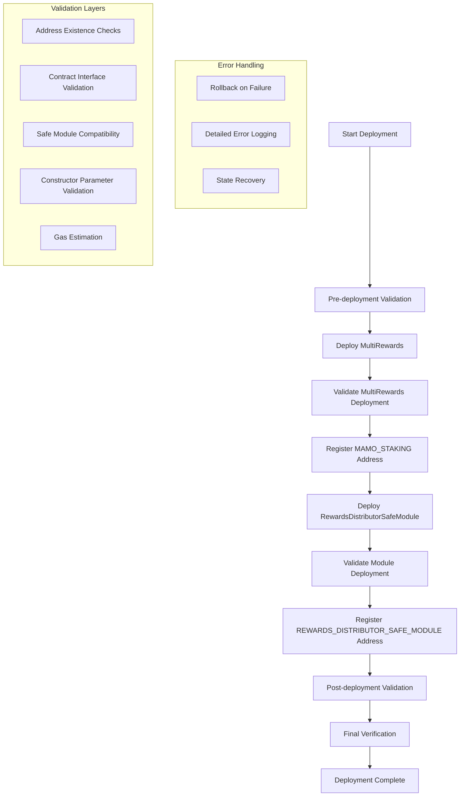

# Enhanced RewardsDistributorSafeModule Deployment Plan

## Overview

This document outlines the comprehensive deployment strategy for the RewardsDistributorSafeModule with enhanced validation steps and error handling mechanisms.

## Architecture Overview



## Enhanced Validation & Error Handling Features

### 1. Pre-deployment Validation
- **Address Existence Verification**: Validate all required addresses exist in addresses/8453.json
- **Contract Interface Checks**: Verify contracts implement expected interfaces
- **Network Validation**: Confirm deployment on correct network (Base mainnet)
- **Gas Estimation**: Pre-calculate gas requirements for all operations
- **Safe Compatibility**: Verify Safe version supports module functionality

### 2. Deployment Validation
- **Contract Bytecode Verification**: Confirm deployed contracts match expected bytecode
- **Constructor Parameter Validation**: Verify all parameters are correctly set
- **Initial State Checks**: Validate contract initial state is correct
- **Event Emission Verification**: Confirm deployment events are emitted correctly

### 3. Safe Module Integration Validation
- **Module Interface Compliance**: Verify module implements required Safe interfaces
- **Permission Validation**: Confirm module has necessary permissions
- **Transaction Data Integrity**: Validate enableModule transaction data
- **Execution Success Verification**: Confirm Safe transaction execution succeeds

### 4. Post-deployment Validation
- **Module Status Verification**: Confirm module is properly enabled in Safe
- **Functional Testing**: Execute basic module functions to verify operation
- **State Consistency Checks**: Validate all contract states are consistent
- **Integration Testing**: Test interaction between all deployed contracts

## Detailed Implementation Plan

### Phase 1: Environment Setup & Validation

```solidity

### Phase 1: MultiRewards Deployment with Validation

```solidity
function deployMultiRewards(Addresses addresses) internal returns (address multiRewards) {
    console.log("Deploying MultiRewards contract...");
    
   
    vm.startBroadcast();
    multiRewards = address(new MultiRewards());
    vm.stopBroadcast();
    
    // Validate deployment
    require(multiRewards != address(0), "MultiRewards deployment failed");
    require(multiRewards.code.length > 0, "MultiRewards bytecode not deployed");
    
    // Validate contract interface
    try IMultiRewards(multiRewards).rewardData(address(0)) {
        console.log("MultiRewards interface validation passed");
    } catch {
        revert("MultiRewards does not implement expected interface");
    }
    
    // Register address in the address registry
    addresses.addAddress("MAMO_STAKING", multiRewards, true);
    return multiRewards;
}
```

### Phase 2: RewardsDistributorSafeModule Deployment with Enhanced Validation

```solidity
function deployRewardsDistributorSafeModule(Addresses addresses) internal returns (address module) {
    console.log("Deploying RewardsDistributorSafeModule...");
    
    // Validate constructor parameters
    address safe = addresses.getAddress("MAMO_MULTISIG");
    address burnAndEarn = addresses.getAddress("BURN_AND_EARN");
    address mamoToken = addresses.getAddress("MAMO");
    address btcToken = addresses.getAddress("cbBTC");
    address nftManager = addresses.getAddress("UNISWAP_V3_POSITION_MANAGER");
    address multiRewards = addresses.getAddress("MAMO_STAKING");
    uint256 rewardDuration = 7 days;
    
    // Pre-deployment validation
    require(multiRewards != address(0), "Invalid MultiRewards address");
    require(rewardDuration >= 1 days && rewardDuration <= 30 days, "Invalid reward duration");
    
    vm.startBroadcast();
    module = address(new RewardsDistributorSafeModule{gas: estimatedGas}(
        payable(safe),
        burnAndEarn,
        multiRewards,
        mamoToken,
        btcToken,
        nftManager,
        safe, // admin
        rewardDuration
    ));
    vm.stopBroadcast();
    
    // Post-deployment validation
    require(module != address(0), "Module deployment failed");
    require(module.code.length > 0, "Module bytecode not deployed");
    
 
    
    // Register address in the address registry
    addresses.addAddress("REWARDS_DISTRIBUTOR_SAFE_MODULE", module, true);
    
    console.log("RewardsDistributorSafeModule deployed successfully at:", module);
    return module;
}
```

### Phase 3: Comprehensive Post-deployment Validation

```solidity
function validateDeployment(Addresses addresses, address multiRewards, address module) internal view {
    console.log("Performing comprehensive deployment validation...");
    
    address safe = addresses.getAddress("MAMO_MULTISIG");
    RewardsDistributorSafeModule moduleContract = RewardsDistributorSafeModule(module);
    
    // 1. Contract deployment validation
    require(multiRewards.code.length > 0, "MultiRewards not properly deployed");
    require(module.code.length > 0, "Module not properly deployed");

   // Validate constructor parameters were set correctly
    RewardsDistributorSafeModule moduleContract = RewardsDistributorSafeModule(module);
    require(address(moduleContract.mamoToken()) == mamoToken, "MAMO token address mismatch");
    require(address(moduleContract.btcToken()) == btcToken, "BTC token address mismatch");
    require(moduleContract.rewardDuration() == rewardDuration, "Reward duration mismatch");
    require(address(moduleContract.safe()) == safe, "Module Safe mismatch");
    require(address(moduleContract.multiRewards()) == multiRewards, "Module MultiRewards mismatch");
    require(moduleContract.admin() == safe, "Module admin mismatch");
    
    // 3. State consistency validation
    require(moduleContract.getCurrentState() == RewardsDistributorSafeModule.RewardState.UNINITIALIZED,
            "Module not in expected initial state");
    
    // 4. Interface compliance validation
    try moduleContract.notifyRewards() {
        // Should revert due to no pending rewards
        revert("Module should revert when no rewards pending");
    } catch Error(string memory reason) {
        require(
            keccak256(bytes(reason)) == keccak256(bytes("Rewards not in pending state")),
            "Unexpected revert reason"
        );
    }
    
    // 5. Address registry validation
    require(addresses.getAddress("MAMO_STAKING") == multiRewards, "MultiRewards not registered correctly");
    require(addresses.getAddress("REWARDS_DISTRIBUTOR_SAFE_MODULE") == module, "Module not registered correctly");
    
    console.log("All deployment validations passed successfully");
}
```

## Error Handling & Recovery Mechanisms

- **Automatic Rollback**: If any deployment step fails, automatically clean up partial deployments
- **State Preservation**: Maintain deployment state for manual recovery if needed
- **Detailed Error Logging**: Comprehensive error messages with context for debugging

## Security Considerations

### 1. Access Control Validation
- Verify admin roles are properly set
- Confirm only authorized addresses can perform critical operations
- Validate Safe multisig requirements are maintained

### 2. Parameter Validation
- Ensure all constructor parameters are within expected ranges
- Validate addresses are not zero addresses
- Confirm contract interfaces match expectations

### 3. State Consistency
- Verify initial contract states are correct
- Ensure no unexpected state changes during deployment
- Validate all contracts are properly initialized

## Usage Instructions

```bash
# Deploy with enhanced validation
forge script script/DeployRewardsDistributorSafeModule.s.sol \
    --rpc-url base \
    --verify \
    --slow
    --account $DEPLOYER
```

## Monitoring & Verification

### Post-deployment Checklist
- [ ] MultiRewards contract deployed and verified
- [ ] MultiRewards address registered as "MAMO_STAKING"
- [ ] RewardsDistributorSafeModule deployed and verified
- [ ] RewardsDistributorSafeModule address registered as "REWARDS_DISTRIBUTOR_SAFE_MODULE"
- [ ] All constructor parameters correctly set
- [ ] Module in expected initial state
- [ ] Address registry updated
- [ ] All validation tests pass
- [ ] Contracts ready for Safe module enabling in test setup

### Long-term Monitoring
- Monitor module state changes
- Track reward distribution events
- Validate Safe transaction execution
- Monitor gas usage patterns

## Conclusion

This enhanced deployment plan provides comprehensive validation and error handling to ensure a robust and secure deployment of the RewardsDistributorSafeModule system. The multi-layered validation approach minimizes deployment risks and provides clear feedback for any issues that may arise.