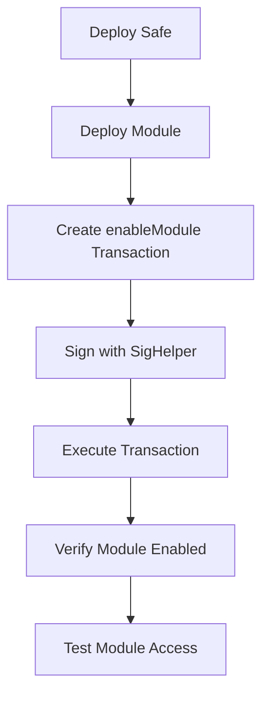

# RewardsDistributorSafeModule Integration Test Plan

## Overview

This document outlines the comprehensive integration test plan for the RewardsDistributorSafeModule contract. The tests will validate the complete workflow from Safe deployment through module enablement to reward distribution, ensuring all security constraints and state transitions work correctly in a realistic environment.

## Test Architecture

### Test Structure
- **File**: `test/RewardsDistributorSafeModule.integration.t.sol`
- **Base Class**: Extends `DeployRewardsDistributorSafeModule` deployment script
- **Pattern**: Follow existing integration test patterns from `test/Mamo.integration.t.sol`
- **Fork**: Use `--fork-url base` for Base network integration testing

### Safe Configuration
- **Multisig Setup**: 2-of-3 multisig configuration with test owners
- **Signature Mocking**: Use `SigHelper.sol` utility for transaction signing
- **Module Enablement**: Test complete Safe transaction flow for module activation

## Test Implementation Plan

### Phase 1: Infrastructure Setup

#### 1.1 Test Contract Structure
```solidity
contract RewardsDistributorSafeModuleIntegrationTest is DeployRewardsDistributorSafeModule {
    using SigHelper for Safe;
    
    Safe public safe;
    address[] public owners;
    RewardsDistributorSafeModule public module;
    MultiRewards public multiRewards;
    IERC20 public rewardToken;
}
```

#### 1.2 Setup Functions
- **`setUp()`**: Initialize test environment with Safe deployment and owner configuration
- **`_deploySafeWithOwners()`**: Deploy Safe with 2-of-3 multisig configuration
- **`_deployContracts()`**: Deploy module and dependencies using existing deployment patterns
- **`_enableModuleOnSafe()`**: Execute Safe transaction to enable module

### Phase 2: Core Integration Tests

#### 2.1 Safe Module Enablement Tests


**Test Cases:**
- `test_enableModuleOnSafe()`: Complete module enablement workflow
- `test_moduleCanCallSafeAfterEnablement()`: Verify module can execute Safe transactions
- `test_onlyEnabledModuleCanCallSafe()`: Ensure access control works correctly
- `test_enableModuleFailsWithInvalidSignatures()`: Test signature validation

#### 2.2 Reward Distribution Integration Tests
**Test Cases:**
- `test_addRewardsIntegration()`: Full workflow from reward addition to notification
- `test_notifyRewardsIntegration()`: Complete reward notification and distribution setup
- `test_multipleRewardTokensIntegration()`: Test with multiple reward tokens
- `test_rewardDistributionWithTimelock()`: Validate time-locked execution

#### 2.3 State Machine Integration Tests
**Test Cases:**
- `test_stateTransitionFlow()`: Complete state machine progression
- `test_stateValidationInIntegratedEnvironment()`: Centralized validation testing
- `test_invalidStateTransitions()`: Error handling in integrated environment
- `test_stateConsistencyAcrossTransactions()`: Multi-transaction state consistency

### Phase 3: Security Integration Tests

#### 3.1 Access Control Integration
**Test Cases:**
- `test_onlyAuthorizedCanAddRewards()`: Role-based access control
- `test_onlyModuleCanNotifyRewards()`: Module-specific permissions
- `test_unauthorizedAccessPrevention()`: Comprehensive access denial testing
- `test_roleManagementIntegration()`: Role assignment and revocation

#### 3.2 Time-lock Security Integration
**Test Cases:**
- `test_timelockEnforcementIntegration()`: End-to-end timelock validation
- `test_prematureExecutionPrevention()`: Early execution blocking
- `test_timelockBypassAttempts()`: Security bypass prevention
- `test_timelockWithMultipleRewards()`: Complex timelock scenarios

#### 3.3 Emergency Controls Integration
**Test Cases:**
- `test_pauseFunctionalityIntegration()`: Complete pause/unpause workflow
- `test_emergencyStopIntegration()`: Emergency stop mechanisms
- `test_recoverabilityIntegration()`: Recovery procedures testing
- `test_upgradeabilityIntegration()`: Upgrade path validation

### Phase 4: Edge Cases and Error Handling

#### 4.1 Contract Interaction Edge Cases
**Test Cases:**
- `test_safeWithNoModulesEnabled()`: Baseline Safe behavior
- `test_moduleWithoutSafeAccess()`: Isolated module behavior
- `test_multipleModulesEnabled()`: Module interaction scenarios
- `test_moduleDisablementIntegration()`: Module removal workflow

#### 4.2 Token Handling Edge Cases
**Test Cases:**
- `test_zeroAmountRewards()`: Zero-value reward handling
- `test_invalidTokenAddresses()`: Invalid token scenarios
- `test_tokenTransferFailures()`: Transfer failure handling
- `test_insufficientTokenBalance()`: Balance validation

#### 4.3 Network and Gas Edge Cases
**Test Cases:**
- `test_gasLimitConstraints()`: Gas optimization validation
- `test_networkCongestionScenarios()`: High gas price scenarios
- `test_transactionRevertHandling()`: Revert scenario management
- `test_reentrancyProtection()`: Reentrancy attack prevention

### Phase 5: Performance and Gas Optimization

#### 5.1 Gas Usage Analysis
**Test Cases:**
- `test_gasUsageOptimization()`: Gas consumption measurement
- `test_batchOperationEfficiency()`: Batch vs individual operations
- `test_storageOptimization()`: Storage access patterns
- `test_computationEfficiency()`: Algorithm efficiency validation

#### 5.2 Scalability Testing
**Test Cases:**
- `test_largeNumberOfRewards()`: High-volume reward handling
- `test_longRunningOperations()`: Extended operation scenarios
- `test_memoryUsageOptimization()`: Memory efficiency validation
- `test_concurrentOperations()`: Parallel operation handling

## Test Data and Scenarios

### Test Owners Configuration
```solidity
address[] memory owners = new address[](3);
owners[0] = makeAddr("owner1");
owners[1] = makeAddr("owner2"); 
owners[2] = makeAddr("owner3");
```

### Reward Token Setup
- **Primary Token**: Mock ERC20 with 18 decimals
- **Secondary Token**: Mock ERC20 with 6 decimals (USDC-like)
- **Test Amounts**: Various amounts from 1 wei to 1000 tokens

### Time-lock Scenarios
- **Standard Timelock**: 24 hours (86400 seconds)
- **Extended Timelock**: 7 days (604800 seconds)
- **Minimum Timelock**: 1 hour (3600 seconds)

## Validation Criteria

### Success Criteria
1. **Module Enablement**: Safe successfully enables module with proper signatures
2. **State Transitions**: All state machine transitions work correctly
3. **Access Control**: Only authorized addresses can perform restricted operations
4. **Time-lock Enforcement**: Time-locked operations respect delay requirements
5. **Token Handling**: Reward tokens are handled correctly throughout the workflow
6. **Error Handling**: Invalid operations fail gracefully with appropriate error messages
7. **Gas Efficiency**: Operations complete within reasonable gas limits
8. **Security**: No unauthorized access or bypass mechanisms


## Implementation Strategy

### Development Phases
1. **Phase 1**: Basic infrastructure and Safe setup (2-3 hours)
2. **Phase 2**: Core integration tests (4-5 hours)
3. **Phase 3**: Security integration tests (3-4 hours)
4. **Phase 4**: Edge cases and error handling (2-3 hours)
5. **Phase 5**: Performance optimization (1-2 hours)

### Testing Approach
- **Incremental Development**: Build tests incrementally, validating each component
- **Continuous Integration**: Run tests frequently during development
- **Documentation**: Document any discovered issues or unexpected behaviors
- **Code Review**: Review test implementation for completeness and accuracy

## Dependencies and Requirements

### External Dependencies
- **Safe Contracts**: Safe proxy factory and implementation contracts
- **SigHelper Utility**: For mocked signature generation
- **Foundry Framework**: For test execution and gas analysis
- **Base Network Fork**: For realistic network conditions

### Internal Dependencies
- **DeployRewardsDistributorSafeModule**: Deployment script base class
- **RewardsDistributorSafeModule**: Main contract under test
- **MultiRewards**: Reward distribution contract
- **Addresses System**: Contract address management

## Risk Mitigation

### Identified Risks
1. **Signature Validation**: Ensure SigHelper generates valid signatures
2. **State Consistency**: Maintain state consistency across complex scenarios
3. **Gas Limits**: Prevent test failures due to gas limit issues
4. **Network Dependencies**: Handle Base network fork reliability

### Mitigation Strategies
1. **Comprehensive Validation**: Validate all assumptions and preconditions
2. **Error Handling**: Implement robust error handling and recovery
3. **Gas Monitoring**: Monitor and optimize gas usage throughout testing
4. **Fallback Mechanisms**: Implement fallback strategies for network issues

## Success Metrics

### Coverage Metrics
- **Function Coverage**: 100% of public/external functions tested
- **Branch Coverage**: 95%+ of conditional branches covered
- **State Coverage**: All state machine states and transitions tested
- **Integration Coverage**: All major integration paths validated

### Quality Metrics
- **Test Reliability**: 99%+ test pass rate
- **Security**: Zero security vulnerabilities identified
- **Documentation**: Complete test documentation and comments

This comprehensive integration test plan ensures thorough validation of the RewardsDistributorSafeModule in a realistic environment, covering all critical functionality, security requirements, and edge cases while maintaining high performance standards.