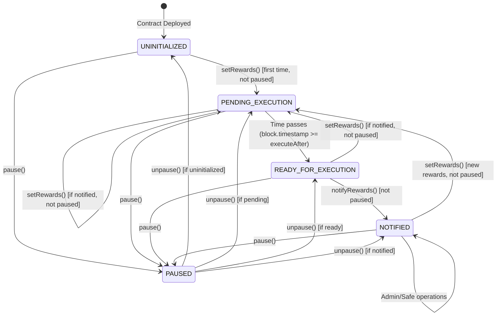

# RewardsDistributorSafeModule State Machine Analysis

## Contract States

### 1. **UNINITIALIZED**
- **Description**: Contract deployed but no rewards have been set
- **Conditions**: `pendingRewards.executeAfter == 0`
- **Available Actions**:
  - `setRewards()` (admin only, when not paused)
  - `pause()` (safe only)
  - `unpause()` (safe only)

### 2. **PENDING_EXECUTION**
- **Description**: Rewards are set but not yet ready for execution
- **Conditions**:
  - `pendingRewards.executeAfter > 0`
  - `!pendingRewards.isNotified`
  - `block.timestamp < pendingRewards.executeAfter`
- **Available Actions**:
  - `setRewards()` (admin only, if current rewards notified and not paused)
  - `pause()` (safe only)
  - `unpause()` (safe only)
  - Wait for execution time

### 3. **READY_FOR_EXECUTION**
- **Description**: Rewards are ready to be executed
- **Conditions**:
  - `pendingRewards.executeAfter > 0`
  - `!pendingRewards.isNotified`
  - `block.timestamp >= pendingRewards.executeAfter`
- **Available Actions**:
  - `notifyRewards()` (anyone, when not paused)
  - `setRewards()` (admin only, if current rewards notified and not paused)
  - `pause()` (safe only)
  - `unpause()` (safe only)

### 4. **NOTIFIED**
- **Description**: Current rewards have been notified to MultiRewards
- **Conditions**: `pendingRewards.isNotified == true`
- **Available Actions**:
  - `setRewards()` (admin only, when not paused)
  - `emergencyTransferNFT()` (safe only)
  - `setAdmin()` (safe only)
  - `setRewardDuration()` (safe only)
  - `pause()` (safe only)
  - `unpause()` (safe only)

### 5. **PAUSED**
- **Description**: Contract operations are paused for emergency situations
- **Conditions**: `paused() == true`
- **Available Actions**:
  - `unpause()` (safe only)
  - `emergencyTransferNFT()` (safe only)
  - `setAdmin()` (safe only)
  - `setRewardDuration()` (safe only)
- **Restricted Actions**: `setRewards()` and `notifyRewards()` are blocked

## State Transitions

## Trigger Conditions

### Time-Based Triggers
- **Execution Window Opens**: `block.timestamp >= pendingRewards.executeAfter`
- **Reward Duration**: Configurable between 1-30 days

### Admin Triggers
- **Set New Rewards**: `setRewards()` - Only when previous rewards notified
- **Update Admin**: `setAdmin()` - Safe only
- **Update Duration**: `setRewardDuration()` - Safe only

### Execution Triggers
- **Execute Rewards**: `notifyRewards()` - Anyone can call when ready and not paused
- **Emergency NFT Transfer**: `emergencyTransferNFT()` - Safe only

### Pause Control Triggers
- **Pause Contract**: `pause()` - Safe only, blocks setRewards() and notifyRewards()
- **Unpause Contract**: `unpause()` - Safe only, restores normal operations

### Safe Module Triggers
- **Token Approval**: Internal `_approveTokenFromSafe()`
- **Reward Setup**: Internal `_setupRewardToken()`
- **Reward Notification**: Internal `_notifyRewardAmountFromSafe()`

## Critical State Invariants

1. **Notification Order**: Rewards must be notified before new ones can be set
2. **Time Constraint**: `executeAfter` must be in the future when setting rewards
3. **Sequential Execution**: New `executeAfter` must be greater than previous
4. **Amount Validation**: At least one reward amount (BTC or MAMO) must be > 0
5. **Balance Requirements**: Safe must have sufficient token balances before notification
6. **State Consistency**: `isNotified` flag tracks notification status accurately
7. **Pause State**: When paused, `setRewards()` and `notifyRewards()` are blocked
8. **Pause Authority**: Only Safe can pause/unpause the contract

## Emergency States

### Admin Recovery
- **Trigger**: `setAdmin()` called by Safe
- **Purpose**: Change admin if compromised
- **State**: Can be called in any state

## Security Considerations by State

### UNINITIALIZED
- ✅ Safe from execution attacks
- ⚠️ Admin can set malicious initial rewards
- ✅ Can be paused to prevent operations

### PENDING_EXECUTION
- ⚠️ Front-running risk on `notifyRewards()`
- ✅ Time-locked protection active
- ✅ Can be paused to halt operations

### READY_FOR_EXECUTION
- ⚠️ MEV extraction opportunities
- ⚠️ Anyone can trigger execution
- ⚠️ Potential for sandwich attacks
- ✅ Can be paused to prevent execution

### NOTIFIED
- ✅ Most secure state
- ✅ Ready for next reward cycle
- ✅ Rewards successfully distributed to MultiRewards contract
- ✅ Can be paused to prevent new reward setting

### PAUSED
- ✅ Maximum security state
- ✅ All critical operations blocked
- ✅ Emergency functions still available
- ✅ Only Safe can restore operations
- ✅ Prevents MEV attacks and front-running