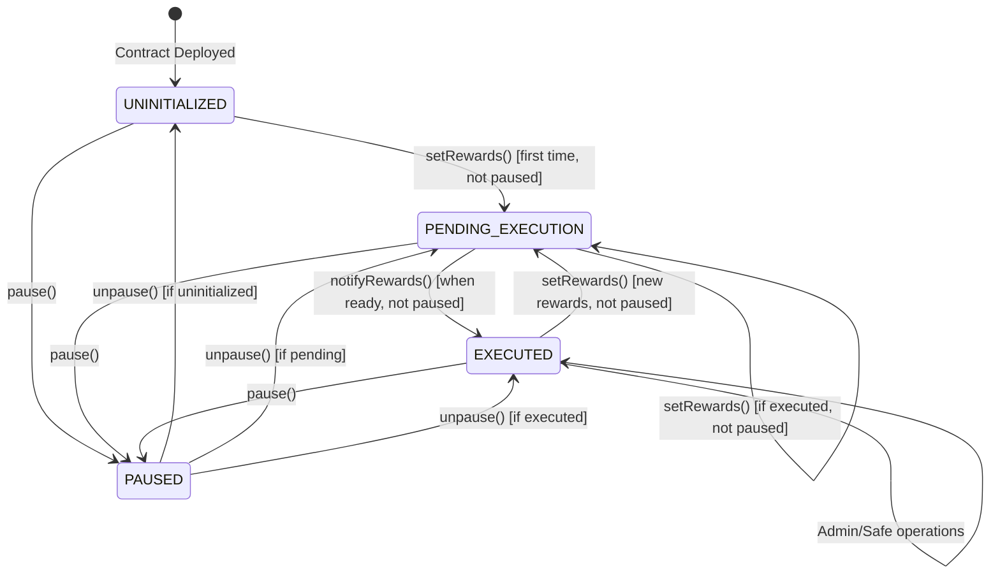

# RewardsDistributorSafeModule State Machine Analysis

## Contract States

The contract now uses a simplified 3-state machine with centralized state determination through the `getCurrentState()` function.

### 1. **UNINITIALIZED**
- **Description**: Contract deployed but no rewards have been set
- **Conditions**: `pendingRewards.notifyAfter == 0`
- **Available Actions**:
  - `setRewards()` (admin only, when not paused)
  - `pause()` (safe only)
  - `unpause()` (safe only)

### 2. **PENDING_EXECUTION**
- **Description**: Rewards are set and waiting for execution (includes time-locked period)
- **Conditions**:
  - `pendingRewards.notifyAfter > 0`
  - `!pendingRewards.isNotified`
- **Available Actions**:
  - `notifyRewards()` (anyone, when `block.timestamp >= pendingRewards.notifyAfter` and not paused)
  - `setRewards()` (admin only, if current rewards executed and not paused)
  - `pause()` (safe only)
  - `unpause()` (safe only)
  - Wait for execution time

### 3. **EXECUTED**
- **Description**: Current rewards have been executed and notified to MultiRewards
- **Conditions**: `pendingRewards.isNotified == true`
- **Available Actions**:
  - `setRewards()` (admin only, when not paused)
  - `emergencyTransferNFT()` (safe only)
  - `setAdmin()` (safe only)
  - `setRewardDuration()` (safe only)
  - `pause()` (safe only)
  - `unpause()` (safe only)

### **PAUSED** (Cross-cutting State)
- **Description**: Contract operations are paused for emergency situations
- **Conditions**: `paused() == true`
- **Available Actions**:
  - `unpause()` (safe only)
  - `emergencyTransferNFT()` (safe only)
  - `setAdmin()` (safe only)
  - `setRewardDuration()` (safe only)
- **Restricted Actions**: `setRewards()` and `notifyRewards()` are blocked

## State Transitions

## Centralized State Management

### State Query Functions
- **`getCurrentState()`**: Returns the current RewardState enum value
- **`isReadyForExecution()`**: Returns true if rewards can be executed now
- **`getExecutionTimestamp()`**: Returns the timestamp when rewards become executable
- **`isPaused()`**: Returns the pause status from OpenZeppelin Pausable

### State Determination Logic
All state-dependent functions now use the centralized `getCurrentState()` function:
- `notifyRewards()` checks `getCurrentState() == RewardState.PENDING_EXECUTION`
- `setRewards()` checks `getCurrentState() == RewardState.UNINITIALIZED` or `RewardState.EXECUTED`
- `isReadyForExecution()` uses `getCurrentState() == RewardState.PENDING_EXECUTION`

## Trigger Conditions

### Time-Based Triggers
- **Execution Window Opens**: `block.timestamp >= pendingRewards.notifyAfter`
- **Reward Duration**: Configurable between 1-30 days

### Admin Triggers
- **Set New Rewards**: `setRewards()` - Only when previous rewards executed or uninitialized
- **Update Admin**: `setAdmin()` - Safe only
- **Update Duration**: `setRewardDuration()` - Safe only

### Execution Triggers
- **Execute Rewards**: `notifyRewards()` - Anyone can call when ready and not paused
- **Emergency NFT Transfer**: `emergencyTransferNFT()` - Safe only

### Pause Control Triggers
- **Pause Contract**: `pause()` - Safe only, blocks setRewards() and notifyRewards()
- **Unpause Contract**: `unpause()` - Safe only, restores normal operations

### Safe Module Triggers
- **Token Approval**: Internal `_approveTokenFromSafe()`
- **Reward Setup**: Internal `_setupRewardToken()`
- **Reward Notification**: Internal `_notifyRewardAmountFromSafe()`

## Critical State Invariants

1. **Execution Order**: Rewards must be executed before new ones can be set
2. **Time Constraint**: `notifyAfter` must be in the future when setting rewards
3. **Sequential Execution**: New `notifyAfter` must be greater than previous
4. **Amount Validation**: At least one reward amount (BTC or MAMO) must be > 0
5. **Balance Requirements**: Safe must have sufficient token balances before notification
6. **State Consistency**: `isNotified` flag tracks execution status accurately
7. **Pause State**: When paused, `setRewards()` and `notifyRewards()` are blocked
8. **Pause Authority**: Only Safe can pause/unpause the contract
9. **Centralized Logic**: All state checks use `getCurrentState()` for consistency

## Emergency States

### Admin Recovery
- **Trigger**: `setAdmin()` called by Safe
- **Purpose**: Change admin if compromised
- **State**: Can be called in any state

## Security Considerations by State

### UNINITIALIZED
- ✅ Safe from execution attacks
- ⚠️ Admin can set malicious initial rewards
- ✅ Can be paused to prevent operations

### PENDING_EXECUTION
- ⚠️ Front-running risk on `notifyRewards()`
- ✅ Time-locked protection active
- ✅ Can be paused to halt operations
- ✅ Centralized state validation prevents inconsistencies

### EXECUTED
- ✅ Most secure state
- ✅ Ready for next reward cycle
- ✅ Rewards successfully distributed to MultiRewards contract
- ✅ Can be paused to prevent new reward setting

### PAUSED
- ✅ Maximum security state
- ✅ All critical operations blocked
- ✅ Emergency functions still available
- ✅ Only Safe can restore operations
- ✅ Prevents MEV attacks and front-running

## Optimization Benefits

### Simplified State Model
- **Reduced Complexity**: Eliminated redundant READY_FOR_EXECUTION state
- **Cleaner Logic**: PENDING_EXECUTION handles both waiting and ready states
- **Centralized Validation**: All state checks use consistent logic

### Improved Maintainability
- **Single Source of Truth**: `getCurrentState()` function centralizes state logic
- **Consistent Behavior**: All functions use the same state determination
- **Easier Testing**: Fewer state combinations to validate

### Enhanced Security
- **Reduced Attack Surface**: Fewer state transitions to exploit
- **Consistent Validation**: Centralized state checks prevent edge cases
- **Clear State Boundaries**: Well-defined state transitions