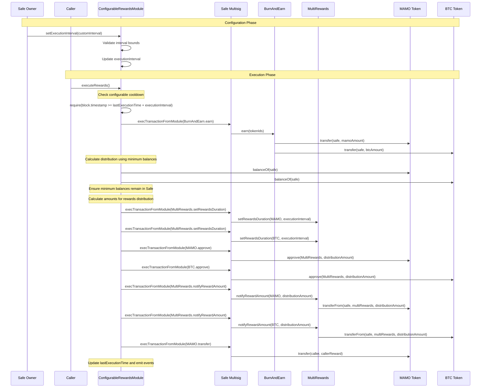

## Architecture

### Core Components

#### 1. ConfigurableRewardsModule Contract
```solidity
contract ConfigurableRewardsModule {
    // ============ CONSTANTS ============
    uint256 public constant BASIS_POINTS_DENOMINATOR = 10000;
    uint256 public constant MAX_CALLER_REWARD_BPS = 1000; // 10%
    uint256 public constant MIN_EXECUTION_INTERVAL = 1 hours;
    uint256 public constant MAX_EXECUTION_INTERVAL = 1 month;
    
    // ============ STATE VARIABLES ============
    // Configuration
    mapping(uint256 => bool) public authorizedTokenIds;
    uint256 public mamoMinBalance;  // Minimum balance to retain in Safe
    uint256 public btcMinBalance;   // Minimum balance to retain in Safe
    uint256 public callerRewardBps;
    uint256 public lastExecutionTime;
    uint256 public executionInterval;
    
    // Contract addresses
    address public immutable burnAndEarn;
    address public immutable multiRewards;
    address public immutable mamoToken;
    address public immutable btcToken;
    address public immutable safe;
    
    // ============ EVENTS ============
    event ExecutionIntervalUpdated(uint256 oldInterval, uint256 newInterval, address updatedBy);
    event RewardsExecuted(uint256 timestamp, uint256 mamoDistributed, uint256 btcDistributed, uint256 callerReward);
    event ConfigurationUpdated(string parameter, uint256 oldValue, uint256 newValue, address updatedBy);
}
```

#### 2. Enhanced Execution Flow



#### 3. Key Functions

##### Main Execution Function (Enhanced)
```solidity
function executeRewards() external {
    require(block.timestamp >= lastExecutionTime + executionInterval, "Execution interval not met");
    
    // 1. Collect LP fees
    _collectLPFees();
    
    // 2. Calculate token balances and distribution
    (uint256 mamoDistribution, uint256 btcDistribution, uint256 callerReward) = _calculateDistributions();
    
    // 3. Set rewards duration to match current interval
    _setRewardsDuration(executionInterval);
    
    // 4. Approve and notify reward amounts
    _distributeRewards(mamoDistribution, btcDistribution);
    
    // 5. Reward caller
    _rewardCaller(callerReward);
    
    lastExecutionTime = block.timestamp;
    
    emit RewardsExecuted(block.timestamp, mamoDistribution, btcDistribution, callerReward);
}
```

##### Enhanced Token Distribution Logic with Minimum Balances
```solidity
function _calculateDistributions() internal view returns (uint256 mamoDist, uint256 btcDist, uint256 callerReward) {
    uint256 mamoBalance = IERC20(mamoToken).balanceOf(safe);
    uint256 btcBalance = IERC20(btcToken).balanceOf(safe);
    
    // Calculate distribution amounts ensuring minimum balances remain
    mamoDist = mamoBalance > mamoMinBalance ? mamoBalance - mamoMinBalance : 0;
    btcDist = btcBalance > btcMinBalance ? btcBalance - btcMinBalance : 0;
    
    // Calculate caller reward from MAMO distribution using named constant
    callerReward = (mamoDist * callerRewardBps) / BASIS_POINTS_DENOMINATOR;
    mamoDist -= callerReward;
}
```

##### Enhanced Rewards Duration Setting
```solidity
function _setRewardsDuration(uint256 duration) internal {
    bytes memory setMamoDurationData = abi.encodeWithSelector(
        IMultiRewards.setRewardsDuration.selector,
        mamoToken,
        duration
    );
    require(ISafe(safe).execTransactionFromModule(multiRewards, 0, setMamoDurationData, Enum.Operation.Call));
    
    bytes memory setBtcDurationData = abi.encodeWithSelector(
        IMultiRewards.setRewardsDuration.selector,
        btcToken,
        duration
    );
    require(ISafe(safe).execTransactionFromModule(multiRewards, 0, setBtcDurationData, Enum.Operation.Call));
}
```

##### Approval and Distribution (Enhanced)
```solidity
function _distributeRewards(uint256 mamoAmount, uint256 btcAmount) internal {
    // Approve MultiRewards to spend tokens
    bytes memory approveMamoData = abi.encodeWithSelector(
        IERC20.approve.selector, 
        multiRewards, 
        mamoAmount
    );
    require(ISafe(safe).execTransactionFromModule(mamoToken, 0, approveMamoData, Enum.Operation.Call));
    
    bytes memory approveBtcData = abi.encodeWithSelector(
        IERC20.approve.selector, 
        multiRewards, 
        btcAmount
    );
    require(ISafe(safe).execTransactionFromModule(btcToken, 0, approveBtcData, Enum.Operation.Call));
    
    // Notify reward amounts (this will transfer tokens)
    bytes memory notifyMamoData = abi.encodeWithSelector(
        IMultiRewards.notifyRewardAmount.selector,
        mamoToken,
        mamoAmount
    );
    require(ISafe(safe).execTransactionFromModule(multiRewards, 0, notifyMamoData, Enum.Operation.Call));
    
    bytes memory notifyBtcData = abi.encodeWithSelector(
        IMultiRewards.notifyRewardAmount.selector,
        btcToken,
        btcAmount
    );
    require(ISafe(safe).execTransactionFromModule(multiRewards, 0, notifyBtcData, Enum.Operation.Call));
}
```

#### 4. Interval Configuration Management

##### Core Interval Configuration Functions
```solidity
/**
 * @notice Set execution interval for rewards distribution
 * @param newInterval New interval in seconds
 * @dev Only Safe owners can call this function
 */
function setExecutionInterval(uint256 newInterval) external {
    require(ISafe(safe).isOwner(msg.sender), "Only Safe owners");
    require(newInterval >= MIN_EXECUTION_INTERVAL, "Interval too short");
    require(newInterval <= MAX_EXECUTION_INTERVAL, "Interval too long");
    
    uint256 oldInterval = executionInterval;
    executionInterval = newInterval;
    
    emit ExecutionIntervalUpdated(oldInterval, newInterval, msg.sender);
}

/**
 * @notice Get time remaining until next execution
 * @return seconds until next execution is allowed
 */
function getTimeUntilNextExecution() external view returns (uint256) {
    uint256 nextExecutionTime = lastExecutionTime + executionInterval;
    if (block.timestamp >= nextExecutionTime) {
        return 0;
    }
    return nextExecutionTime - block.timestamp;
}

/**
 * @notice Check if execution is currently allowed
 * @return true if execution can proceed
 */
function canExecute() external view returns (bool) {
    return block.timestamp >= lastExecutionTime + executionInterval;
}
```

##### Enhanced Configuration Functions
```solidity
function setTokenId(uint256 tokenId, bool authorized) external {
    require(ISafe(safe).isOwner(msg.sender), "Only Safe owners");
    authorizedTokenIds[tokenId] = authorized;
    
    emit ConfigurationUpdated("tokenId", authorized ? 0 : 1, authorized ? 1 : 0, msg.sender);
}

function setMinimumBalances(uint256 _mamoMinBalance, uint256 _btcMinBalance) external {
    require(ISafe(safe).isOwner(msg.sender), "Only Safe owners");
    
    uint256 oldMamoMinBalance = mamoMinBalance;
    uint256 oldBtcMinBalance = btcMinBalance;
    
    mamoMinBalance = _mamoMinBalance;
    btcMinBalance = _btcMinBalance;
    
    emit ConfigurationUpdated("mamoMinBalance", oldMamoMinBalance, _mamoMinBalance, msg.sender);
    emit ConfigurationUpdated("btcMinBalance", oldBtcMinBalance, _btcMinBalance, msg.sender);
}

function setCallerRewardPercentage(uint256 _callerRewardBps) external {
    require(ISafe(safe).isOwner(msg.sender), "Only Safe owners");
    require(_callerRewardBps <= MAX_CALLER_REWARD_BPS, "Max 10% caller reward");
    
    uint256 oldCallerReward = callerRewardBps;
    callerRewardBps = _callerRewardBps;
    
    emit ConfigurationUpdated("callerRewardBps", oldCallerReward, _callerRewardBps, msg.sender);
}
```

## Interval Configuration API

### Custom Interval Configuration
```solidity
// Custom intervals with validation
setExecutionInterval(12 hours);           // Every 12 hours
setExecutionInterval(3 days);             // Every 3 days
setExecutionInterval(14 days);            // Bi-weekly
setExecutionInterval(30 days);            // Monthly
setExecutionInterval(7 days + 12 hours);  // Weekly + 12 hours
```

### Interval Bounds and Validation
- **Minimum Interval**: 1 hour (prevents spam and excessive gas costs)
- **Maximum Interval**: 1 month (prevents indefinite delays)
- **Validation**: All intervals must be within bounds and set by Safe owners only

### Monitoring Functions
```solidity
// Check execution readiness
bool canRun = canExecute();

// Get time until next execution
uint256 timeRemaining = getTimeUntilNextExecution();

// Get current interval
uint256 currentInterval = executionInterval;
```

## Security Considerations

### Access Control Security
- **Owner-Only Configuration**: All interval changes require Safe owner authorization
- **Multi-signature Protection**: Changes go through Safe's multi-sig process
- **Event Logging**: All configuration changes are logged with timestamps and initiators

### Interval Security Measures
```solidity
// Anti-spam protection
require(newInterval >= MIN_EXECUTION_INTERVAL, "Prevents spam attacks");

// Reasonable upper bound
require(newInterval <= MAX_EXECUTION_INTERVAL, "Prevents indefinite delays");

// Owner verification
require(ISafe(safe).isOwner(msg.sender), "Prevents unauthorized changes");
```

### Gas Optimization Security
- **Named Constants**: All magic numbers replaced with gas-efficient constants
- **Batch Operations**: Multiple configuration changes can be batched
- **Efficient Calculations**: Using constants reduces gas costs in calculations

### Token Safety
- **Critical**: Minimum balance retention happens BEFORE `notifyRewardAmount` calls
- **Critical**: Proper approval flow before token transfers
- Validation of minimum balances to ensure Safe always retains specified amounts
- Protection against token drainage

### Execution Safety
- **Configurable Cooldown**: Prevents spam based on set interval
- **Atomic Execution**: All steps execute atomically or revert completely
- **Proper Error Handling**: Comprehensive reversion on failures
- **Reentrancy Protection**: Standard reentrancy guards applied

## Example Usage Patterns

### High-Frequency Trading Setup
```solidity
// For active trading strategies
setExecutionInterval(1 hours);
setCallerRewardPercentage(500); // 5% to incentivize frequent execution
setMinimumBalances(1000e18, 0.1e8); // Keep 1000 MAMO and 0.1 BTC minimum
```

### Conservative Long-term Setup
```solidity
// For long-term holding strategies
setExecutionInterval(30 days);
setMinimumBalances(10000e18, 1e8); // Keep 10,000 MAMO and 1 BTC minimum
setCallerRewardPercentage(100); // 1% caller reward
```

### Balanced Setup
```solidity
// Balanced approach
setExecutionInterval(7 days);
setMinimumBalances(5000e18, 0.5e8); // Keep 5,000 MAMO and 0.5 BTC minimum
setCallerRewardPercentage(250); // 2.5% caller reward
```

### Custom Interval Examples
```solidity
// Business hours execution (every 8 hours)
setExecutionInterval(8 hours);

// Bi-weekly execution
setExecutionInterval(14 days);

// Custom 10-day cycle
setExecutionInterval(10 days);

// Twice daily execution
setExecutionInterval(12 hours);
```

## Implementation Phases (Updated)

### Phase 1: Core Module Structure with Intervals
- [x] Basic Safe module setup with proper inheritance
- [x] Configurable interval mechanism replacing fixed weekly cooldown
- [x] Enhanced access control for configuration functions
- [x] Comprehensive event definitions
- [x] Named constants implementation

### Phase 2: Enhanced Configuration System
- [x] Interval management functions (custom intervals only)
- [x] Token ID management functions
- [x] Minimum balance configuration replacing percentage retention
- [x] Caller reward configuration with bounds
- [x] Advanced parameter validation

### Phase 3: LP Fee Collection (Unchanged)
- [ ] Integration with BurnAndEarn contract
- [ ] Token ID iteration and fee collection
- [ ] Error handling for failed collections

### Phase 4: Enhanced Token Distribution Logic
- [x] Balance calculation functions using constants
- [x] Minimum balance calculations replacing percentage retention
- [x] Distribution amount calculations
- [x] Caller reward calculations with named constants

### Phase 5: Dynamic MultiRewards Integration
- [x] Dynamic rewards duration setting based on execution interval
- [x] Token approval mechanism
- [x] Reward amount notification
- [x] Proper error handling

### Phase 6: Security & Testing (Enhanced)
- [ ] Reentrancy protection
- [ ] Enhanced input validation for intervals
- [ ] Comprehensive unit tests for all interval scenarios
- [ ] Integration tests with Safe
- [ ] Gas optimization testing

### Phase 7: Deployment & Documentation (Enhanced)
- [ ] Deployment scripts with interval configuration
- [ ] Safe module installation guide
- [ ] Interval configuration usage documentation
- [ ] Emergency procedures for interval changes

## Enhanced Security Considerations

### Interval Change Security
- **Immediate Effect**: Interval changes take effect immediately for next execution
- **No Retroactive Changes**: Cannot affect already scheduled executions
- **Owner Consensus**: Multi-sig requirements for interval modifications
- **Event Auditing**: All changes logged for transparency

### Gas Cost Management
```solidity
// Gas-efficient constant usage
uint256 distribution = balance > minBalance ? balance - minBalance : 0;
// vs inefficient magic number calculations
```

### Spam Prevention
- **Minimum Interval**: 1-hour minimum prevents excessive execution
- **Caller Incentives**: Balanced rewards prevent spam while encouraging execution
- **Gas Cost Consideration**: Shorter intervals increase gas costs naturally

### Access Control
- Only Safe owners can modify configuration
- Anyone can trigger execution (with configurable cooldown)
- Module must be properly enabled on Safe

## Key Changes from Original Plan

1. **Configurable Intervals**: Replaced fixed 7-day cycle with flexible intervals (no predefined constants)
2. **Named Constants**: Eliminated all hardcoded `10000` values with `BASIS_POINTS_DENOMINATOR`
3. **Minimum Balance System**: Replaced percentage retention with minimum balance approach
4. **Token Naming**: Changed from "WELL" to "MAMO" token throughout
5. **Simplified Configuration**: Removed predefined interval constants, allowing any custom interval
6. **Enhanced Security**: Added comprehensive validation and access controls
7. **Gas Optimization**: Constants reduce gas costs and improve maintainability
8. **Comprehensive Events**: Enhanced logging for all configuration changes
9. **Dynamic Rewards Duration**: Rewards duration automatically matches execution interval

## Dependencies

- Safe Smart Account contracts
- BurnAndEarn contract interface
- MultiRewards contract interface
- OpenZeppelin SafeERC20 library
- Solidity 0.8.28 compatibility

## Testing Strategy

### Unit Tests
- Test each internal function in isolation
- Mock external contract calls
- Validate calculation logic with named constants
- Test access control mechanisms
- Test interval configuration functions
- Test minimum balance calculations

### Integration Tests
- Test with actual [`BurnAndEarn`](src/BurnAndEarn.sol) and [`MultiRewards`](src/MultiRewards.sol) contracts
- Verify token flow end-to-end
- Test Safe module integration
- Validate configurable cooldown mechanism
- Test various interval scenarios (hourly, daily, weekly, monthly, custom)
- Test minimum balance enforcement

### Security Tests
- Test reentrancy protection
- Validate access control for interval changes
- Test edge cases (zero balances, failed calls)
- Test with malicious token contracts
- Validate interval bounds and spam prevention
- Test minimum balance edge cases

This enhanced plan provides a robust, flexible, and secure foundation for the configurable execution interval system with minimum balance retention while maintaining backward compatibility and improving gas efficiency through the use of named constants.