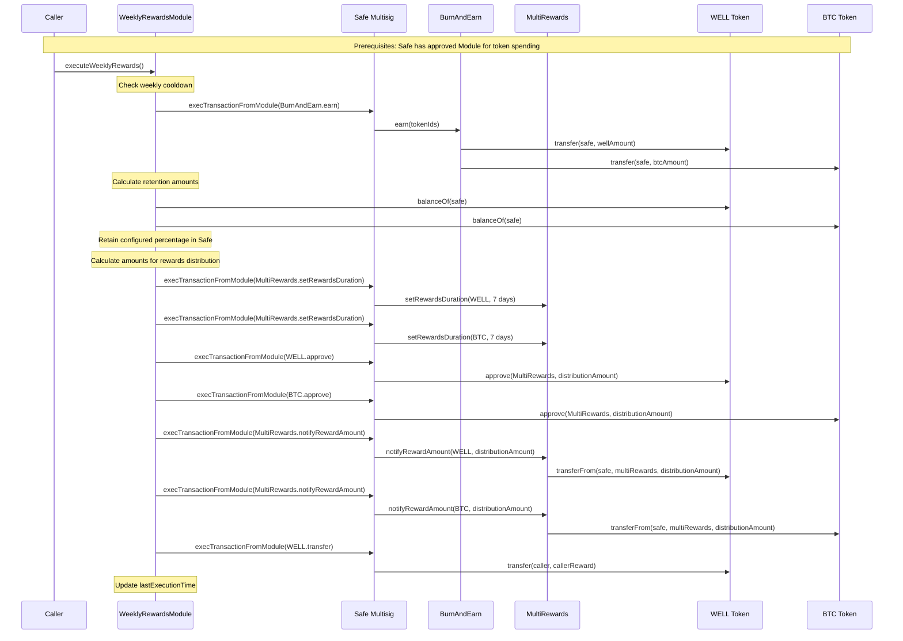

# Weekly Rewards Module - Updated Architectural Plan

## Overview
A Safe module that automates weekly reward distribution by collecting LP fees and distributing them to stakers, with proper token retention and approval handling.

## Critical Requirements (Updated)
- **Token Retention BEFORE Transfer**: Must retain configured percentage of tokens before calling `notifyRewardAmount` since this function transfers tokens away from the Safe
- **Prior Approval Required**: Safe must approve the module to spend tokens before execution
- **Weekly Cooldown**: Callable once per week by anyone
- **Configurable Parameters**: Token IDs, retention percentages, caller rewards

## Architecture

### Core Components

#### 1. WeeklyRewardsModule Contract
```solidity
contract WeeklyRewardsModule {
    // Configuration
    mapping(uint256 => bool) public authorizedTokenIds;
    uint256 public wellRetentionBps;  // Basis points (e.g., 1000 = 10%)
    uint256 public btcRetentionBps;
    uint256 public callerRewardBps;
    uint256 public lastExecutionTime;
    uint256 public constant EXECUTION_INTERVAL = 7 days;
    
    // Contract addresses
    address public immutable burnAndEarn;
    address public immutable multiRewards;
    address public immutable wellToken;
    address public immutable btcToken;
    address public immutable safe;
}
```

#### 2. Execution Flow (Updated)



#### 3. Key Functions

##### Main Execution Function
```solidity
function executeWeeklyRewards() external {
    require(block.timestamp >= lastExecutionTime + EXECUTION_INTERVAL, "Too early");
    
    // 1. Collect LP fees
    _collectLPFees();
    
    // 2. Calculate token balances and retention
    (uint256 wellDistribution, uint256 btcDistribution, uint256 callerReward) = _calculateDistributions();
    
    // 3. Set rewards duration
    _setRewardsDuration();
    
    // 4. Approve and notify reward amounts
    _distributeRewards(wellDistribution, btcDistribution);
    
    // 5. Reward caller
    _rewardCaller(callerReward);
    
    lastExecutionTime = block.timestamp;
}
```

##### Token Distribution Logic (Updated)
```solidity
function _calculateDistributions() internal view returns (uint256 wellDist, uint256 btcDist, uint256 callerReward) {
    uint256 wellBalance = IERC20(wellToken).balanceOf(safe);
    uint256 btcBalance = IERC20(btcToken).balanceOf(safe);
    
    // Calculate retention amounts (stay in Safe)
    uint256 wellRetention = (wellBalance * wellRetentionBps) / 10000;
    uint256 btcRetention = (btcBalance * btcRetentionBps) / 10000;
    
    // Calculate distribution amounts (go to MultiRewards)
    wellDist = wellBalance - wellRetention;
    btcDist = btcBalance - btcRetention;
    
    // Calculate caller reward from WELL distribution
    callerReward = (wellDist * callerRewardBps) / 10000;
    wellDist -= callerReward;
}
```

##### Approval and Distribution (New)
```solidity
function _distributeRewards(uint256 wellAmount, uint256 btcAmount) internal {
    // Approve MultiRewards to spend tokens
    bytes memory approveWellData = abi.encodeWithSelector(
        IERC20.approve.selector, 
        multiRewards, 
        wellAmount
    );
    require(ISafe(safe).execTransactionFromModule(wellToken, 0, approveWellData, Enum.Operation.Call));
    
    bytes memory approveBtcData = abi.encodeWithSelector(
        IERC20.approve.selector, 
        multiRewards, 
        btcAmount
    );
    require(ISafe(safe).execTransactionFromModule(btcToken, 0, approveBtcData, Enum.Operation.Call));
    
    // Notify reward amounts (this will transfer tokens)
    bytes memory notifyWellData = abi.encodeWithSelector(
        IMultiRewards.notifyRewardAmount.selector,
        wellToken,
        wellAmount
    );
    require(ISafe(safe).execTransactionFromModule(multiRewards, 0, notifyWellData, Enum.Operation.Call));
    
    bytes memory notifyBtcData = abi.encodeWithSelector(
        IMultiRewards.notifyRewardAmount.selector,
        btcToken,
        btcAmount
    );
    require(ISafe(safe).execTransactionFromModule(multiRewards, 0, notifyBtcData, Enum.Operation.Call));
}
```

#### 4. Configuration Management

##### Owner-Only Configuration Functions
```solidity
function setTokenId(uint256 tokenId, bool authorized) external {
    require(ISafe(safe).isOwner(msg.sender), "Only Safe owners");
    authorizedTokenIds[tokenId] = authorized;
}

function setRetentionPercentages(uint256 _wellRetentionBps, uint256 _btcRetentionBps) external {
    require(ISafe(safe).isOwner(msg.sender), "Only Safe owners");
    require(_wellRetentionBps <= 10000 && _btcRetentionBps <= 10000, "Invalid percentages");
    wellRetentionBps = _wellRetentionBps;
    btcRetentionBps = _btcRetentionBps;
}

function setCallerRewardPercentage(uint256 _callerRewardBps) external {
    require(ISafe(safe).isOwner(msg.sender), "Only Safe owners");
    require(_callerRewardBps <= 1000, "Max 10% caller reward");
    callerRewardBps = _callerRewardBps;
}
```

## Implementation Phases

### Phase 1: Core Module Structure
- [ ] Basic Safe module setup with proper inheritance
- [ ] Weekly cooldown mechanism
- [ ] Access control for configuration functions
- [ ] Event definitions

### Phase 2: Configuration System
- [ ] Token ID management functions
- [ ] Retention percentage configuration
- [ ] Caller reward configuration
- [ ] Parameter validation

### Phase 3: LP Fee Collection
- [ ] Integration with BurnAndEarn contract
- [ ] Token ID iteration and fee collection
- [ ] Error handling for failed collections

### Phase 4: Token Distribution Logic
- [ ] Balance calculation functions
- [ ] Retention amount calculations
- [ ] Distribution amount calculations
- [ ] Caller reward calculations

### Phase 5: MultiRewards Integration
- [ ] Rewards duration setting
- [ ] Token approval mechanism
- [ ] Reward amount notification
- [ ] Proper error handling

### Phase 6: Security & Testing
- [ ] Reentrancy protection
- [ ] Input validation
- [ ] Comprehensive unit tests
- [ ] Integration tests with Safe

### Phase 7: Deployment & Documentation
- [ ] Deployment scripts
- [ ] Safe module installation guide
- [ ] Usage documentation
- [ ] Emergency procedures

## Security Considerations

### Access Control
- Only Safe owners can modify configuration
- Anyone can trigger weekly execution (with cooldown)
- Module must be properly enabled on Safe

### Token Safety
- **Critical**: Retention happens BEFORE `notifyRewardAmount` calls
- **Critical**: Proper approval flow before token transfers
- Validation of retention percentages (≤100%)
- Protection against token drainage

### Execution Safety
- Weekly cooldown prevents spam
- Atomic execution of all steps
- Proper error handling and reversion
- Reentrancy protection

## Key Changes from Original Plan

1. **Token Retention Timing**: Now happens BEFORE calling `notifyRewardAmount` instead of after
2. **Approval Flow**: Added explicit approval steps before `notifyRewardAmount` calls
3. **Distribution Calculation**: Updated to account for the fact that `notifyRewardAmount` transfers tokens away
4. **Execution Order**: Restructured to ensure tokens are retained before any transfers occur

## Dependencies

- Safe Smart Account contracts
- BurnAndEarn contract interface
- MultiRewards contract interface
- OpenZeppelin SafeERC20 library
- Solidity 0.8.28 compatibility

## Implementation Makefile

```makefile
# Weekly Rewards Module - Implementation Makefile
# This file provides build targets and function references for the WeeklyRewardsModule

.PHONY: help build test deploy clean lint format

# Default target
help:
	@echo "Weekly Rewards Module - Available targets:"
	@echo "  build     - Compile the WeeklyRewardsModule contract"
	@echo "  test      - Run all tests"
	@echo "  deploy    - Deploy the module to testnet"
	@echo "  lint      - Run solidity linter"
	@echo "  format    - Format solidity files"
	@echo "  clean     - Clean build artifacts"

# Build the contract
build:
	forge build

# Run tests
test:
	forge test --fork-url base

# Deploy to testnet
deploy:
	forge script script/DeployWeeklyRewardsModule.s.sol --rpc-url base --broadcast

# Lint solidity files
lint:
	solhint src/WeeklyRewardsModule.sol

# Format solidity files
format:
	forge fmt

# Clean build artifacts
clean:
	forge clean

# Integration test with existing contracts
test-integration:
	forge test --fork-url base --match-contract WeeklyRewardsModuleIntegrationTest
```

## Function Reference with File Locations

### External Contract Functions Referenced

#### BurnAndEarn Contract ([`src/BurnAndEarn.sol`](src/BurnAndEarn.sol))
- **[`earn(uint256 tokenId)`](src/BurnAndEarn.sol:45-67)** - Lines 45-67
  - Collects LP fees for a specific Uniswap V3 position
  - Returns `(uint256 amount0, uint256 amount1)` - amounts collected
  - Transfers collected tokens to `feeCollector` address
  - Used in: `WeeklyRewardsModule._collectLPFees()`

#### MultiRewards Contract ([`src/MultiRewards.sol`](src/MultiRewards.sol))
- **[`setRewardsDuration(address _rewardsToken, uint256 _rewardsDuration)`](src/MultiRewards.sol:485-489)** - Lines 485-489
  - Sets the duration for reward distribution period
  - Only callable by rewards distributor
  - Used in: `WeeklyRewardsModule._setRewardsDuration()`

- **[`notifyRewardAmount(address _rewardsToken, uint256 reward)`](src/MultiRewards.sol:494-511)** - Lines 494-511
  - Notifies contract of new reward amount to distribute
  - **CRITICAL**: Uses [`safeTransferFrom(msg.sender, address(this), reward)`](src/MultiRewards.sol:498) on line 498
  - Transfers tokens FROM caller TO MultiRewards contract
  - Used in: `WeeklyRewardsModule._distributeRewards()`

#### IERC20 Interface Functions
- **`balanceOf(address account)`** - Standard ERC20
  - Used in: `WeeklyRewardsModule._calculateDistributions()`
  
- **`approve(address spender, uint256 amount)`** - Standard ERC20
  - Used in: `WeeklyRewardsModule._distributeRewards()`
  
- **`transfer(address to, uint256 amount)`** - Standard ERC20
  - Used in: `WeeklyRewardsModule._rewardCaller()`

### WeeklyRewardsModule Functions (To Be Implemented)

#### Public/External Functions
- **`executeWeeklyRewards()`** - Main execution function
  - Checks weekly cooldown
  - Orchestrates the complete reward distribution flow
  - Callable by anyone after cooldown period

#### Configuration Functions (Safe Owners Only)
- **`setTokenId(uint256 tokenId, bool authorized)`**
  - Manages authorized Uniswap V3 token IDs
  - Only callable by Safe owners

- **`setRetentionPercentages(uint256 _wellRetentionBps, uint256 _btcRetentionBps)`**
  - Sets percentage of tokens to retain in Safe
  - Validates percentages ≤ 10000 (100%)

- **`setCallerRewardPercentage(uint256 _callerRewardBps)`**
  - Sets caller incentive percentage
  - Validates percentage ≤ 1000 (10%)

#### Internal Functions
- **`_collectLPFees()`**
  - Iterates through authorized token IDs
  - Calls [`BurnAndEarn.earn()`](src/BurnAndEarn.sol:45) for each position
  - Handles failed collections gracefully

- **`_calculateDistributions()`**
  - Calculates token balances in Safe
  - Computes retention amounts (stay in Safe)
  - Computes distribution amounts (go to MultiRewards)
  - Calculates caller reward from WELL distribution

- **`_setRewardsDuration()`**
  - Sets 7-day reward duration for both WELL and BTC tokens
  - Calls [`MultiRewards.setRewardsDuration()`](src/MultiRewards.sol:485) via Safe

- **`_distributeRewards(uint256 wellAmount, uint256 btcAmount)`**
  - **CRITICAL FUNCTION**: Handles token approval and distribution
  - Approves MultiRewards to spend tokens
  - Calls [`MultiRewards.notifyRewardAmount()`](src/MultiRewards.sol:494) (which transfers tokens)
  - Must be called AFTER retention calculations

- **`_rewardCaller(uint256 callerReward)`**
  - Transfers WELL tokens to function caller as incentive
  - Uses Safe's `execTransactionFromModule()`

### Safe Integration Functions
- **`execTransactionFromModule(address to, uint256 value, bytes data, Enum.Operation operation)`**
  - Core Safe function for module execution
  - Used throughout WeeklyRewardsModule for all external calls

### Critical Implementation Notes

1. **Token Flow Order**:
   - Calculate retention amounts FIRST
   - Approve MultiRewards for distribution amounts
   - Call [`notifyRewardAmount()`](src/MultiRewards.sol:494) (transfers tokens away from Safe)

2. **Approval Requirements**:
   - Safe must pre-approve WeeklyRewardsModule for token spending
   - Module must approve MultiRewards before calling [`notifyRewardAmount()`](src/MultiRewards.sol:494)

3. **Error Handling**:
   - Failed LP fee collections should not revert entire transaction
   - Invalid token IDs should be skipped with event emission

4. **Security Considerations**:
   - Weekly cooldown prevents spam execution
   - Only Safe owners can modify configuration
   - Retention percentages prevent token drainage
   - Reentrancy protection on main execution function

### Testing Strategy

#### Unit Tests
- Test each internal function in isolation
- Mock external contract calls
- Validate calculation logic
- Test access control mechanisms

#### Integration Tests
- Test with actual [`BurnAndEarn`](src/BurnAndEarn.sol) and [`MultiRewards`](src/MultiRewards.sol) contracts
- Verify token flow end-to-end
- Test Safe module integration
- Validate weekly cooldown mechanism

#### Security Tests
- Test reentrancy protection
- Validate access control
- Test edge cases (zero balances, failed calls)
- Test with malicious token contracts

This updated plan addresses the critical token flow requirements and ensures proper handling of approvals and retention percentages.