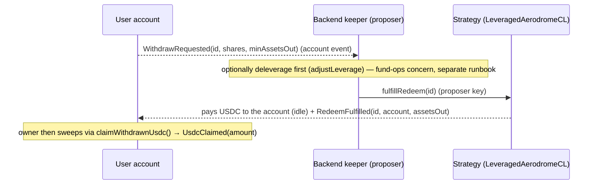

# Leveraged Aero — Backend integration guide

## The product — Leveraged Aerodrome LP Fund

Leveraged Aerodrome LP fund. Users deposit USDC; the Mamo agent runs a leveraged AERO-farming
position that earns through emissions. Custody and execution are deliberately separate: the fund's share
ledger is a minimal in-repo vault (`LeveragedAeroVault` — shares only, priced off the strategy's NAV),
execution lives in one strategy contract (supply USDC on Moonwell → borrow cbBTC + ETH → Aerodrome
concentrated LP → farm & compound AERO, with onchain leverage caps and a permissionless deleverage), and
Mamo's backend is the agent — the same trusted-operator model as Mamo today: it manages the position but
can never withdraw user funds. Users redeem anytime at NAV.

| At a glance | |
|---|---|
| Chain | Base |
| Deposit asset | USDC (ETH & cbBTC added later) |
| Structure | Pooled fund — many depositors, one shared position |
| Strategy | Supply USDC → borrow cbBTC + ETH → Aerodrome CL LP → farm & compound AERO |
| Posture | Leveraged Aerodrome CL LP + AERO emissions carry |
| Custody | Agent manages the position, can never withdraw user funds; users redeem anytime |
| Lifetime | Runs indefinitely — no fixed term; the terminal `Settled` state is driven by the vault owner (MAMO multisig) |

**Where this guide sits.** Mamo users don't touch the fund contracts directly. Each user gets a
per-user **Mamo account** (`MamoLeveragedAeroStrategy`) that custodies their fund shares and exposes a
USDC-in / USDC-out surface. This guide is the backend integration surface for that account system:
provisioning, the `depositIdle` nudge, and fulfilling async withdrawals. (Running the fund itself —
deploy/compound/re-range/leverage — is the agent's fund-ops surface, a separate runbook.)

---

This is the backend contract-integration guide for the **leveraged Aerodrome LP** product. The backend
integrates with the per-user **Mamo account** (`MamoLeveragedAeroStrategy`), its **factory**
(`MamoLeveragedAeroStrategyFactory`), and the **registry** (`MamoStrategyRegistry`) — **plus exactly one
strategy touchpoint** (`fulfillRedeem`, below). Everything else about the strategy (deployIdle / compound
/ rerange / adjustLeverage / deleverage — the fund-ops surface) is a separate concern covered by the
fund-ops runbook, not this integration boundary.

- USDC (6dp) in and out; vault shares are **12dp** (`LeveragedAeroVault.decimals() == assetDecimals + 6`),
  custodied by each account, never handled by users.
- The account is `onlyOwner` for user actions; the backend's contract-level responsibilities are
  **account provisioning**, the optional **`depositIdle` nudge**, and **`fulfillRedeem` of async
  withdrawals**.
- **Legacy naming, unchanged ABI:** the account still exposes `sherwoodStrategy()` and the initializer
  guard `"Invalid sherwoodStrategy address"`; the address-book key is still
  `SHERWOOD_LEVERAGED_AERO_STRATEGY`. Historical names — they point at the in-repo
  `LeveragedAerodromeCLStrategy` clone. Nothing on this integration surface was renamed or resigned.

---

## Two distinct BACKEND_ROLE domains — do not conflate

There are two separate `BACKEND_ROLE` grants, in two different contracts, resolved differently. Ops must
know which key each call needs.

| Domain | Contract | Role holder | What it authorizes |
|---|---|---|---|
| Factory backend | `MamoLeveragedAeroStrategyFactory.BACKEND_ROLE` | `MAMO_BACKEND` (granted at construction) | `createStrategyForUser` on behalf of a user |
| Registry backend | `MamoStrategyRegistry.BACKEND_ROLE` | **the factory contract** holds it (so `addStrategy` succeeds inside creation) | `addStrategy`, and it is the address `getBackendAddress()` resolves for the `depositIdle` gate |

`MamoLeveragedAeroStrategyFactory.BACKEND_ROLE == keccak256("BACKEND_ROLE")` and
`MamoStrategyRegistry.BACKEND_ROLE == keccak256("BACKEND_ROLE")` are the same constant, but they are
**independent role sets on independent contracts**. The factory itself is a registry-backend member so
that `createStrategyForUser` can call `registry.addStrategy` internally.

### The `depositIdle` gate resolves a *specific* registry member (verified live)

```solidity
// MamoLeveragedAeroStrategy.depositIdle
require(msg.sender == owner() || msg.sender == mamoStrategyRegistry.getBackendAddress(), "Not owner or backend");

// MamoStrategyRegistry.getBackendAddress
function getBackendAddress() external view returns (address) {
    return getRoleMember(BACKEND_ROLE, 0); // ROLE MEMBER AT INDEX 0 — not "any backend member"
}
```

`getBackendAddress()` returns **only role member index 0**, not any BACKEND_ROLE holder. On the current
Base registry that is `0x7cb24EFA3fe76650388145b9B0823De6600f1f4c` (the registry has 7 BACKEND_ROLE
members; index ≠ 0 members do **not** pass the `depositIdle` gate). This is **not** the
`MAMO_BACKEND` address-book entry. So:

| Backend action | Key that must sign | Address (Base) |
|---|---|---|
| `depositIdle(minShares)` on an account | registry BACKEND_ROLE **member 0** | `0x7cb24EFA3fe76650388145b9B0823De6600f1f4c` |
| `fulfillRedeem(id)` on the strategy | strategy **proposer** = `MAMO_BACKEND` | `0x2Ab03887829EA8632D972cf3816b825Fe7FC5e73` |
| `createStrategyForUser(user)` on the factory | factory BACKEND_ROLE = `MAMO_BACKEND` | `0x2Ab03887829EA8632D972cf3816b825Fe7FC5e73` |

Signing `depositIdle` with the proposer key (or any non-index-0 backend key) reverts `"Not owner or
backend"`. Wire the two keys explicitly.

> **The `proposer` role survives the de-Sherwood change.** The backend is still the strategy's proposer —
> the role is a per-clone immutable set at `initialize(vault_, proposer_, data)` on the strategy itself,
> not something the old Sherwood governance granted. This two-key table is unchanged and still correct.

---

## Account provisioning

```solidity
// MamoLeveragedAeroStrategyFactory — callable by factory BACKEND_ROLE or by `user`
function createStrategyForUser(address user) public returns (address strategy);
function createStrategy(address user) external returns (address strategy);   // alias, same body
function computeStrategyAddress(address user) public view returns (address); // CREATE2 precompute
```

- Deterministic address, salt `keccak256(abi.encodePacked(user))`; precompute with
  `computeStrategyAddress` and treat `code.length == 0` as not-yet-created.
- Inside creation the factory CREATE2-deploys the `ERC1967Proxy`, calls `initialize`, and registers via
  `registry.addStrategy(user, strategy)` (this is why the factory holds registry `BACKEND_ROLE`).
- After creation `account.owner() == user`; the account is registered under the user in the registry.
- Idempotency: re-creating reverts `"Strategy already exists"`; guard with `computeStrategyAddress`.

Revert strings: `"Invalid user address"`, `"Only backend or user can create strategy"`,
`"Strategy already exists"`.

---

## The one strategy touchpoint — `fulfillRedeem`

Async withdrawals are the only place the backend reaches past the Mamo account into the strategy. The
account's `ILeveragedAeroCLStrategy` interface **deliberately omits** `fulfillRedeem` (it is a
proposer-only op, out of the wrapper's surface), so the backend calls it on the strategy clone directly,
as the strategy **proposer**:

```solidity
// LeveragedAerodromeCLStrategy (ERC-1167 clone) — onlyProposer, requires state == Executed
function fulfillRedeem(uint256 id) external;
```

Strategy events for indexing (note: `owner` here is the **Mamo account address**, i.e. the
`msg.sender` that escrowed the shares — not the end user):

| Event | Meaning |
|---|---|
| `RedeemRequested(uint256 indexed id, address indexed owner, uint256 shares)` | request escrowed (owner = account) |
| `RedeemFulfilled(uint256 indexed id, address indexed owner, uint256 assetsOut)` | backend fulfilled; USDC paid to the account |
| `RedeemCancelled(uint256 indexed id, address indexed owner, uint256 shares)` | request cancelled by the account owner |
| `RedeemEmergency(uint256 indexed id, address indexed owner, uint256 assetsOut)` | deadman self-fulfill after the window |

### Keeper loop



1. Watch each account's `WithdrawRequested(id, shares, minAssetsOut)` (equivalently the strategy's
   `RedeemRequested(id, account, shares)`). The `id` is the strategy request id — pass it straight to
   `fulfillRedeem`.
2. Optionally deleverage first so the oracle-free proportional unwind self-funds its IL (via
   `adjustLeverage` — **fund-ops**, separate runbook; not part of this integration surface).
3. `fulfillRedeem(id)` with the **proposer** key. USDC lands on the account; the owner claims it with
   `claimWithdrawnUsdc()`.
4. Confirm downstream via the account's `UsdcClaimed(amount)` (owner-initiated) or the strategy's
   `RedeemFulfilled`.

### SLA — the 2-day deadman

`FULFILL_WINDOW = 2 days`. If the backend does not fulfill within that window, the request owner (the
account, owner-gated) can trustlessly self-service via `emergencyWithdraw(id, minAssetsOut)` →
`emergencyRedeem` (oracle-free proportional unwind). Treat 2 days as the hard fulfillment SLA:
unfulfilled requests become user-executable and remove the backend from the loop.

---

## `depositIdle` — coordination footgun (documented in the contract)

```solidity
function depositIdle(uint256 minShares) external returns (uint256 shares); // owner OR registry backend member 0
```

Idle USDC on an account is **ambiguous**: it may be funds a user plain-transferred for re-deposit, **or**
the payout of a fulfilled async withdrawal that is waiting for the owner's `claimWithdrawnUsdc()`. A
permissionless `depositIdle` would let anyone front-run the owner's claim and force a fulfilled
withdrawal back into the leveraged position (repeatable re-lock griefing) — which is why the call is
gated to the owner or registry backend member 0.

**Rule:** the backend calls `depositIdle` **only on explicit user/product intent to re-deposit** — never
as an automatic idle-USDC sweep. There is no on-chain flag distinguishing "re-deposit" from "awaiting
claim" idle USDC; the owner and backend coordinate off-chain which idle balance is which. Auto-sweeping
would silently re-lock users' fulfilled withdrawals.

---

## Account entrypoints the backend touches

| Call | Contract | Gate | Notes |
|---|---|---|---|
| `createStrategyForUser(user)` | Factory | factory BACKEND_ROLE or `user` | provisioning; deterministic address |
| `depositIdle(minShares)` | Account | owner OR registry backend member 0 | only on explicit re-deposit intent |
| `fulfillRedeem(id)` | Strategy clone | proposer (`MAMO_BACKEND`) | the one strategy touchpoint |

Account entrypoints the backend does **not** call (owner-only, for reference): `deposit` (permissionless,
but normally user-driven), `withdraw` / `withdrawAll` / `requestWithdraw` / `cancelWithdraw` /
`emergencyWithdraw` / `claimWithdrawnUsdc` / `recoverERC20` — all `onlyOwner`.

---

## Events the backend indexes

Account (`MamoLeveragedAeroStrategy`):

| Event | Use |
|---|---|
| `Deposit(address indexed depositor, uint256 assets, uint256 shares)` | fund inflows (deposit/depositIdle) |
| `Withdraw(address indexed owner, uint256 shares, uint256 assetsOut)` | fast-path exits |
| `WithdrawRequested(uint256 indexed id, uint256 shares, uint256 minAssetsOut)` | **keeper trigger** for `fulfillRedeem` |
| `WithdrawCancelled(uint256 indexed id)` | request cancelled — drop from the fulfill queue |
| `WithdrawEmergency(uint256 indexed id, uint256 assetsOut)` | deadman fired (backend missed SLA) |
| `UsdcClaimed(uint256 amount)` | owner swept fulfilled USDC |

Factory: `StrategyCreated(address indexed user, address indexed strategy)`.

Registry: `StrategyAdded(address indexed user, address strategy, address implementation)`,
`StrategyOwnerUpdated(address indexed strategy, address indexed oldOwner, address indexed newOwner)`.

Strategy: `RedeemRequested` / `RedeemFulfilled` / `RedeemCancelled` / `RedeemEmergency` (table
above) — use these when indexing the strategy clone directly rather than per-account.

---

## Revert-string reference

Account (`require` strings): `"Amount must be greater than 0"`, `"No idle USDC to deposit"`,
`"Not owner or backend"`, `"No shares to withdraw"`, `"No USDC to claim"`; OZ
`OwnableUnauthorizedAccount(address)` for `onlyOwner` misuse; initializer strings
`"Invalid mamoStrategyRegistry address"`, `"Strategy type id not set"`, `"Invalid owner address"`,
`"Invalid sherwoodStrategy address"`, `"Invalid usdc address"`, `"Invalid vault address"`.

Factory: `"Invalid user address"`, `"Only backend or user can create strategy"`,
`"Strategy already exists"` (plus constructor guards `"Invalid admin address"`,
`"Invalid mamoBackend address"`, `"Invalid mamoStrategyRegistry address"`,
`"Invalid strategyImplementation address"`, `"Implementation must be a contract"`,
`"Strategy type id not set"`, `"Invalid sherwoodStrategy address"`, `"Invalid usdc address"`).

Strategy (custom errors, decode by selector): `NotExecuted()`,
`FastRedeemExceedsLtv(uint256 ltvBps, uint256 maxLtvBps)`, `FulfillWindowOpen()`, `RequestSettled()`,
`NotRequestOwner()`, plus `onlyProposer` gate on `fulfillRedeem`.

Vault (`LeveragedAeroVault`, `require` strings the backend can hit): `"LAV: deposits closed"` — every
share mint, including `deposit`/`depositIdle` through an account, while the vault owner has
`depositsOpen == false`. It is the **only** issuance gate (no depositor whitelist, no pause), and
withdrawals are deliberately not gated on it, so the fulfill loop is unaffected. Read `depositsOpen()`
before a `depositIdle` nudge and treat the revert as retryable, not as a bad request.

---

## Vault lifecycle — what gates the backend's calls

The strategy's `Pending → Executed → Settled` lifecycle is driven by the **vault owner** (MAMO multisig)
via `activateStrategy(seed)` and `settleStrategy()`. There is no proposal, vote, or external governance
in the path any more. Operationally for the backend:

- `deposit` / `depositIdle` / `fulfillRedeem` all require `Executed` — before activation and after
  settlement they revert `NotExecuted()`.
- After `settleStrategy()` the whole book is unwound and the realized USDC sits on the **vault**. Holders
  exit permissionlessly with `vault.redeemSettled(shares)`, which needs the shares in the caller's own
  wallet — i.e. each account owner first pulls them out with `recoverERC20(vaultShares, owner, …)`. The
  backend has **no role** in the Settled exit; drop accounts from the fulfill queue once state is
  `Settled`.

---

## Staging

> ⚠️ **The live staging instance is STALE.** It still runs the pre-de-Sherwood stack: the vault beneath the
> accounts is Sherwood's `SyndicateVault`, so `redeemSettled` does not exist there and `setOpenDeposits` /
> `activateStrategy` / `settleStrategy` behave as the old vault did. The **account + factory + registry**
> surface and the `fulfillRedeem` touchpoint are unaffected and still valid for BE work. A redeploy onto
> the `LeveragedAeroVault` architecture is **pending** (deploy tooling not written yet). Re-read
> `script/tenderly/leveraged-aero-vnet.json` and `docs/LEVERAGED_AERO_VNET_RUNBOOK.md` before wiring an
> environment — the rows below snapshot the old instance and the config file already lists a newer account
> impl/factory pair.

| Field | Value |
|---|---|
| Network | Base fork (Tenderly Virtual TestNet) — **stale instance, pending redeploy** |
| RPC | `https://virtual.base.eu.rpc.tenderly.co/70a4990f-6686-4536-8237-ad9103acd11b` |
| Factory | see `script/tenderly/leveraged-aero-vnet.json` (`mamo.accountFactory`) |
| Account implementation | see `script/tenderly/leveraged-aero-vnet.json` (`mamo.accountImplementation`) |
| Strategy type id | `5` |
| Vault (shares, 12dp) | Sherwood-era `SyndicateVault` on the current instance — **not** `LeveragedAeroVault` |
| Strategy clone | `0x5E22913E4C96f816133fbc8E894F652a4f87C760` (Sherwood-era build) |

---

## Backend checklist

- [ ] Provision accounts via `createStrategyForUser` with the factory `MAMO_BACKEND` key; guard with `computeStrategyAddress`.
- [ ] Sign `depositIdle` with registry BACKEND_ROLE **member 0** (`0x7cb2…1f4c`), and only on explicit re-deposit intent — never as an auto-sweep.
- [ ] Sign `fulfillRedeem` with the strategy **proposer** key (`MAMO_BACKEND`, `0x2Ab0…5e73`).
- [ ] Keeper watches `WithdrawRequested`, (optionally deleverages), `fulfillRedeem(id)`, confirms via `RedeemFulfilled` / `UsdcClaimed`.
- [ ] Treat `FULFILL_WINDOW = 2 days` as the fulfillment SLA; monitor for `WithdrawEmergency` (missed SLA).
- [ ] Gate deposit nudges on `strategy.state() == Executed` **and** `vault.depositsOpen()`; treat `"LAV: deposits closed"` as retryable.
- [ ] Stop fulfilling once the strategy is `Settled` — exits then run owner-side via `recoverERC20` + `vault.redeemSettled`, with no backend involvement.
