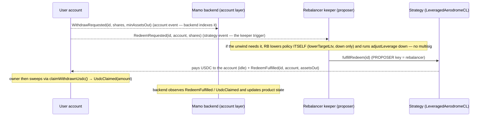

# Leveraged Aero — Backend integration guide

## The product — Leveraged Aerodrome LP Fund

Leveraged Aerodrome LP fund. Users deposit USDC; the Mamo agent runs a leveraged AERO-farming
position that earns through emissions. Custody and execution are deliberately separate: the fund's share
ledger is a minimal in-repo vault (`LeveragedAeroVault` — shares only, priced off the strategy's NAV),
execution lives in one strategy contract (supply USDC on Moonwell → borrow the CL leg(s) → Aerodrome
concentrated LP → farm & compound AERO, with onchain leverage caps and a permissionless deleverage), and
Mamo's **rebalancer** service is the agent — the same trusted-operator model as Mamo today: it manages the
position but can never withdraw user funds. Users redeem anytime at NAV.

| At a glance | |
|---|---|
| Chain | Base |
| Deposit asset | USDC (ETH & cbBTC added later) |
| Structure | Pooled fund — many depositors, one shared position |
| Strategy | Supply USDC → borrow the CL leg(s) → Aerodrome CL LP → farm & compound AERO |
| Pool shape | Per-clone, derived at init: *two borrowed legs* (e.g. cbBTC + ETH) **or** *asset-as-leg-B* (borrow one volatile leg, pair it with USDC). **Nothing on this integration surface branches on it** — see below. |
| Posture | Leveraged Aerodrome CL LP + AERO emissions carry |
| Custody | Agent manages the position, can never withdraw user funds; users redeem anytime |
| Lifetime | Runs indefinitely — no fixed term; the terminal `Settled` state is driven by the vault owner (MAMO multisig) |

**Where this guide sits.** Mamo users don't touch the fund contracts directly. Each user gets a
per-user **Mamo account** (`MamoLeveragedAeroStrategy`) that custodies their fund shares and exposes a
USDC-in / USDC-out surface. This guide is the backend integration surface for that account system:
provisioning and the `depositIdle` nudge. (Running the fund itself — deploy/compound/re-range/leverage
**and fulfilling async withdrawals** — is the rebalancer's fund-ops surface, a separate runbook:
[`LEVERAGED_AERO_REBALANCER.md`](./LEVERAGED_AERO_REBALANCER.md).)

---

This is the backend contract-integration guide for the **leveraged Aerodrome LP** product. The backend
integrates with the per-user **Mamo account** (`MamoLeveragedAeroStrategy`), its **factory**
(`MamoLeveragedAeroStrategyFactory`), and the **registry** (`MamoStrategyRegistry`). The strategy itself
(`fulfillRedeem` / deployIdle / compound / rerange / adjustLeverage / deleverage — the whole fund-ops
surface) is **not** a backend touchpoint: every one of those is `onlyProposer`, and the proposer is the
**rebalancer**, covered by [`LEVERAGED_AERO_REBALANCER.md`](./LEVERAGED_AERO_REBALANCER.md).

- USDC (6dp) in and out; vault shares are **12dp** (`LeveragedAeroVault.decimals() == assetDecimals + 6`),
  custodied by each account, never handled by users.
- The account is `onlyOwner` for user actions; the backend's contract-level responsibilities are
  **account provisioning** and the optional **`depositIdle` nudge** — that is all.
- **Legacy naming, unchanged ABI:** the account still exposes `sherwoodStrategy()` and the initializer
  guard `"Invalid sherwoodStrategy address"`; the address-book key is still
  `SHERWOOD_LEVERAGED_AERO_STRATEGY`. Historical names — they point at the in-repo
  `LeveragedAerodromeCLStrategy` clone. Nothing on this integration surface was renamed or resigned.

---

## Pool shape (`legBIsAsset`) — the backend does **not** branch on it

The strategy supports two pool shapes, derived per clone at init and readable as
`strategy.layout().legBIsAsset` (`true` ⇒ the leg-B slot **is** USDC, so the fund borrows one volatile leg
and pairs it with USDC; `false` ⇒ both legs are borrowed). The distinction is real and it changes several
**fund-ops** behaviors — see the rebalancer runbook
([`LEVERAGED_AERO_REBALANCER.md`](./LEVERAGED_AERO_REBALANCER.md) §G).

**On this integration boundary it changes nothing, and that is the load-bearing statement.** Verified
against the code rather than assumed:

| Backend call | Shape-dependent? | Why |
|---|---|---|
| `createStrategyForUser(user)` | No | Account/factory layer; never touches the fund's legs. |
| `depositIdle(assets, minShares)` | No | USDC in, shares out. **You pick `assets`** — it no longer sweeps the whole idle balance. Deposits land as **idle USDC on the strategy** in both shapes and are deployed later by the proposer's `deployIdle`. Reverts if `assets` exceeds the account's idle balance, or with `FundAtCapacity` if the deposit would push the fund's NAV past `vault.maxTotalAssets()` (see below). |
| `fulfillRedeem(id)` | No | Same oracle-free proportional unwind in both shapes: remove `f = shares/supply` of **every** leg, repay `f` of **every** debt, pay the net USDC. Asset-mode does change the *internal* stayer-reservation accounting (leg B's "idle leg" balance **is** the idle USDC, so it is reserved once, not twice) — but that is inside `redeemUnwindImpl`, not on the call surface. |
| `WithdrawRequested` → fulfill loop | No | Same events, same ids, same `FULFILL_WINDOW`. |

So: **do not add a `legBIsAsset` branch to the account keeper.** Read it only if you are surfacing the
fund's composition in ops tooling.

## Fund capacity cap

`LeveragedAeroVault.maxTotalAssets` is a ceiling on the **whole fund's NAV**, denominated in USDC
(6dp). `0` means unlimited (the deploy default). Only the vault owner (MAMO_MULTISIG) can change it.

It is a limit on the FUND, not on any one user: once the book reaches the ceiling, **nobody** can
deposit, regardless of how little their own account holds. It is enforced in the strategy's `deposit`
— the single path every share-minting deposit takes, accounts and direct depositors alike — and it
**reverts** rather than trimming:

```
deposit(assets, minShares)        → reverts FundAtCapacity(navAfter, cap)
depositIdle(assets, minShares)    → reverts FundAtCapacity(navAfter, cap)
```

That is why `depositIdle` takes an amount. When the fund is near its ceiling, an account holding more
idle USDC than the remaining capacity cannot deposit the whole balance, so the keeper sizes the call
to the room:

```
room = vault.remainingCapacity()   // USDC (6dp). type(uint256).max => cap disabled
                                   // 0 => fund is full, do not call
```

**Leave headroom — do not size to the exact edge.** `remainingCapacity()` reads raw `nav()`, while the
deposit measures against `navNet` (NAV after the fee crystallisation the deposit runs first), and NAV
moves between your read and your transaction landing. Target ~95% of `room` and treat `FundAtCapacity`
as **retryable** (re-read and re-size, do not escalate). Leftover idle USDC stays on the account and
the owner can claim it via `claimWithdrawnUsdc` at any time.

Three properties worth building around:

- **The ceiling is in USDC, so it means what it says** — no share conversion, no 12dp/6dp trap.
- **NAV moves on its own.** The fund can drift *above* the ceiling on gains alone, closing deposits
  with nobody having deposited, and back below it on a drawdown, reopening them. Do not treat "closed"
  as permanent, and do not cache `remainingCapacity()`.
- **Withdrawals free room, for everyone.** The check is against live NAV, not a high-water mark, so an
  exit immediately reopens that much capacity to any depositor. There is no release step.

`vault.previewSharesForAssets(assets)` remains the assets→shares conversion for sizing `minShares`; it
**reverts** `"LAV: nav unpriceable"` when the book cannot be priced (`nav() == 0` with shares
outstanding, e.g. post-settle). Treat that as "retry later", never as a usable number.

Two fund-ops reads exist for that tooling and are worth knowing about even though this doc's loop does not
call them — both are plain views on the strategy clone:

```solidity
function targetLtvBps() external view returns (uint16);                   // standing target LTV
function hedgedDebt() external view returns (uint128 legA, uint128 legB); // hedged borrow principal per leg
```

`hedgedDebt().legB` is structurally **0** in asset-mode (leg B is the unit of account and is never
borrowed) — treat a zero there as "shape", not as "missing data".

**One place the shape leaks into the SLA loop indirectly.** Step 2 of the keeper loop below optionally
levers **down** before a fulfill. That direction is safe in both shapes and, in asset-mode, actually
*frees* idle USDC. Levering **up** is the asymmetric one — in asset-mode it **consumes** idle USDC and
reverts `InsufficientIdleForLeverUp(needed, available)` if the book is short — but lever-up is not part of
the fulfill loop and belongs to the fund-ops runbook. If the same service ever drives both, size lever-ups
against available idle.

---

## Two distinct BACKEND_ROLE domains — do not conflate

There are two separate `BACKEND_ROLE` grants, in two different contracts, resolved differently. Ops must
know which key each call needs.

| Domain | Contract | Role holder | What it authorizes |
|---|---|---|---|
| Factory backend | `MamoLeveragedAeroStrategyFactory.BACKEND_ROLE` | `MAMO_BACKEND` (granted at construction) | `createStrategyForUser` on behalf of a user |
| Registry backend | `MamoStrategyRegistry.BACKEND_ROLE` | **the factory contract** holds it (so `addStrategy` succeeds inside creation) | `addStrategy`, and it is the address `getBackendAddress()` resolves for the `depositIdle` gate |

`MamoLeveragedAeroStrategyFactory.BACKEND_ROLE == keccak256("BACKEND_ROLE")` and
`MamoStrategyRegistry.BACKEND_ROLE == keccak256("BACKEND_ROLE")` are the same constant, but they are
**independent role sets on independent contracts**. The factory itself is a registry-backend member so
that `createStrategyForUser` can call `registry.addStrategy` internally.

### The `depositIdle` gate resolves a *specific* registry member (verified live)

```solidity
// MamoLeveragedAeroStrategy.depositIdle
require(msg.sender == owner() || msg.sender == mamoStrategyRegistry.getBackendAddress(), "Not owner or backend");

// MamoStrategyRegistry.getBackendAddress
function getBackendAddress() external view returns (address) {
    return getRoleMember(BACKEND_ROLE, 0); // ROLE MEMBER AT INDEX 0 — not "any backend member"
}
```

`getBackendAddress()` returns **only role member index 0**, not any BACKEND_ROLE holder. On the current
Base registry that is `0x7cb24EFA3fe76650388145b9B0823De6600f1f4c` (the registry has 7 BACKEND_ROLE
members; index ≠ 0 members do **not** pass the `depositIdle` gate). This is **not** the
`MAMO_BACKEND` address-book entry. So:

| Action | Key that must sign | Address (Base) | Whose key |
|---|---|---|---|
| `createStrategyForUser(user)` on the factory | factory BACKEND_ROLE = `MAMO_BACKEND` | `0x2Ab03887829EA8632D972cf3816b825Fe7FC5e73` | backend |
| `depositIdle(assets, minShares)` on an account | registry BACKEND_ROLE **member 0** | `0x7cb24EFA3fe76650388145b9B0823De6600f1f4c` | backend |
| `fulfillRedeem(id)` on the strategy | strategy **proposer** = `MAMO_REBALANCER` | `0x73f6B456d063F78129113D42DBC315b9eEee8FAf` | **rebalancer — NOT the backend** |

Signing `depositIdle` with a non-index-0 backend key reverts `"Not owner or backend"`. Wire the keys
explicitly, and note that the two backend keys above are **different addresses**.

> ### ⚠️ The strategy `proposer` is the REBALANCER, not `MAMO_BACKEND`
>
> Earlier revisions of this guide claimed the backend was the strategy's proposer. **That was wrong.** The
> strategy has exactly one operator role (`proposer`, a per-clone immutable set at
> `initialize(vault_, proposer_, data)`), and it is held by a **dedicated rebalancer address**
> (`MAMO_REBALANCER`, `pooled.proposer` in `script/tenderly/leveraged-aero-vnet.json`) — deliberately
> **not** `MAMO_BACKEND`. The split is the point: account-layer keys must not reach the levered book's
> operator surface.
>
> **`fulfillRedeem` is `onlyProposer`, so the REBALANCER fulfils user withdrawal requests — not the
> backend.** The backend drives the account layer (`createStrategyForUser`, `depositIdle`); the rebalancer
> drives the strategy (`compound`, `rerange`, `adjustLeverage`, `fulfillRedeem`). Confirm with
> `strategy.proposer()` before wiring any keeper.
>
> ### The operations / policy split — `proposer` is operations only
>
> **The `proposer` role IS the rebalancer** (we deliberately did not rename it) and it covers
> **operations** only. Fund **policy** sits behind a second, derived role: **`admin` ==
> `Ownable(vault()).owner()`, the MAMO multisig** — no stored field, no setter, it simply follows the
> vault owner. The gate is `onlyAdmin` → `NotAdmin()`.
>
> The principle: **the backend/keeper must not be capable of rugging you — RAISING fund risk is
> multisig-only.** Admin-only entrypoints on the strategy are **`setTargetLtv(uint16)`** (the fund's
> standing target LTV, either direction) and **`rescueToVault(address)`** (stray-token sweep; the
> proposer could previously call this and can no longer). Neither is a backend touchpoint; both are
> listed so the role model is unambiguous.
>
> ### The direction rule
>
> **The admin sets the target LTV in either direction; the proposer may only reduce it.** The proposer's
> **`lowerTargetLtv(uint16)`** (`0xbd41b78c`) is monotonic down — it reverts `TargetLtvNotLower()`
> (`0x4f3f9c5d`) unless the new value is *strictly* below the stored one, and it shares the same non-zero
> floor (`TargetLtvZero()`). So a compromised keeper key can never raise leverage, never reach a zero
> target, and never move tokens; it *can* ratchet the target down and destroy yield, which is bounded,
> emits `TargetLtvUpdated` every step, and is reversible by the admin in one `setTargetLtv`. This is what
> keeps the 2-day fulfil SLA off the multisig's critical path (see "SLA — the 2-day deadman" below).
>
> **ABI note for anyone remapping selectors:** `adjustLeverage` lost its target parameter —
> `adjustLeverage(uint16,uint256,uint256)` (`0x9792419f`) → `adjustLeverage(uint256,uint256)`
> (`0x4be1cadd`). Target LTV is now standing policy rather than a per-call argument. This is a
> rebalancer-surface change; the account layer (`MamoLeveragedAeroStrategy`) is **unaffected**.

---

## Account provisioning

```solidity
// MamoLeveragedAeroStrategyFactory — callable by factory BACKEND_ROLE or by `user`
function createStrategyForUser(address user) public returns (address strategy);
function createStrategy(address user) external returns (address strategy);   // alias, same body
function computeStrategyAddress(address user) public view returns (address); // CREATE2 precompute
```

- Deterministic address, salt `keccak256(abi.encodePacked(user))`; precompute with
  `computeStrategyAddress` and treat `code.length == 0` as not-yet-created.
- Inside creation the factory CREATE2-deploys the `ERC1967Proxy`, calls `initialize`, and registers via
  `registry.addStrategy(user, strategy)` (this is why the factory holds registry `BACKEND_ROLE`).
- After creation `account.owner() == user`; the account is registered under the user in the registry.
- Idempotency: re-creating reverts `"Strategy already exists"`; guard with `computeStrategyAddress`.

Revert strings: `"Invalid user address"`, `"Only backend or user can create strategy"`,
`"Strategy already exists"`.

---

## Async withdrawals — the backend does NOT fulfil them

There is **no** backend touchpoint on the strategy. `fulfillRedeem` is `onlyProposer` and the proposer is
the **rebalancer** (`MAMO_REBALANCER`), so the fulfil loop belongs to the fund-ops keeper documented in
[`LEVERAGED_AERO_REBALANCER.md`](./LEVERAGED_AERO_REBALANCER.md) §C:

```solidity
// LeveragedAerodromeCLStrategy (ERC-1167 clone) — onlyProposer (rebalancer), requires state == Executed
function fulfillRedeem(uint256 id) external;
```

The account's `ILeveragedAeroCLStrategy` interface **deliberately omits** `fulfillRedeem` for exactly this
reason: it is out of the wrapper's surface and out of the backend's. Calling it with a backend key reverts
`NotProposer()`.

What the backend **does** own here is **observability** — the async flow is the user's slowest path, so the
backend indexes it and drives product state / notifications off it, and escalates to the rebalancer when the
SLA is at risk. Strategy events for that (note: `owner` here is the **Mamo account address**, i.e. the
`msg.sender` that escrowed the shares — not the end user):

| Event | Meaning |
|---|---|
| `RedeemRequested(uint256 indexed id, address indexed owner, uint256 shares)` | request escrowed (owner = account) |
| `RedeemFulfilled(uint256 indexed id, address indexed owner, uint256 assetsOut)` | **rebalancer** fulfilled; USDC paid to the account |
| `RedeemCancelled(uint256 indexed id, address indexed owner, uint256 shares)` | request cancelled by the account owner |
| `RedeemEmergency(uint256 indexed id, address indexed owner, uint256 assetsOut)` | deadman self-fulfill after the window |

### Who does what



1. The backend watches each account's `WithdrawRequested(id, shares, minAssetsOut)` (equivalently the
   strategy's `RedeemRequested(id, account, shares)`) for UX/product state — **not** to fulfil it.
2. The book is optionally levered **down** first so the oracle-free proportional unwind self-funds its IL
   — a **single-actor** step: the rebalancer lowers the standing target itself with
   `lowerTargetLtv(newTargetBps)` (proposer-only, strictly-lower) and runs `adjustLeverage(minLiq, minOut)`,
   then calls `fulfillRedeem(id)` — all three with the **proposer** key, no multisig on the path.
3. USDC lands on the account; the **owner** claims it with `claimWithdrawnUsdc()`.
4. Confirm downstream via the account's `UsdcClaimed(amount)` (owner-initiated) or the strategy's
   `RedeemFulfilled`.

### SLA — the 2-day deadman

`FULFILL_WINDOW = 2 days`. If the **rebalancer** does not fulfil within that window, the request owner (the
account, owner-gated) can trustlessly self-service via `emergencyWithdraw(id, minAssetsOut)` →
`emergencyRedeem` (oracle-free proportional unwind). 2 days is the hard fulfillment SLA — it is the
rebalancer's to meet, and the backend's to alert on: unfulfilled requests become user-executable and remove
the operator from the loop.

**No multisig signature sits inside that window.** The pre-fulfil de-risk is `lowerTargetLtv` +
`adjustLeverage`, both proposer-only, so the SLA never depends on assembling multisig signers. The admin's
`setTargetLtv` is needed only to **raise** the target back afterwards, which is off the critical path.

---

## `depositIdle` — coordination footgun (documented in the contract)

```solidity
function depositIdle(uint256 assets, uint256 minShares) external returns (uint256 shares); // owner OR registry backend member 0
```

Idle USDC on an account is **ambiguous**: it may be funds a user plain-transferred for re-deposit, **or**
the payout of a fulfilled async withdrawal that is waiting for the owner's `claimWithdrawnUsdc()`. A
permissionless `depositIdle` would let anyone front-run the owner's claim and force a fulfilled
withdrawal back into the leveraged position (repeatable re-lock griefing) — which is why the call is
gated to the owner or registry backend member 0.

**Rule:** the backend calls `depositIdle` **only on explicit user/product intent to re-deposit** — never
as an automatic idle-USDC sweep. There is no on-chain flag distinguishing "re-deposit" from "awaiting
claim" idle USDC; the owner and backend coordinate off-chain which idle balance is which. Auto-sweeping
would silently re-lock users' fulfilled withdrawals.

---

## Account entrypoints the backend touches

| Call | Contract | Gate | Notes |
|---|---|---|---|
| `createStrategyForUser(user)` | Factory | factory BACKEND_ROLE or `user` | provisioning; deterministic address |
| `depositIdle(assets, minShares)` | Account | owner OR registry backend member 0 | only on explicit re-deposit intent; **you pick `assets`** |

That is the whole backend write surface. `fulfillRedeem(id)` on the strategy clone is **not** on it —
`onlyProposer`, i.e. the **rebalancer** (`MAMO_REBALANCER`), never `MAMO_BACKEND`.

Account entrypoints the backend does **not** call (owner-only, for reference): `deposit` (permissionless,
but normally user-driven), `withdraw` / `withdrawAll` / `requestWithdraw` / `cancelWithdraw` /
`emergencyWithdraw` / `claimWithdrawnUsdc` / `recoverERC20` — all `onlyOwner`.

---

## Events the backend indexes

Account (`MamoLeveragedAeroStrategy`):

| Event | Use |
|---|---|
| `Deposit(address indexed depositor, uint256 assets, uint256 shares)` | fund inflows (deposit/depositIdle) |
| `Withdraw(address indexed owner, uint256 shares, uint256 assetsOut)` | fast-path exits |
| `WithdrawRequested(uint256 indexed id, uint256 shares, uint256 minAssetsOut)` | pending async withdrawal — product state + SLA alerting (the `fulfillRedeem` trigger itself is the **rebalancer's**) |
| `WithdrawCancelled(uint256 indexed id)` | request cancelled — drop it from the pending set |
| `WithdrawEmergency(uint256 indexed id, uint256 assetsOut)` | deadman fired (backend missed SLA) |
| `UsdcClaimed(uint256 amount)` | owner swept fulfilled USDC |

Factory: `StrategyCreated(address indexed user, address indexed strategy)`.

Registry: `StrategyAdded(address indexed user, address strategy, address implementation)`,
`StrategyOwnerUpdated(address indexed strategy, address indexed oldOwner, address indexed newOwner)`.

Strategy: `RedeemRequested` / `RedeemFulfilled` / `RedeemCancelled` / `RedeemEmergency` (table
above) — use these when indexing the strategy clone directly rather than per-account.

---

## Revert-string reference

Account (`require` strings): `"Amount must be greater than 0"`, `"Insufficient idle USDC"`,
`"Not owner or backend"`, `"No shares to withdraw"`, `"No USDC to claim"`; OZ
`OwnableUnauthorizedAccount(address)` for `onlyOwner` misuse; initializer strings
`"Invalid mamoStrategyRegistry address"`, `"Strategy type id not set"`, `"Invalid owner address"`,
`"Invalid sherwoodStrategy address"`, `"Invalid usdc address"`, `"Invalid vault address"`.

Factory: `"Invalid user address"`, `"Only backend or user can create strategy"`,
`"Strategy already exists"` (plus constructor guards `"Invalid admin address"`,
`"Invalid mamoBackend address"`, `"Invalid mamoStrategyRegistry address"`,
`"Invalid strategyImplementation address"`, `"Implementation must be a contract"`,
`"Strategy type id not set"`, `"Invalid sherwoodStrategy address"`, `"Invalid usdc address"`).

Strategy (custom errors, decode by selector): `NotExecuted()`,
`FastRedeemExceedsLtv(uint256 ltvBps, uint256 maxLtvBps)`, `FulfillWindowOpen()`, `RequestSettled()`,
`NotRequestOwner()`, plus `onlyProposer` gate on `fulfillRedeem`.

Vault (`LeveragedAeroVault`, `require` strings the backend can hit): `"LAV: deposits closed"` — every
share mint, including `deposit`/`depositIdle` through an account, while the vault owner has
`depositsOpen == false`. It is the **only** issuance gate (no depositor whitelist, no pause), and
withdrawals are deliberately not gated on it, so the rebalancer's fulfil loop is unaffected. Read `depositsOpen()`
before a `depositIdle` nudge and treat the revert as retryable, not as a bad request.

---

## Vault lifecycle — what gates the backend's calls

The strategy's `Pending → Executed → Settled` lifecycle is driven by the **vault owner** (MAMO multisig)
via `activateStrategy(seed)` and `settleStrategy()`. There is no proposal, vote, or external governance
in the path any more. Operationally for the backend:

- `deposit` / `depositIdle` / `fulfillRedeem` all require `Executed` — before activation and after
  settlement they revert `NotExecuted()`.
- After `settleStrategy()` the whole book is unwound and the realized USDC sits on the **vault**. Holders
  exit permissionlessly with `vault.redeemSettled(shares)`, which needs the shares in the caller's own
  wallet — i.e. each account owner first pulls them out with `recoverERC20(vaultShares, owner, …)`. The
  backend has **no role** in the Settled exit; drop accounts from the async watch list once state is
  `Settled`.

---

## Staging

> **The staging instance runs the current in-repo stack** (vault generation 2): `LeveragedAeroVault`
> replaces Sherwood's `SyndicateVault`, so `depositsOpen()` / `setOpenDeposits` / `activateStrategy` /
> `settleStrategy` / `redeemSettled` are all the in-repo ones. No governor, no proposal lifecycle.
>
> ⚠️ **`script/tenderly/leveraged-aero-vnet.json` is the source of truth**, not this table — a harness
> redeploy changes these addresses (and a new pooled layer invalidates the account factory, which binds the
> strategy clone at construction). Read the config and `docs/LEVERAGED_AERO_VNET_RUNBOOK.md` before wiring
> an environment.

| Field | Value | Config key |
|---|---|---|
| Network | Base fork (Tenderly Virtual TestNet), chainId `8453` | `chainId` |
| RPC (public, read-only) | `https://virtual.base.eu.rpc.tenderly.co/70a4990f-6686-4536-8237-ad9103acd11b` | `publicRpc` |
| Admin RPC (writes) | **1Password** (write-capable — never committed to this repo) | `adminRpc` |
| Factory | `0x3E1304044c31907379c00dd24Bd648327Ac2F20b` | `mamo.accountFactory` |
| Account implementation | `0xC68F14197Bb68C2b96E90ccA7227cc497Fb48bf9` | `mamo.accountImplementation` |
| Registry | `0x46a5624C2ba92c08aBA4B206297052EDf14baa92` | `mamo.strategyRegistry` |
| Strategy type id | `5` | `strategyTypeId` |
| Vault (`LeveragedAeroVault`, shares 12dp) | `0x8343b35617326A2B416e17388e1BdF10d5Fd22D7` | `pooled.vault` |
| Strategy clone | `0xA26557fA6823881327fca5b8C4eD5857997A49da` | `pooled.strategyClone` |
| Strategy `proposer` (rebalancer — fulfils redeems) | `0x73f6B456d063F78129113D42DBC315b9eEee8FAf` | `pooled.proposer` |
| USDC | `0x833589fCD6eDb6E08f4c7C32D4f71b54bdA02913` | `usdc` |

---

## Backend checklist

- [ ] Provision accounts via `createStrategyForUser` with the factory `MAMO_BACKEND` key (`0x2Ab0…5e73`); guard with `computeStrategyAddress`.
- [ ] Sign `depositIdle` with registry BACKEND_ROLE **member 0** (`0x7cb2…1f4c`), and only on explicit re-deposit intent — never as an auto-sweep.
- [ ] Do **not** wire a backend key to `fulfillRedeem` — it is `onlyProposer` (the **rebalancer**, `0x73f6…8FAf`) and reverts `NotProposer()` for the backend.
- [ ] Index `WithdrawRequested` / `RedeemFulfilled` / `UsdcClaimed` for product state, and alert the rebalancer when a request nears its SLA.
- [ ] Treat `FULFILL_WINDOW = 2 days` as the (rebalancer's) fulfillment SLA; monitor for `WithdrawEmergency` (missed SLA).
- [ ] Gate deposit nudges on `strategy.state() == Executed` **and** `vault.depositsOpen()`; treat `"LAV: deposits closed"` as retryable.
- [ ] Stop nudging deposits once the strategy is `Settled` — exits then run owner-side via `recoverERC20` + `vault.redeemSettled`, with no backend involvement.
