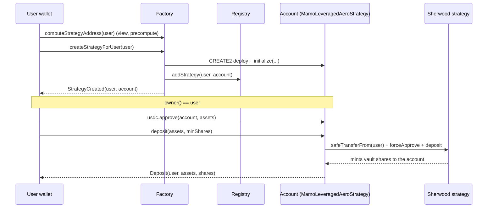
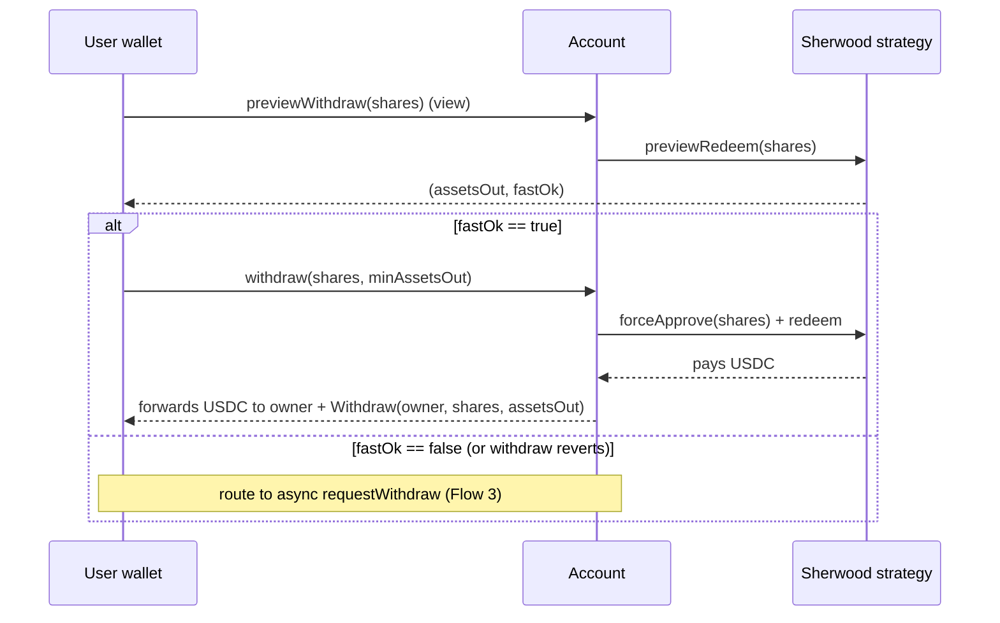
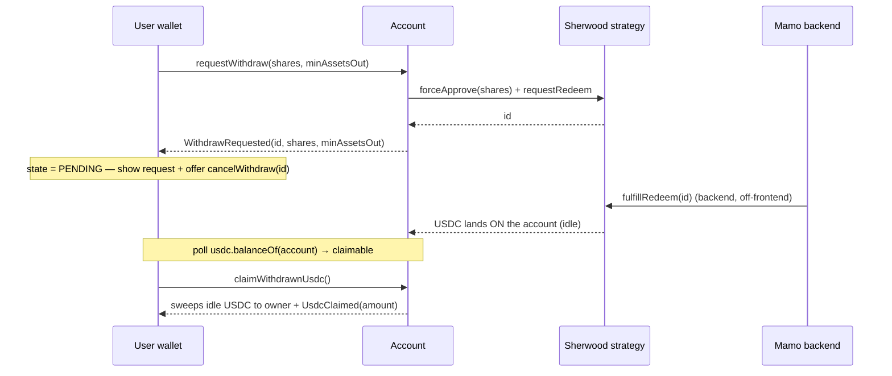

# Leveraged Aero — Frontend integration guide

This is the frontend contract-integration guide for the **leveraged Aerodrome LP** product. The single
integration surface for the frontend is the per-user **Mamo account** (`MamoLeveragedAeroStrategy`), its
**factory** (`MamoLeveragedAeroStrategyFactory`), and the **registry** (`MamoStrategyRegistry`). The
Sherwood strategy internals (`LeveragedAerodromeCLStrategy`, `SyndicateVault`, the leverage engine) are
**out of scope** for the frontend — the account wraps them and exposes a USDC-in / USDC-out surface.

- **In:** USDC (6dp). **Out:** USDC (6dp). The user never sees or touches vault shares.
- Vault shares are **12dp** and are custodied by the account contract on the user's behalf.
- Each user has exactly one account per factory, at a **deterministic (CREATE2) address** the frontend
  can precompute before it exists.
- `account.owner() == user`. Every state-changing user action is `onlyOwner`; the user's wallet signs
  directly against their own account.

---

## Contracts & chain (staging)

| Field | Value |
|---|---|
| Network | Base fork (Tenderly Virtual TestNet) — **current staging instance, rotates** |
| RPC | `https://virtual.base.eu.rpc.tenderly.co/70a4990f-6686-4536-8237-ad9103acd11b` |
| Factory | `0x9CDBe7DB9F967E793E7261e0ffd546E5D29b476f` |
| Account implementation | `0x3F26d1E36310442453d3aefCf75d5817eceBCF29` |
| Strategy type id | `5` |
| Sherwood vault (shares, 12dp) | `0xf88F704023ED4f77769cB112B3FcBB4Cda8588E9` |
| Sherwood strategy clone | `0x168ac730AB0DA6FCDE8aA26e33eac4aE6c8CfB4B` |

> Staging endpoints rotate. Always re-read the current instance from
> `docs/LEVERAGED_AERO_VNET_RUNBOOK.md` before wiring an environment. Production addresses are published
> separately at deploy.

---

## Account address precompute (CREATE2)

The account address is deterministic in the user address alone, so the frontend can render the account
page, deep-link, and index events **before the account is created**.

```solidity
// MamoLeveragedAeroStrategyFactory
function computeStrategyAddress(address user) public view returns (address);
```

`code.length == 0` at that address ⇒ not yet created. Salt is `keccak256(abi.encodePacked(user))`; the
proxy is an `ERC1967Proxy` pointing at `strategyImplementation`, so the address does not change across
implementation upgrades.

```ts
// viem-ish
const account = await factory.read.computeStrategyAddress([user]);
const exists  = (await client.getBytecode({ address: account }))?.length > 0;
```

---

## Lifecycle state — gate every action on it

The account passes through the Sherwood strategy's lifecycle enum:

```solidity
function strategyState() external view returns (State); // enum State { Pending, Executed, Settled }
```

| State | Value | Meaning for the frontend |
|---|---|---|
| `Pending` | 0 | Not live yet — deposits/withdrawals revert `NotExecuted()`. Show "not open". |
| `Executed` | 1 | Live — all deposit/withdraw entrypoints work. Normal operating state. |
| `Settled` | 2 | **Terminal.** No deposits/withdrawals. Exit only via the owner share-recovery hatch (below). |

**Settled exit hatch.** When the strategy is `Settled`, the user exits by pulling the raw vault shares
out of the account with the inherited `BaseStrategy` hatch and redeeming them at the vault queue
directly (Sherwood UI / manual):

```solidity
// BaseStrategy — always-open onlyOwner, no state gate
function recoverERC20(address token, address to, uint256 amount) external; // token = vault shares
```

Read the share balance to fill `amount` (see Views). This bypasses the slippage/LTV redeem path by design.

---

## Views for display

```solidity
function sharesBalance() external view returns (uint256);                     // 12dp, custodied shares
function previewWithdraw(uint256 shares) external view returns (uint256 assetsOut, bool fastOk); // advisory
function strategyState() external view returns (State);
function owner() external view returns (address);
```

- **Position USD value (estimate):** `previewWithdraw(sharesBalance()) → (assetsOut, _)`. `assetsOut` is
  the USDC (6dp) the whole position would return on the fast path right now. Display it as the position
  value; it is advisory (oracle-priced) and moves block to block.
- **`fastOk`:** `true` iff the fast withdraw path would currently price and clear the LTV gate. It is
  **advisory only** — execution can still revert even when `fastOk == true` (prices move between the
  preview call and the tx). Use it to choose the default UX path, not as a guarantee.
- **Idle / claimable USDC:** `IERC20(usdc).balanceOf(account)`. After an async withdrawal is fulfilled,
  the payout lands here as idle USDC awaiting `claimWithdrawnUsdc()` (see async flow). Surface it as a
  "claimable" balance.

> **Never cache a quote across blocks.** Fees crystallize inside user transactions and supply/NAV move,
> so `previewWithdraw` and any derived `minShares` / `minAssetsOut` must come from a fresh read in the
> same UX step as the tx.

---

## Slippage guards (`minShares` / `minAssetsOut`)

Every value-moving call takes a caller-supplied floor. Derive it from a **fresh** quote:

- **Withdrawals:** quote `previewWithdraw(shares) → assetsOut`, then set
  `minAssetsOut = assetsOut * (1 - tolBps/10_000)`.
- **Deposits:** there is no `previewDeposit`. Either derive expected shares off the same oracle-NAV math
  the preview uses (inverse), or quote a reference and accept a bps tolerance below a fresh quote. `0` is
  legal but leaves the deposit unprotected against oracle-lag skim — always pass a real floor in prod.

---

## Flow 1 — create account + deposit

Two entrypoints exist to fund an account. The **primary** flow is `approve` + `deposit`:

```solidity
// permissionless — funds pulled from msg.sender, shares always accrue to the account
function deposit(uint256 assets, uint256 minShares) external returns (uint256 shares);
```

Account creation is done once, either by the user themselves or by the Mamo backend
(`createStrategyForUser` / `createStrategy` — same body). If the frontend drives creation, the user's
own wallet may call it (they are the `user` arg):

```solidity
// MamoLeveragedAeroStrategyFactory — callable by BACKEND_ROLE or by `user` themselves
function createStrategyForUser(address user) external returns (address strategy);
```



```ts
// 1. create (idempotent-guarded: reverts "Strategy already exists")
if (!exists) await factory.write.createStrategyForUser([user]);
// 2. approve + deposit
await usdc.write.approve([account, assets]);
await accountContract.write.deposit([assets, minShares]);
```

**Alt fund flow (plain transfer + nudge).** A user can plain-`transfer` USDC to the account address, then
the owner (or backend) sweeps it into the position:

```solidity
function depositIdle(uint256 minShares) external returns (uint256 shares); // gated: owner OR registry backend
```

Because idle USDC on an account is ambiguous (pending re-deposit vs. a fulfilled withdrawal awaiting
claim), `depositIdle` is gated to `owner() || registry.getBackendAddress()` and reverts `"Not owner or
backend"` otherwise. Prefer the explicit `approve`+`deposit` flow in the UI.

---

## Flow 2 — fast withdraw (synchronous)

The fast path redeems shares and pays USDC to the owner in a single transaction. It is oracle-priced and
LTV-gated: it can revert when the oracle is down or the position's LTV gate trips.

```solidity
function withdraw(uint256 shares, uint256 minAssetsOut) external returns (uint256 assetsOut); // onlyOwner
function withdrawAll(uint256 minAssetsOut) external returns (uint256 assetsOut);              // onlyOwner
```

**Always preflight** with `previewWithdraw` and fall back to the async path when `fastOk == false`:



> The strategy pays the account and the account forwards the USDC to `owner()` atomically in the same
> tx, so the owner receives USDC directly. `withdrawAll` redeems the account's entire share balance and
> reverts `"No shares to withdraw"` if there is none.

---

## Flow 3 — async withdraw (request → pending → claim)

For sizes the fast path can't serve, or when the oracle is down, the owner escrows shares into a request;
the backend fulfills it; the USDC lands **on the account** as idle balance; the owner sweeps it.

```solidity
function requestWithdraw(uint256 shares, uint256 minAssetsOut) external returns (uint256 id); // onlyOwner
function cancelWithdraw(uint256 id) external;                                                 // onlyOwner
function claimWithdrawnUsdc() external returns (uint256 amount);                              // onlyOwner
```

> **Value floats until fulfill.** `requestWithdraw` escrows the shares but does **not** freeze a price —
> the escrowed shares keep bearing the position's PnL until the backend fulfills. The USDC the user
> ultimately receives is priced at fulfill time, not request time. Surface this clearly (e.g. "amount
> finalizes when processed") and do not display the request-time preview as a locked payout.



**Pending-state UX.** Track pending requests from `WithdrawRequested` / `WithdrawCancelled` events and
the account's idle USDC balance:

1. `WithdrawRequested(id, shares, minAssetsOut)` → mark request `id` pending; offer **Cancel**
   (`cancelWithdraw(id)` returns the escrowed shares to the account, emits `WithdrawCancelled(id)`).
2. Detect fulfillment by polling `IERC20(usdc).balanceOf(account)` becoming non-zero (there is no
   fulfill callback/event on the account). Surface it as **claimable**.
3. `claimWithdrawnUsdc()` sweeps the idle USDC to the owner and emits `UsdcClaimed(amount)`.

---

## Flow 4 — emergency deadman withdraw

If the backend never fulfills a request, after a **2-day** fulfill window the owner can trustlessly
self-service the request; USDC is forwarded to the owner in the same tx.

```solidity
function emergencyWithdraw(uint256 id, uint256 minAssetsOut) external returns (uint256 assetsOut); // onlyOwner
```

Only enable this in the UI once `block.timestamp > requestedAt + 2 days` for the request; before then it
reverts `FulfillWindowOpen()`. `minAssetsOut` is a **fresh** floor (the request's original floor may be
stale after two days).

---

## Events (for indexing / UX)

Account (`MamoLeveragedAeroStrategy`) — exact signatures:

| Event | When |
|---|---|
| `Deposit(address indexed depositor, uint256 assets, uint256 shares)` | `deposit` / `depositIdle` |
| `Withdraw(address indexed owner, uint256 shares, uint256 assetsOut)` | fast `withdraw` / `withdrawAll` |
| `WithdrawRequested(uint256 indexed id, uint256 shares, uint256 minAssetsOut)` | `requestWithdraw` |
| `WithdrawCancelled(uint256 indexed id)` | `cancelWithdraw` |
| `WithdrawEmergency(uint256 indexed id, uint256 assetsOut)` | `emergencyWithdraw` |
| `UsdcClaimed(uint256 amount)` | `claimWithdrawnUsdc` |
| `TokenRecovered(address indexed token, address indexed to, uint256 amount)` | `recoverERC20` / `recoverETH` (Settled exit) |

Factory:

| Event | When |
|---|---|
| `StrategyCreated(address indexed user, address indexed strategy)` | account created |

Registry (`MamoStrategyRegistry`) — for ownership indexing (`transferOwnership` mirrors into the registry):

| Event | When |
|---|---|
| `StrategyAdded(address indexed user, address strategy, address implementation)` | account registered |
| `StrategyOwnerUpdated(address indexed strategy, address indexed oldOwner, address indexed newOwner)` | ownership transfer |

---

## Revert-string → UX message map

Account (`require` strings):

| Revert | Trigger | Suggested UX |
|---|---|---|
| `"Amount must be greater than 0"` | `deposit`/`withdraw`/`requestWithdraw` with 0 | Validate amount > 0 client-side |
| `"No idle USDC to deposit"` | `depositIdle` with 0 idle balance | Nothing to sweep |
| `"Not owner or backend"` | `depositIdle` from a non-owner | Hide/disable for non-owner |
| `"No shares to withdraw"` | `withdrawAll` with 0 shares | Empty position |
| `"No USDC to claim"` | `claimWithdrawnUsdc` with 0 idle | Nothing claimable yet |
| `OwnableUnauthorizedAccount(address)` (OZ custom error) | any `onlyOwner` call from non-owner | Wrong wallet connected |

Factory (`require` strings):

| Revert | Trigger |
|---|---|
| `"Invalid user address"` | zero user |
| `"Only backend or user can create strategy"` | caller is neither backend nor `user` |
| `"Strategy already exists"` | account already deployed for `user` |

Sherwood strategy errors surfaced through the account (fast/async paths) — custom errors, decode by
selector:

| Error | Trigger | Frontend action |
|---|---|---|
| `FastRedeemExceedsLtv(uint256 ltvBps, uint256 maxLtvBps)` | fast `withdraw`/`withdrawAll` would breach the LTV cap | Fall back to `requestWithdraw` |
| `NotExecuted()` | any deposit/withdraw while state ≠ `Executed` | Gate on `strategyState()` |
| `FulfillWindowOpen()` | `emergencyWithdraw` before the 2-day window | Disable until window elapses |
| oracle-staleness reverts | fast path while the oracle is down | Fall back to `requestWithdraw` |

---

## Frontend checklist

- [ ] Precompute the account address with `computeStrategyAddress(user)`; treat `code.length == 0` as "not created".
- [ ] Gate all deposit/withdraw UI on `strategyState() == Executed`; render a Settled exit path via `recoverERC20(vaultShares, user, sharesBalance())`.
- [ ] Show position value from `previewWithdraw(sharesBalance())`; never cache the quote across blocks.
- [ ] Fast withdraw: preflight `previewWithdraw`, default to async when `fastOk == false`, and catch `FastRedeemExceedsLtv` / oracle reverts as an async fallback.
- [ ] Async withdraw: surface pending requests from `WithdrawRequested`/`WithdrawCancelled`, offer `cancelWithdraw`, poll idle USDC for fulfillment, and expose `claimWithdrawnUsdc`.
- [ ] Warn that async payout value floats until fulfill (no price freeze at request time).
- [ ] Enable `emergencyWithdraw` only after `requestedAt + 2 days`.
