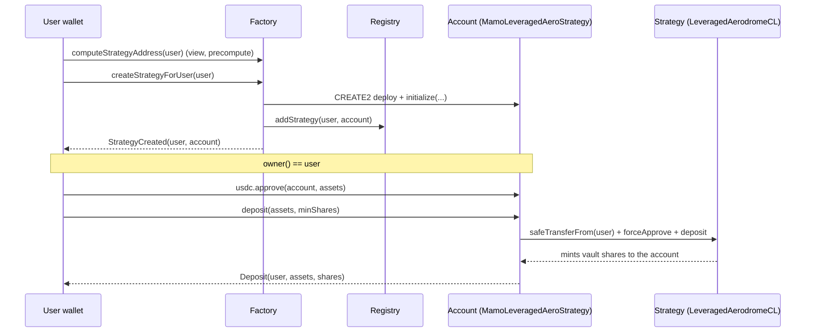
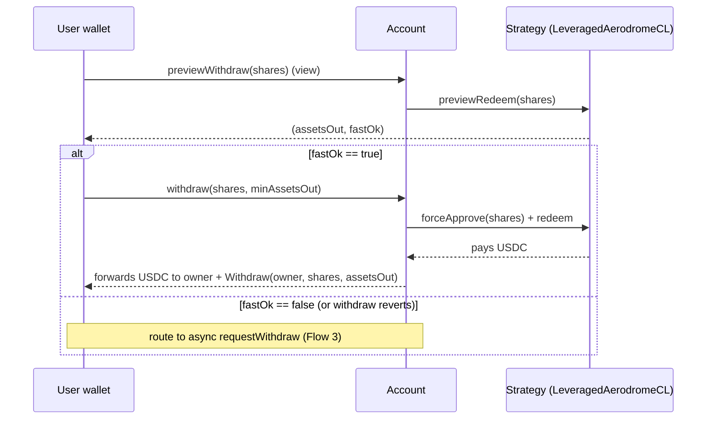
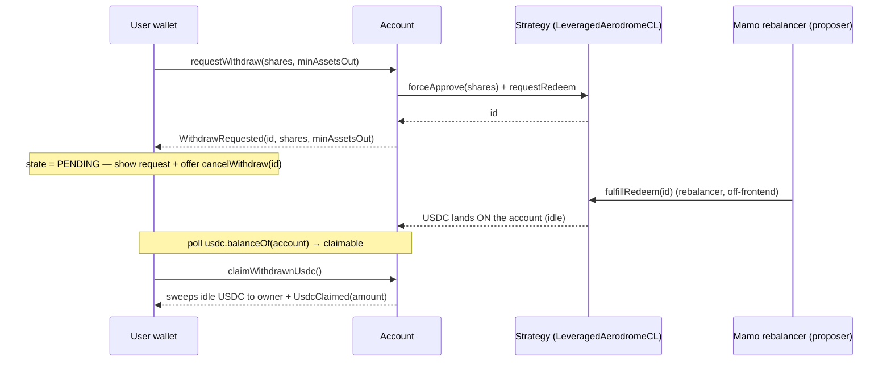

# Leveraged Aero — Frontend integration guide

## The product — Leveraged Aerodrome LP Fund

Leveraged Aerodrome LP fund. Users deposit USDC; the Mamo agent runs a leveraged AERO-farming
position that earns through emissions. Custody and execution are deliberately separate: the fund's share
ledger is a minimal in-repo vault (`LeveragedAeroVault` — shares only, priced off the strategy's NAV),
execution lives in one strategy contract (supply USDC on Moonwell → borrow the CL leg(s) → Aerodrome
concentrated LP → farm & compound AERO, with onchain leverage caps and a permissionless deleverage), and
Mamo's **rebalancer** service is the agent — the same trusted-operator model as Mamo today: it manages the
position but can never withdraw user funds. Users redeem anytime at NAV.

| At a glance | |
|---|---|
| Chain | Base |
| Deposit asset | USDC (ETH & cbBTC added later) |
| Structure | Pooled fund — many depositors, one shared position |
| Strategy | Supply USDC → borrow the CL leg(s) → Aerodrome CL LP → farm & compound AERO |
| Pool shape | Per-clone: *two borrowed legs* (e.g. cbBTC + ETH) **or** *asset-as-leg-B* (one borrowed leg paired with USDC). Affects **copy only** — no flow, ABI or guard in this guide changes. See "Describing the position" below. |
| Posture | Leveraged Aerodrome CL LP + AERO emissions carry |
| Custody | Agent manages the position, can never withdraw user funds; users redeem anytime |
| Lifetime | Runs indefinitely — no fixed term; the terminal `Settled` state is driven by the vault owner (MAMO multisig) |

**Where this guide sits.** Mamo users don't touch the fund contracts directly. Each user gets a
per-user **Mamo account** (`MamoLeveragedAeroStrategy`) that custodies their fund shares and exposes a
USDC-in / USDC-out surface — the same account model as every other Mamo strategy. This guide is the
frontend integration surface for that account.

---

This is the frontend contract-integration guide for the **leveraged Aerodrome LP** product. The single
integration surface for the frontend is the per-user **Mamo account** (`MamoLeveragedAeroStrategy`), its
**factory** (`MamoLeveragedAeroStrategyFactory`), and the **registry** (`MamoStrategyRegistry`). The fund
internals (`LeveragedAerodromeCLStrategy`, `LeveragedAeroVault`, the leverage engine) are **out of scope**
for the frontend — the account wraps them and exposes a USDC-in / USDC-out surface.

- **In:** USDC (6dp). **Out:** USDC (6dp). The user never sees or touches vault shares.
- Vault shares are **12dp** (`LeveragedAeroVault.decimals() == assetDecimals + 6`) and are custodied by
  the account contract on the user's behalf.
- Each user has exactly one account per factory, at a **deterministic (CREATE2) address** the frontend
  can precompute before it exists.
- `account.owner() == user`. Every state-changing user action is `onlyOwner`; the user's wallet signs
  directly against their own account.
- **Legacy naming, unchanged ABI:** the account's strategy pointer is still the public getter
  `sherwoodStrategy()` (and the initializer guard `"Invalid sherwoodStrategy address"`). The name is
  historical — it points at the in-repo `LeveragedAerodromeCLStrategy` clone. Keep it as-is in
  ABIs/typings; nothing on the account's integration surface was renamed.

---

## Contracts & chain (staging)

> **The staging instance now runs the current in-repo stack** (vault generation 2): the vault beneath the
> accounts is `LeveragedAeroVault`, so `depositsOpen()` and the permissionless `redeemSettled` Settled
> flow below are both live and exercisable. Sherwood is gone — no `SyndicateVault`, no governor, no
> propose→vote→execute.
>
> ⚠️ **`script/tenderly/leveraged-aero-vnet.json` is the source of truth**, not this table. Addresses
> change whenever a harness redeploys; read the config file (and
> `docs/LEVERAGED_AERO_VNET_RUNBOOK.md`) before wiring an environment.

| Field | Value | Config key |
|---|---|---|
| Network | Base fork (Tenderly Virtual TestNet), chainId `8453` | `chainId` |
| RPC (public, read-only) | `https://virtual.base.eu.rpc.tenderly.co/70a4990f-6686-4536-8237-ad9103acd11b` | `publicRpc` |
| Admin RPC (writes) | **1Password** (write-capable — never committed to this repo) | `adminRpc` |
| Factory | `0x3E1304044c31907379c00dd24Bd648327Ac2F20b` | `mamo.accountFactory` |
| Account implementation | `0xC68F14197Bb68C2b96E90ccA7227cc497Fb48bf9` | `mamo.accountImplementation` |
| Registry | `0x46a5624C2ba92c08aBA4B206297052EDf14baa92` | `mamo.strategyRegistry` |
| Strategy type id | `5` | `strategyTypeId` |
| Vault (`LeveragedAeroVault`, shares 12dp) | `0x8343b35617326A2B416e17388e1BdF10d5Fd22D7` | `pooled.vault` |
| Strategy clone | `0xA26557fA6823881327fca5b8C4eD5857997A49da` | `pooled.strategyClone` |
| USDC | `0x833589fCD6eDb6E08f4c7C32D4f71b54bdA02913` | `usdc` |

> Production addresses are published separately at deploy.

---

## Account address precompute (CREATE2)

The account address is deterministic in the user address alone, so the frontend can render the account
page, deep-link, and index events **before the account is created**.

```solidity
// MamoLeveragedAeroStrategyFactory
function computeStrategyAddress(address user) public view returns (address);
```

`code.length == 0` at that address ⇒ not yet created. Salt is `keccak256(abi.encodePacked(user))`; the
proxy is an `ERC1967Proxy` pointing at `strategyImplementation`, so the address does not change across
implementation upgrades.

```ts
// viem-ish
const account = await factory.read.computeStrategyAddress([user]);
const exists  = (await client.getBytecode({ address: account }))?.length > 0;
```

---

## Lifecycle state — gate every action on it

The account passes through the strategy's lifecycle enum:

```solidity
function strategyState() external view returns (State); // enum State { Pending, Executed, Settled }
```

| State | Value | Meaning for the frontend |
|---|---|---|
| `Pending` | 0 | Not live yet — deposits/withdrawals revert `NotExecuted()`. Show "not open". |
| `Executed` | 1 | Live — all deposit/withdraw entrypoints work. Normal operating state. |
| `Settled` | 2 | **Terminal.** No deposits/withdrawals. Exit only via the two-step Settled path (below). |

The transitions are driven by the **vault owner** (MAMO multisig) — `activateStrategy(seed)` moves
`Pending → Executed`, `settleStrategy()` moves `Executed → Settled`. Both are one-way; there is no vote,
proposal, or external governance in the path. The frontend only ever *reads* the state.

**Settled exit — two steps.** `settleStrategy()` unwinds the whole levered book and pushes the realized
USDC to the **vault**, while holders still hold their shares. The strategy's own `redeem` /
`requestRedeem` paths are gated on `Executed`, so the exit runs through the vault instead:

```solidity
// 1. Pull the raw shares out of the account — BaseStrategy hatch, always-open onlyOwner, no state gate
function recoverERC20(address token, address to, uint256 amount) external; // token = vaultShares, to = user

// 2. Burn them at the vault for a pro-rata slice of the settled USDC — LeveragedAeroVault, PERMISSIONLESS
function redeemSettled(uint256 shares) external returns (uint256 assetsOut);
```

```ts
const shares = await accountContract.read.sharesBalance();
await accountContract.write.recoverERC20([vaultShares, user, shares]); // shares now in the user's wallet
await vault.write.redeemSettled([shares]);                              // USDC paid to the user
```

- Step 2 is **permissionless and unconditional post-settle**, so a holder can never be stranded:
  `assetsOut = shares × vaultAssetBalance / totalSupply`, computed on the **pre-burn** supply and
  **pre-transfer** balance, rounding down in the stayers' favour.
- The shares must sit in the caller's own wallet for step 2 — the account contract has no
  `redeemSettled` passthrough, which is exactly why step 1 exists.
- Reverts on step 2: `"LAV: not settled"` (called before `settleStrategy()`), `"LAV: zero shares"`,
  `"LAV: no shares outstanding"`.
- Step 1 bypasses the slippage/LTV redeem path by design and emits `TokenRecovered`; step 2 emits the
  vault's `SettledRedeem(owner, shares, assetsOut)`.
- **Pending async requests must be cancelled first.** `fulfillRedeem` and `emergencyWithdraw` both require
  `Executed`, so a request outstanding at settlement can never be fulfilled — but `cancelWithdraw(id)` is
  callable in **any** state and returns the escrowed shares to the account. Prompt the user to cancel, then
  run the two steps above; otherwise those shares stay escrowed on the strategy.

---

## Views for display

```solidity
function sharesBalance() external view returns (uint256);                     // 12dp, custodied shares
function previewWithdraw(uint256 shares) external view returns (uint256 assetsOut, bool fastOk); // advisory
function strategyState() external view returns (State);
function owner() external view returns (address);
```

- **Position USD value (estimate):** `previewWithdraw(sharesBalance()) → (assetsOut, _)`. `assetsOut` is
  the USDC (6dp) the whole position would return on the fast path right now. Display it as the position
  value; it is advisory (oracle-priced) and moves block to block.
- **`fastOk`:** `true` iff the fast withdraw path would currently price and clear the LTV gate. It is
  **advisory only** — execution can still revert even when `fastOk == true` (prices move between the
  preview call and the tx). Use it to choose the default UX path, not as a guarantee.
- **Idle / claimable USDC:** `IERC20(usdc).balanceOf(account)`. After an async withdrawal is fulfilled,
  the payout lands here as idle USDC awaiting `claimWithdrawnUsdc()` (see async flow). Surface it as a
  "claimable" balance.

> **Never cache a quote across blocks.** Fees crystallize inside user transactions and supply/NAV move,
> so `previewWithdraw` and any derived `minShares` / `minAssetsOut` must come from a fresh read in the
> same UX step as the tx.

> **Fees at launch — don't promise what isn't charged.** The vault deploys with
> `feeConfig == address(0)`, so the **protocol-fee** leg is **off** (enableable later by the vault owner
> without touching the strategy). The **management** and **performance** fees are the strategy clone's own
> init params — read `managementFeeBps` / `performanceFeeBps` off the strategy's `layout()` instead of
> hardcoding a schedule in copy, and treat any "APY net of fees" display as moot for whichever legs read
> zero.

### Describing the position — don't hardcode "cbBTC + ETH"

The fund is **not** fixed to one pair, and it is not even fixed to one *shape*. A clone initializes against
any Slipstream pool whose tokens have Moonwell markets and Chainlink feeds, and there are two shapes,
derived at init:

| `strategy.layout().legBIsAsset` | Shape | How to describe it |
|---|---|---|
| `false` | **Two borrowed legs** — the whole deposit is collateral, both pool tokens are borrowed | "Supply USDC, borrow *`legA`* + *`legB`*, LP the pair" |
| `true` | **Asset-as-leg-B** — the leg-B slot **is** USDC; part of the deposit is collateral, one volatile leg is borrowed and paired with the rest | "Supply USDC, borrow *`legA`*, LP it against USDC" |

```ts
const l = await strategy.read.layout();
const legA = l.weth;   // leg A slot — always the borrowed volatile leg
const legB = l.cbBTC;  // leg B slot — a second borrowed leg, or USDC in asset-mode
const assetMode = l.legBIsAsset;
```

- **`weth` / `cbBTC` in `LayoutView` are leg SLOTS, not tokens.** The field names are historical. Resolve
  symbols/decimals from the actual addresses; never render the field name.
- **Nothing else in this guide changes.** In / out is USDC (6dp) in both shapes; every flow, ABI, event,
  revert and guard above is shape-invariant. `previewWithdraw(sharesBalance())` remains the position value
  in both — there is no per-leg breakdown to render and none is needed.
- **`hedgedDebt()` and `targetLtvBps()` on the strategy are fund-ops reads, not frontend reads.** They
  exist for the rebalancer (see [`LEVERAGED_AERO_REBALANCER.md`](./LEVERAGED_AERO_REBALANCER.md) §E). The
  only reason to touch them here is an optional "strategy details" panel — and if you do surface
  `hedgedDebt()`, note `legB` is structurally `0` in asset-mode, so render it as "n/a", not as a zero
  balance.
- The strategy clone is otherwise **out of scope** for the frontend (see the scope note at the top); this
  subsection exists purely so marketing/product copy tracks the clone it is actually pointed at.

---

## Slippage guards (`minShares` / `minAssetsOut`)

Every value-moving call takes a caller-supplied floor. Derive it from a **fresh** quote:

- **Withdrawals:** quote `previewWithdraw(shares) → assetsOut`, then set
  `minAssetsOut = assetsOut * (1 - tolBps/10_000)`.
- **Deposits:** there is no `previewDeposit`. Either derive expected shares off the same oracle-NAV math
  the preview uses (inverse), or quote a reference and accept a bps tolerance below a fresh quote. `0` is
  legal but leaves the deposit unprotected against oracle-lag skim — always pass a real floor in prod.

---

## Flow 1 — create account + deposit

Two entrypoints exist to fund an account. The **primary** flow is `approve` + `deposit`:

```solidity
// permissionless — funds pulled from msg.sender, shares always accrue to the account
function deposit(uint256 assets, uint256 minShares) external returns (uint256 shares);
```

Account creation is done once, either by the user themselves or by the Mamo backend
(`createStrategyForUser` / `createStrategy` — same body). If the frontend drives creation, the user's
own wallet may call it (they are the `user` arg):

```solidity
// MamoLeveragedAeroStrategyFactory — callable by BACKEND_ROLE or by `user` themselves
function createStrategyForUser(address user) external returns (address strategy);
```



```ts
// 1. create (idempotent-guarded: reverts "Strategy already exists")
if (!exists) await factory.write.createStrategyForUser([user]);
// 2. approve + deposit
await usdc.write.approve([account, assets]);
await accountContract.write.deposit([assets, minShares]);
```

**Alt fund flow (plain transfer + nudge).** A user can plain-`transfer` USDC to the account address, then
the owner (or backend) sweeps it into the position:

```solidity
function depositIdle(uint256 minShares) external returns (uint256 shares); // gated: owner OR registry backend
```

Because idle USDC on an account is ambiguous (pending re-deposit vs. a fulfilled withdrawal awaiting
claim), `depositIdle` is gated to `owner() || registry.getBackendAddress()` and reverts `"Not owner or
backend"` otherwise. Prefer the explicit `approve`+`deposit` flow in the UI.

> **Deposits can be frozen.** New share issuance is gated by a single owner-controlled flag on the vault,
> `setOpenDeposits(bool)`; while it is off, every deposit path reverts `"LAV: deposits closed"`.
> Withdrawals are deliberately **not** gated on it and keep working. There is no depositor whitelist and
> no pause — that one flag is the entire gate — so surface the revert as "deposits are temporarily closed",
> not as a user error. Read it with `vault.depositsOpen()` to pre-disable the deposit CTA.

---

## Flow 2 — fast withdraw (synchronous)

The fast path redeems shares and pays USDC to the owner in a single transaction. It is oracle-priced and
LTV-gated: it can revert when the oracle is down or the position's LTV gate trips.

```solidity
function withdraw(uint256 shares, uint256 minAssetsOut) external returns (uint256 assetsOut); // onlyOwner
function withdrawAll(uint256 minAssetsOut) external returns (uint256 assetsOut);              // onlyOwner
```

**Always preflight** with `previewWithdraw` and fall back to the async path when `fastOk == false`:



> The strategy pays the account and the account forwards the USDC to `owner()` atomically in the same
> tx, so the owner receives USDC directly. `withdrawAll` redeems the account's entire share balance and
> reverts `"No shares to withdraw"` if there is none.

---

## Flow 3 — async withdraw (request → pending → claim)

For sizes the fast path can't serve, or when the oracle is down, the owner escrows shares into a request;
the **rebalancer** fulfils it; the USDC lands **on the account** as idle balance; the owner sweeps it.

> **Who fulfils:** `fulfillRedeem` is `onlyProposer` on the strategy, and the proposer is the dedicated
> **rebalancer** address — **not** the Mamo backend. The backend drives the account layer
> (`createStrategyForUser`, `depositIdle`); the rebalancer drives the strategy (`compound`, `rerange`,
> `adjustLeverage`, `fulfillRedeem`). Irrelevant to the frontend's calls, but do not label the pending
> state "waiting for the backend" in copy or in ops tooling.

```solidity
function requestWithdraw(uint256 shares, uint256 minAssetsOut) external returns (uint256 id); // onlyOwner
function cancelWithdraw(uint256 id) external;                                                 // onlyOwner
function claimWithdrawnUsdc() external returns (uint256 amount);                              // onlyOwner
```

> **Value floats until fulfill.** `requestWithdraw` escrows the shares but does **not** freeze a price —
> the escrowed shares keep bearing the position's PnL until the rebalancer fulfils. The USDC the user
> ultimately receives is priced at fulfill time, not request time. Surface this clearly (e.g. "amount
> finalizes when processed") and do not display the request-time preview as a locked payout.



**Pending-state UX.** Track pending requests from `WithdrawRequested` / `WithdrawCancelled` events and
the account's idle USDC balance:

1. `WithdrawRequested(id, shares, minAssetsOut)` → mark request `id` pending; offer **Cancel**
   (`cancelWithdraw(id)` returns the escrowed shares to the account, emits `WithdrawCancelled(id)`).
2. Detect fulfillment by polling `IERC20(usdc).balanceOf(account)` becoming non-zero (there is no
   fulfill callback/event on the account). Surface it as **claimable**.
3. `claimWithdrawnUsdc()` sweeps the idle USDC to the owner and emits `UsdcClaimed(amount)`.

---

## Flow 4 — emergency deadman withdraw

If the rebalancer never fulfils a request, after a **2-day** fulfill window the owner can trustlessly
self-service the request; USDC is forwarded to the owner in the same tx.

```solidity
function emergencyWithdraw(uint256 id, uint256 minAssetsOut) external returns (uint256 assetsOut); // onlyOwner
```

Only enable this in the UI once `block.timestamp > requestedAt + 2 days` for the request; before then it
reverts `FulfillWindowOpen()`. `minAssetsOut` is a **fresh** floor (the request's original floor may be
stale after two days).

---

## Events (for indexing / UX)

Account (`MamoLeveragedAeroStrategy`) — exact signatures:

| Event | When |
|---|---|
| `Deposit(address indexed depositor, uint256 assets, uint256 shares)` | `deposit` / `depositIdle` |
| `Withdraw(address indexed owner, uint256 shares, uint256 assetsOut)` | fast `withdraw` / `withdrawAll` |
| `WithdrawRequested(uint256 indexed id, uint256 shares, uint256 minAssetsOut)` | `requestWithdraw` |
| `WithdrawCancelled(uint256 indexed id)` | `cancelWithdraw` |
| `WithdrawEmergency(uint256 indexed id, uint256 assetsOut)` | `emergencyWithdraw` |
| `UsdcClaimed(uint256 amount)` | `claimWithdrawnUsdc` |
| `TokenRecovered(address indexed token, address indexed to, uint256 amount)` | `recoverERC20` / `recoverETH` (Settled exit) |

Factory:

| Event | When |
|---|---|
| `StrategyCreated(address indexed user, address indexed strategy)` | account created |

Registry (`MamoStrategyRegistry`) — for ownership indexing (`transferOwnership` mirrors into the registry):

| Event | When |
|---|---|
| `StrategyAdded(address indexed user, address strategy, address implementation)` | account registered |
| `StrategyOwnerUpdated(address indexed strategy, address indexed oldOwner, address indexed newOwner)` | ownership transfer |

---

## Revert-string → UX message map

Account (`require` strings):

| Revert | Trigger | Suggested UX |
|---|---|---|
| `"Amount must be greater than 0"` | `deposit`/`withdraw`/`requestWithdraw` with 0 | Validate amount > 0 client-side |
| `"No idle USDC to deposit"` | `depositIdle` with 0 idle balance | Nothing to sweep |
| `"Not owner or backend"` | `depositIdle` from a non-owner | Hide/disable for non-owner |
| `"No shares to withdraw"` | `withdrawAll` with 0 shares | Empty position |
| `"No USDC to claim"` | `claimWithdrawnUsdc` with 0 idle | Nothing claimable yet |
| `OwnableUnauthorizedAccount(address)` (OZ custom error) | any `onlyOwner` call from non-owner | Wrong wallet connected |

Factory (`require` strings):

| Revert | Trigger |
|---|---|
| `"Invalid user address"` | zero user |
| `"Only backend or user can create strategy"` | caller is neither backend nor `user` |
| `"Strategy already exists"` | account already deployed for `user` |

Strategy errors surfaced through the account (fast/async paths) — custom errors, decode by selector:

| Error | Trigger | Frontend action |
|---|---|---|
| `FastRedeemExceedsLtv(uint256 ltvBps, uint256 maxLtvBps)` | fast `withdraw`/`withdrawAll` would breach the LTV cap | Fall back to `requestWithdraw` |
| `NotExecuted()` | any deposit/withdraw while state ≠ `Executed` | Gate on `strategyState()` |
| `FulfillWindowOpen()` | `emergencyWithdraw` before the 2-day window | Disable until window elapses |
| oracle-staleness reverts | fast path while the oracle is down | Fall back to `requestWithdraw` |

Vault (`LeveragedAeroVault`) `require` strings, surfaced through the account's deposit paths and the
Settled exit:

| Revert | Trigger | Suggested UX |
|---|---|---|
| `"LAV: deposits closed"` | any deposit while `depositsOpen == false` | "Deposits temporarily closed" — withdrawals still work |
| `"LAV: not settled"` | `redeemSettled` before `settleStrategy()` | Only offer the Settled exit at `strategyState() == Settled` |
| `"LAV: zero shares"` / `"LAV: no shares outstanding"` | `redeemSettled` with 0 shares / empty ledger | Nothing to redeem |

---

## Frontend checklist

- [ ] Precompute the account address with `computeStrategyAddress(user)`; treat `code.length == 0` as "not created".
- [ ] Gate all deposit/withdraw UI on `strategyState() == Executed`; render the two-step Settled exit — `recoverERC20(vaultShares, user, sharesBalance())` then `vault.redeemSettled(shares)`.
- [ ] Read `vault.depositsOpen()` and pre-disable the deposit CTA when issuance is closed (`"LAV: deposits closed"`); never gate withdrawals on it.
- [ ] Show position value from `previewWithdraw(sharesBalance())`; never cache the quote across blocks.
- [ ] Derive position copy from the clone (`layout().legBIsAsset` + the leg-slot addresses) rather than hardcoding "cbBTC + ETH"; both shapes are USDC-in / USDC-out and every flow below is shape-invariant.
- [ ] Fast withdraw: preflight `previewWithdraw`, default to async when `fastOk == false`, and catch `FastRedeemExceedsLtv` / oracle reverts as an async fallback.
- [ ] Async withdraw: surface pending requests from `WithdrawRequested`/`WithdrawCancelled`, offer `cancelWithdraw`, poll idle USDC for fulfillment, and expose `claimWithdrawnUsdc`.
- [ ] Warn that async payout value floats until fulfill (no price freeze at request time).
- [ ] Enable `emergencyWithdraw` only after `requestedAt + 2 days`.
